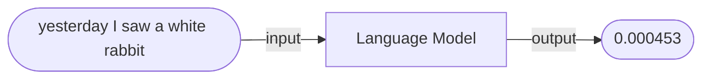
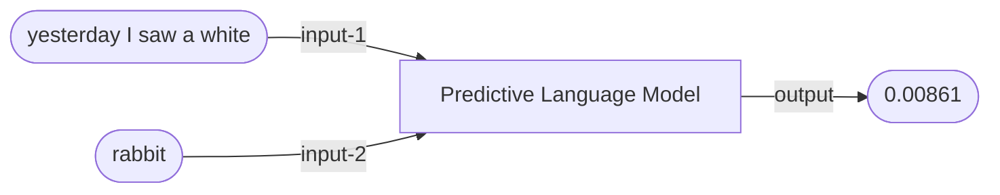
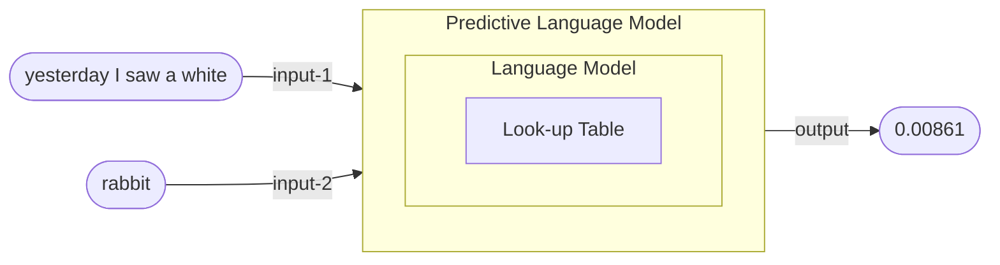

# N-gram language models

\[My notes from Jurafsky and Martin (2000) §6\]

Contents:
- [Counting words in corpora](#counting-words-in-corpora)
- [Simple unsmoothed n-grams](#simple-unsmoothed-n-grams)
- [Smoothing](#smoothing)
- [Backoff](#backoff)

§0.1. <mark>Word prediction</mark> is an essential subtask for speech recognition, handwriting recognition, augmentative communication for the disabled, and spelling error detection (especially real-word, context-sensitive spelling errors).

§0.2. An <mark>n-gram language model</mark> uses the previous $n-1$ words to predict the next one.

## Counting words in corpora

§1.1. Probabilities for the word prediction task comes from counting words in <mark>corpora</mark> – online collections of text and transcribed speech, eg.
- the Brown Corpus (1963–4) – a one million word collection of samples from 500 written texts from different genres
- the Switchboard Corpus (early 1990s) of telephone conversations (including sentence fragments and filled pauses) – 240 hours, three million words.

§1.2. Every word (token) in a corpus is an instance of a <mark>wordform</mark>, which is itself a member of a <mark>lemma</mark> – a set of lexical forms having the same stem, major part-of-speech and word-sense.

Back up to: [Top](#)

## Simple unsmoothed n-grams

§2.1. A <mark>language model</mark> is a computer (program) which accepts a sequence of words (and other tokens) as input and assigns a probability as output.



### Bigrams

§2.2. A <mark>bigram</mark> language model contains/consults a look-up table which assigns, for every pair of words $w_1, w_2$ in the vocabulary, the probability of $w_2$ occurring immediately after $w_1$, ie. $P(w_2 | w_1)$.
- If there are $N$ words in the vocabulary, this table will have $N+1$ rows (representing the first word, or the start of the text `$`) and $N$ columns (representing the second word) and hence c. $N^2$ cells.

§2.3. The algorithm underlying the bigram language model is as follows:

```
Let OUTPUT = 1
Repeat for every bigram w1 w2 in the (tokenised) input, from left to right:
  OUTPUT = OUTPUT * P(w2|w1)
Return OUTPUT
```

§2.4. For example:
- $P(yesterday\ I\ saw\ a\ white\ rabbit) = P(yesterday|£) \cdot P(I|yesterday) \cdot P(saw|I) \cdot P(a|saw) \cdot P(white|a) \cdot P(rabbit|white)$

§2.5. A bigram language model can be ‘trained’ from a corpus by counting and normalising, as follows:

```
Repeat for every word w1 in the corpus vocabulary:
  Repeat for every word w2 in the corpus vocabulary:
    Let P(w2|w1) = |w1 w2| / |w1|
```

§2.6. For example:
- $P(rabbit|white) = \frac{|white\ rabbit|}{|white|}$

§2.7. Bigram language models are <mark>Markov models</mark> – the class of probabilistic models that assume that we can predict the probability of some future unit without looking too far into the past. More specifically, bigram language models are <mark>first-order</mark> Markov models, a simple kind of Markov chain (ie. weighted finite state automaton) which has one state for each word.

§2.8. Note that the product of many probabilities gets smaller the more probabilities we multiply, leading to <mark>numeric underflow</mark>. It is more customary to do the computation in <mark>log space</mark> – adding the logs of each probability, and taking the anti-log of the result.

§2.9. Bigram training is an example of <mark>Maximum Likelihood Estimation</mark> (MLE) – using relative frequencies means that the likelihood of the training set given the model is maximised. This can lead to sparse look-up tables with lots of 0 probabilities – see discussion of ‘smoothing’ below.


### Trigrams

§2.7. A <mark>trigram</mark> language model contains/consults a look-up table which assigns, for every triple of words $w_1, w_2, w_3$ in the vocabulary, the probability of $w_3$ occurring immediately after $w_1\ w_2$, ie. $P(w_3 | w_1\ w_2)$.
- If there are $N$ words in the vocabulary, this table will have $(N+1)^2$ rows (representing the first two words, or the start of the text) and $N$ columns (representing the third word) and hence c. $N^3$ cells.

§2.8. The algorithm underlying the trigram language model is as follows:

```
Let OUTPUT = 1
Repeat for every trigram w1 w2 w3 in the (tokenised) input, from left to right:
  OUTPUT = OUTPUT * P(w3|w1 w2)
Return OUTPUT
```

§2.9. For example:
- $P(yesterday\ I\ saw\ a\ white\ rabbit) = P(yesterday|££) \cdot P(I|£\ yesterday) \cdot P(saw|yesterday\ I) \cdot P(a|I\ saw) \cdot P(white|saw\ a) \cdot P(rabbit|a\ white)$

§2.10. A trigram language model can be ‘trained’ from a corpus as follows:

```
Repeat for every word w1 in the corpus vocabulary:
  Repeat for every word w2 in the corpus vocabulary:
    Repeat for every word w3 in the corpus vocabulary:
      Let P(w3|w1 w2) = |w1 w2 w3| / |w1 w2|
```

§2.11. For example:
- $P(rabbit|a\ white) = \frac{|a\ white\ rabbit|}{|a\ white|}$

§2.12. Trigram language models are <mark>second-order Markov models</mark>.

### Predictive n-gram language models

§2.13. A <mark>predictive language model</mark> is a computer (program) which accepts two inputs – a sequence of words and another (potentially next) word – and assigns a probability as output.



§2.14. The algorithm underlying the predictive language model is as follows:

```
Let P be the probability of INPUT-1
Let Q be the probability of INPUT-1+INPUT-2
Return Q / P
```

§2.15. Note that a predictive language model contains an n-gram language model as a component:



§2.16. A predictive language model can itself be embedded in a computer (program) which outputs the most likely next word given a sequence of prior words:

```
Let CURRENT-PROB be 0
Let CURRENT-WORD be null
Repeat for every word w in the vocabulary:
  Let NEW-PROB be the probability of w being the next word after INPUT (according to the predictive language model)
  If NEW-PROB > CURRENT-PROB:
    CURRENT-WORD = w
    CURRENT-PROB = NEW-PROB
Return CURRENT-WORD
```

§2.17. Elaborations of this basic model include computers (or computer programs) which predict the nth most likely next word, or the n most likely next words (in descending order of likelihood), etc.

§2.18. This can then be embedded in a simple Generative LLM seeded by a prompt from the user:

```
Repeat for ever:
  Let NEXT be the most likely next word given the prior PROMPT
  Let PROMPT be PROMPT+NEXT
```

Back up to: [Top](#)

## Smoothing

Back up to: [Top](#)

## Backoff

Back up to: [Top](#)

## N-grams for spelling and pronunciation

Back up to: [Top](#)

## Entropy

Back up to: [Top](#)

----

Back up to: [LLMs](index.md) | [AI](../index.md)
