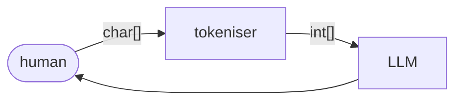

# Tokenisation

A tokeniser is a machine that accepts a string of characters as its input and outputs a list of token identifiers (positive integers), which can then be fed into a large language model.



For example, OpenAI’s [GPT-4 tokeniser](https://platform.openai.com/tokenizer) accepts the following input string:
```
"Have the bards who preceded me left any theme unsung?"
```
And outputs the following list of token identifiers:
```
[15334, 290, 287, 3098, 1218, 91138, 668, 3561, 1062, 9660, 3975, 988, 30]
```
These output token identifiers stand for the following tokens:
```
15334  "Have"
290    " the"
287    " b"
3098   "ards"
1218   " who"
91138  " preceded"
668    " me"
3561   " left"
1062   " any"
9660   " theme"
3975   " uns"
988    "ung"
30     "?"
```

Looking closely at the output of this tokeniser, a number of things stand out.

First of all, the GPT-4 tokeniser is clearly not a **word tokeniser**.

A word tokeniser divides up an input string by implementing two basic rules:
- Spaces are token separators.
- Punctuation characters are tokens.

When fed the input string above, a word tokeniser would produce token identifiers corresponding to the following tokens:
```
Have
the
bards
who
preceded
me
left
any
theme
unsung
?
```

Note however that the output of the GPT-4 tokeniser includes some tokens which are not whole words:
- The word `bards` is tokenised as `" b", "ards"`.
- The word `unsung` is tokenised as `" uns", "ung"`.

Note also that when a word in the input is preceded by a space, the GPT-4 tokeniser includes that space at the start of the (first) corresponding token, as in `" the"`, `" who"`, etc.

Word tokenisation is simple and intuitive, easy to understand and implement (notwithstanding edge cases like the word-internal apostrophes in `don’t`, `can’t`, `Mary’s` etc). Word tokenisers do not need to be trained and are purely left-to-right deterministic, meaning that they are very fast and efficient.

Older language models, such as those based on the `word2vec` word-embedding algorithm, used word tokenisation. However, modern LLMs generally avoid using word tokenisers, because the resulting vocabulary of token types is simply too large to efficiently train an LLM on. Even the largest training corpora will have lexical gaps meaning that an LLM based on word tokenisation would have to deal with a relatively large number of out-of-vocabulary tokens in user input prompts. For similar reasons, an LLM based on word tokenisation would be less robust at handling mispellings. In addition, a language like English contains lots of related words which are treated as completely distinct by a word tokeniser, eg. `apology`, `apologise`, `apologetic`, `apologist`, which again does not allow for efficient learning of the underlying semantics, compared to a tokeniser which recognises stems (`apolog-`) and suffixes (`-y`, `-ise`, `-etic`, `-ist`).

Another reason for avoiding word tokenisation in modern LLMs is that they then cannot tokenise text from languages which do not use spaces to separate words, like Japanese or Chinese.

While it is clear that the GPT-4 tokeniser is not a word tokeniser, nor is it a **character tokeniser** either.

A character tokeniser simply divides up a string into the individual characters that it is composed of, as in:
```
H
a
v
e

t
h
e

b
a
r
d
s 

. . .
```
Note that the blank lines here indicate a single space character.

While the GPT-4 tokeniser does produce some tokens that consist of a single character, mainly punctuation characters like `?` in the example above, the vast majority of the tokens produced consist of multiple characters – the above example even contains the nine-character token ` preceded`.

Like word tokenisation, character tokenisers are simple and intuitive, easy to understand and implement, do not need to be trained, and are purely left-to-right deterministic.

However, current LLMs do not generally use character tokenisation either. While word tokenisers assume too large a vocabulary of token types for meaningful generalisations to be learned efficiently, character tokenisers have the exact opposite problem – they assume too small a vocabulary (ie. alphabet).

----


subword tokenisation, but not linguistically sound

whitespace is preserved

case sensitive

numbers

code


----

Back up to: [LLMs](index.md) | [AI](../index.md) | [Tangator](../../index.md)
