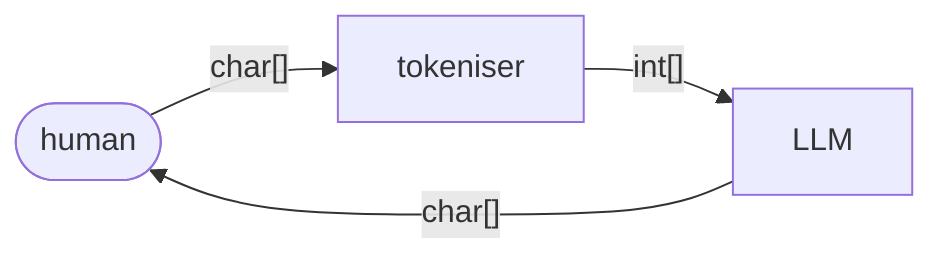
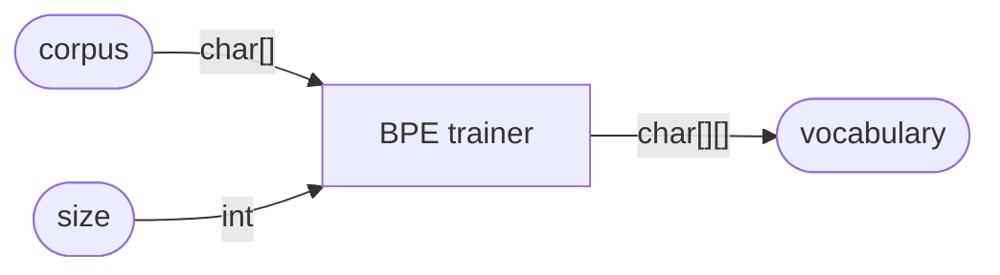
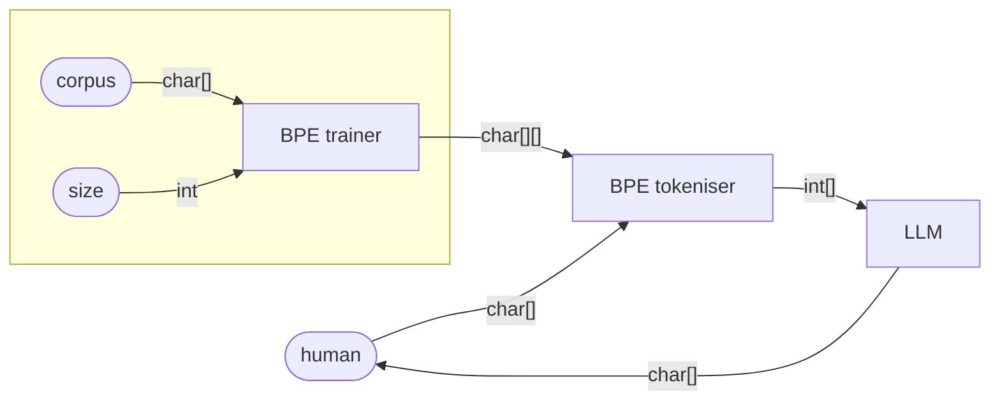

# Tokenisation

## What does a tokeniser do?

A tokeniser is a machine that accepts a string of characters as its input and outputs a list of token identifiers (positive integers), which can then be fed into a large language model.



For example, when OpenAI’s [GPT-4 tokeniser](https://platform.openai.com/tokenizer) is fed the following input string:
```
"Have the bards who preceded me left any theme unsung?"
```
It outputs the following list of token identifiers:
```
[15334, 290, 287, 3098, 1218, 91138, 668, 3561, 1062, 9660, 3975, 988, 30]
```
These output token identifiers stand for the following tokens:
```
15334  "Have"
290    " the"
287    " b"
3098   "ards"
1218   " who"
91138  " preceded"
668    " me"
3561   " left"
1062   " any"
9660   " theme"
3975   " uns"
988    "ung"
30     "?"
```

Looking closely at the output of this tokeniser, a number of things stand out.

First of all, the GPT-4 tokeniser is clearly not a **word tokeniser**.

A word tokeniser divides up an input string by implementing two basic rules:
- Spaces are token separators.
- Punctuation characters are tokens.

When fed the input string above, a word tokeniser would produce token identifiers corresponding to the following tokens:
```
Have
the
bards
who
preceded
me
left
any
theme
unsung
?
```

Note however that the output of the GPT-4 tokeniser includes some tokens which are not whole words:
- The word `bards` is tokenised as `" b", "ards"`.
- The word `unsung` is tokenised as `" uns", "ung"`.

Note also that when a word in the input is preceded by a space, the GPT-4 tokeniser includes that space at the start of the (first) corresponding token, as in `" the"`, `" who"`, etc.

Word tokenisation is simple and intuitive, easy to understand and implement (notwithstanding edge cases like the word-internal apostrophes in `don’t`, `can’t`, `Mary’s` etc). Word tokenisers do not need to be trained and are purely left-to-right deterministic, meaning that they are very fast and efficient.

Older language models, such as those based on the `word2vec` word-embedding algorithm, used word tokenisation. However, modern LLMs generally avoid using word tokenisers, because the resulting vocabulary of token types is simply too large to efficiently train an LLM on. Even the largest training corpora will have lexical gaps meaning that an LLM based on word tokenisation would have to deal with a relatively large number of out-of-vocabulary tokens in user input prompts. For similar reasons, an LLM based on word tokenisation would be less robust at handling mispellings. In addition, a language like English contains lots of related words which are treated as completely distinct by a word tokeniser, eg. `apology`, `apologise`, `apologetic`, `apologist`. Again, this does not allow for efficient learning of the underlying semantics, compared to a tokeniser which separates stems (`apolog-`) from suffixes (`-y`, `-ise`, `-etic`, `-ist`).

Another reason for avoiding word tokenisation in modern LLMs is that they then cannot tokenise text from languages which do not use spaces to separate words, like Japanese or Chinese.

While it is clear that the GPT-4 tokeniser is not a word tokeniser, nor is it a **character tokeniser** either.

A character tokeniser simply divides up a string into the individual characters that it is composed of, as in:
```
H
a
v
e

t
h
e

b
a
r
d
s 

. . .
```
Note that the blank lines here indicate a single space character.

While the GPT-4 tokeniser does produce some tokens that consist of a single character, mainly punctuation characters like `?` in the example above, the vast majority of the tokens produced consist of multiple characters – the above example even contains the nine-character token ` preceded`.

Like word tokenisation, character tokenisers are simple and intuitive, easy to understand and implement, do not need to be trained, and are purely left-to-right deterministic.

However, current LLMs do not generally use character tokenisation either (aside from a handful of experimental LLMs like `CANINE`, `ByT5` and `Charformer`). While word tokenisers assume too large a vocabulary of token types for meaningful generalisations to be learned efficiently, character tokenisers have the exact opposite problem – the vocabulary (or more accurately the *alphabet*) they assume is too small.

The GPT-4 tokeniser thus appears to occupy a middle ground between word tokenisation and character tokenisation – it is a **sub-word tokeniser**. 

Some of the tokens produced by the GPT-4 tokenisers are whole words, like `Have`. Others are whole words with a leading space, like ` the` or ` preceded`.

But, as noted already, there are also GPT-4 tokens that consist of parts of words, again with or without a leading space:
- The input word `bards` is tokenised as `" b", "ards"`.
- The input word `unsung` is tokenised as `" uns", "ung"`.

Note that the sub-word tokeniser used in GPT-4 seems to have little understanding of English word morphology though! For the two words which have been split up, this has been done in a very counterintuitive manner. It would have made a lot more linguistic sense to analyse:
- `bards` as `bard + s` rather than as `b + ards`
- `unsung` as `un + sung` rather than as `uns + ung` 

In addition, there are some words which arguably should have been split up by the tokeniser but were not:
- `preceded` could surely be analysed as `precede + d`, or perhaps even as `pre + cede + d`.

To give another example, the GPT-4 tokeniser parses the word `antidisestablishmentarianism` as `ant + idis + est + ablishment + arian + ism` rather than the more sensible `anti + dis + establish + ment + arian + ism`.

In sum, the GPT-4 tokeniser could more accurately be described as a *linguistically naive* sub-word tokeniser.

Before looking at how the GPT-4 tokeniser works, there are two more aspects of its behaviour to consider.

First of all, the GPT-4 tokeniser is case-sensitive:
- `Have` and `have` are distinct tokens, with IDs `15334` and `35723` respectively.
- `HAVE` is tokenised as `H + AVE`, ie. token `39` followed by token `16357`.

Secondly, leading spaces are meaningful within tokens:
- ` Have` has token ID `14465`, compared to `15334` for `Have`.
- ` have` has token ID `679`, compared to `35723` for `have`.

## Byte-pair encoding – How does a sub-word tokeniser work?

So, how does the linguistically naive sub-word tokeniser used by GPT-4 actually work? How does the tokeniser decide which words to split up and how to split them up, given that it certainly does not appear to be using any real knowledge of their actual linguistic sub-structure?

Technically, the GPT-4 tokeniser is known as a **byte-pair encoding** ([BPE](https://arxiv.org/pdf/1508.07909)) tokeniser.

To build a BPE tokeniser you need two basic ingredients:
- a corpus of texts to learn from
- a desired vocabulary size.

Different BPE tokenisers are trained on different corpora, containing different genres of text, different languages, different proportions of computer programming code etc.

In addition, different BPE tokenisers have different vocabulary sizes, ie. different numbers of distinct token types that they recognise:
- The GPT-2 tokeniser (2019) recognises around 50k distinct tokens.
- The GPT-4 tokeniser (2023) recognises around 100k distinct tokens.
- The LLaMa 2 tokeniser (2023) recognises around 32k distinct tokens.

In essence, the desired vocabulary size tells the BPE training algorithm when to stop learning from the corpus – when the desired size is reached.

Here is a simplified version of the BPE training algorithm:

> Given corpus `C` and desired vocabulary size `N`:
> 
> > Let `cs` be the list of characters resulting from character tokenising `C`.  
> > Let `vocab` be the set of distinct tokens in `cs`.  
> > While `vocab` is smaller than `N`:  
> > > Let `(x,y)` be the most frequent adjacent pair of tokens in `cs`.  
> > > Merge all instances of `(x,y)` in `cs` to just `xy`.  
> > > Add `xy` to `vocab`.
> > 
> > Return `vocab`.  

Let’s run through an example of this BPE training algorithm in operation.

\[TO DO\]

To summarise, the BPE training algorithm can be understood as a machine which accepts two inputs – a corpus of texts and a desired output vocabulary size – and which then outputs a vocabulary containing the desired number of token types (ie. sequences of characters):



This output vocabulary is then one of the inputs to the BPE tokeniser itself, when used to mediate between a human user and an LLM:



We now know how to build a BPE tokeniser for any desired size of vocabulary, assuming we have an appropriate corpus of texts to hand. 

We can then use this trained tokeniser to tokenise any string of text we want, including those that were not in the training corpus.

The BPE tokeniser algorithm is as follows:

> Given input string `S` and vocabulary of tokens `V`:
> 
> > Let `cs` be the list of characters resulting from character tokenising `S`.
> > 
> > Repeat for every token `t` in `V`:  
> > > Repeat for every adjacent pair of tokens `(x,y)` in `cs` (from left to right):  
> > > > If `t` is the result of merging `x` and `y`:  
> > > > > Replace `(x,y)` in `cs` with `t`.  
> > 
> > Let `ids` be the list of integers resulting from replacing every token in `cs` with its position in `V`.
> > 
> > Return `ids`.

Let’s run through an example of a trained BPS tokeniser in operation.

\[TO DO\]

## Further observations

As LLMs are getting larger, so are **vocabulary sizes**. Some recent LLMs recognise over 500k distinct token types. According to proposed scaling laws, the optimal vocabulary size increases as model size and compute increases, and hence most current models probably have suboptimal vocabulary sizes.

Tokenisers differ significantly in how they handle **whitespace** characters (spaces, tabs, newlines, carriage returns). As discussed above, the GPT-4 tokeniser has a strong tendency to include leading spaces at the start of tokens. The GPT-NeoX-20B tokeniser does the same but represents them using a `Ġ`, eg. `Ġoffice` for ` office`. Tokenisers trained on lots of computer **programming code** tend to have lots of different tokens for different combinations of whitespace, especially for languages like Python where indentation is meaningful. Such tokenisers often have distinct tokens for strings of punctuation markers like `});`.

Alternatively, some LLMs do not include leading spaces but rather add a special character on to the start of tokens representing suffixes.

**Case-sensitive** vocabularies are almost always better than uncased ones, assuming that there is enough training data to learn distinctive representations for uppercase and lowercase tokens.

Tokenisers also differ significantly in how they deal with **numbers**. Smaller numbers like `934` tend to have their own tokens but larger ones like `93477` need to be split up.

Character tokenisation is often called **tokenisation-free** language modelling, meaning that the main work of the tokeniser is understood as being consolidated into the LLM itself, rather than being a pre-processing step. A more extreme version of character tokenisation is known as **byte tokenisation**, where the input is uniformly segmented into 8-bit tokens, regardless of the character encoding. See:
- [CANINE: Pre-training an efficient tokenization-free encoder for language representation](https://arxiv.org/pdf/2103.06874)
- [ByT5: Towards a token-free future with pre-trained byte-to-byte models](https://arxiv.org/pdf/2105.13626)

Tokenisation proper may be seens as being part of a pipeline, preceded by:
- **normalisation** – perhaps converting text to lowercase, stripping off accents from letters, etc.
- **pre-tokenisation** – maybe performing word tokenisation as a prelude to subword tokenisation

[Wordpiece](https://static.googleusercontent.com/media/research.google.com/en//pubs/archive/37842.pdf) is a tokenisation algorithm used by BERT, which is similar to BPE but uses maximum likelihood rather than frequencies. Merge rules are not used during actual tokenisation, but rather the tokeniser identifies the longest subword. See also: [SentencePiece](https://arxiv.org/pdf/1808.06226), [cf](https://arxiv.org/pdf/1804.10959).

An artifact of the BPE training algorithm is that LLMs can end up with weird **glitch tokens** (eg. `SolidMagiGoldcarp`). **Token etymology** is a hobby for many LLM enthusiasts – finding glitch tokens and unearthing their origins.

After tokenisation, a post-processing step involves inserting **special (utility) tokens** into the tokenised output, to help out the LLM in various ways. Some examples are:
- `<s>`, `[CLS]`, `cls_token` – marking the start of the input (?), classification token (?)
- `[SEP]`, `sep_token`, `<|assistant|>` – marking the end of the input and the start of the response (?)
- `[UNK]`, `<UNK>`, `unk_token` – represents an unknown, out-of-vocabulary token
- `[PAD]`, `<PAD>`, `pad_token` – padding, in case the input is less than the maximum sequence length
- `[MASK]`, `mask_token`
- `<EOS>`, `<|endoftext|>` – end of the sequence, signalling to the LLM to stop generating
- `<|user|>`, `<|system|>`
- [fill in the middle tokens](https://arxiv.org/pdf/2207.14255) (GPT-4): `<|fim_prefix|>`, `<|fim_middle|>`, `<|fim_suffix|>`
- utility tokens for names of files and repos ([Starcoder2](https://arxiv.org/pdf/2305.06161), [cf](https://arxiv.org/pdf/2402.19173)): `<filename>`, `<reponame>`, `<gh_stars>`
- `<TOOL_CALL>`, `</TOOL_CALL>` – marking input to an external took, like an API call or a database query
- `<TOOL_RESULT>`, `</TOOL_RESULT>` – marking the result of a tool call
- Galactica (Meta): `[START_REF`] and `[END_REF]`, `<WORK>` as an internal working memory for chain-of-thought reasoning, `[START_AMINO]`, `[END_AMINO]`, `[START_DNA]`, etc.

----

Back up to: [LLMs](index.md) | [AI](../index.md) | [Tangator](../../index.md)
