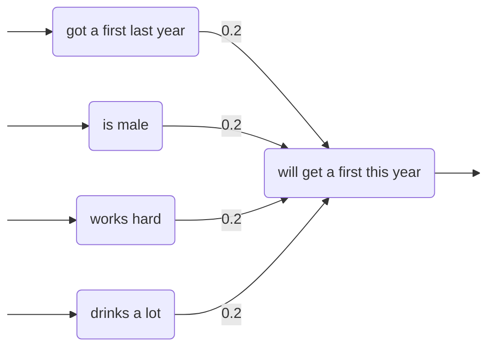

# Artificial neural networks

## Cawsey (1998)

\[Notes from §7.6 of *The Essence of Artificial Intelligence* by Alison Cawsey (1998)\]

§1. The human brain consists of billions of connected <mark>neurons</mark> (simple processing units). A neuron receives input from its neighbours, and if enough input is received at the same time, the neuron will ‘fire’, sending an output to other neurons. Input channels to a neuron are called ‘dendrites’, the output channel is called the ‘axon’, and the interfaces where axons meet dendrites are called ‘synapses’, which are mediated via ‘neurotransmitters’. Emission of neurotransmitters across a synapse can be altered over time, and this is how ‘learning’ happens in the brain.

§2. One kind of artificial neuron is the simple <mark>perceptron</mark>. A perceptron has a finite number of inputs, each of which will be either 0 or 1 at any particular time (depending on whether the source perceptron has recently fired or not). Each input has a corresponding weight, between 0 and 1. If the sum of the weighted inputs at any given time is greater than some threshhold (eg. 1), then the perceptron will fire, sending a signal of 1 along all its outputs. 

§3. The simple perceptron was proposed by Frank Rosenblatt in 1962 (1958) inspired by the McCulloch-Pitts neuron (1943).

§4. An <mark>artificial neural network</mark> (ANN) consists of perceptrons connected together via weighted inputs and outputs. 

§5. ANNs can be used as <mark>inductive learners</mark> - they can be trained on example data to become classifiers, by adjusting the weights on the connections between perceptrons.

§6. Here is some example data to train a simple classifier:
- Richard got a first last year, is male, doesn’t work hard, and drinks a lot; and he **didn’t** get a first this year.
- Alan got a first last year, is male, works hard, and doesn’t drink a lot; and he **did** get a first this year.
- Alison didn’t get a first last year, is not male, works hard, and doesn’t drink a lot; and she **didn’t** get a first this year.
- Jeff didn’t get a first last year, is male, doesn’t work hard, and drinks a lot; and he **didn’t** get a first this year.
- Gail got a first last year, is not male, works hard, and drinks a lot; and she **did** get a first this year.
- Simon didn’t get a first last year, is male, works hard, and drinks a lot; and he **didn’t** get a first this year.

§7. Here is a simple one-perceptron network that can be trained as a classifier for this example data:



§8. The training algorithm for this one-perceptron network is as follows:

```
Randomly initialise all weights.

Until the network has converged:
    For each student in the training data:
        Fire the relevant input perceptrons.
        If the perceptron fired but shouldn’t have:
            Decrease the weights on all active inputs by 0.05.
        Else if the perception didn’t fire but should have:
            Increase the weights on all active inputs by 0.05.
```

§9. A trained ANN classifier embodies <mark>subsymbolic</mark> knowledge, and is hence a ‘black box’.

§10. Minsky & Papert demonstrated in *Perceptions* (1969) that many important functions cannot be implemented using a perceptron classifier, eg. ‘exclusive *or*’. This led to a decline in interest in neural networks during the 1970s.

§11. There are many other kinds of ANN, other than those based on perceptrons.


----

Back up to: [Artificial intelligence](../index.md)
