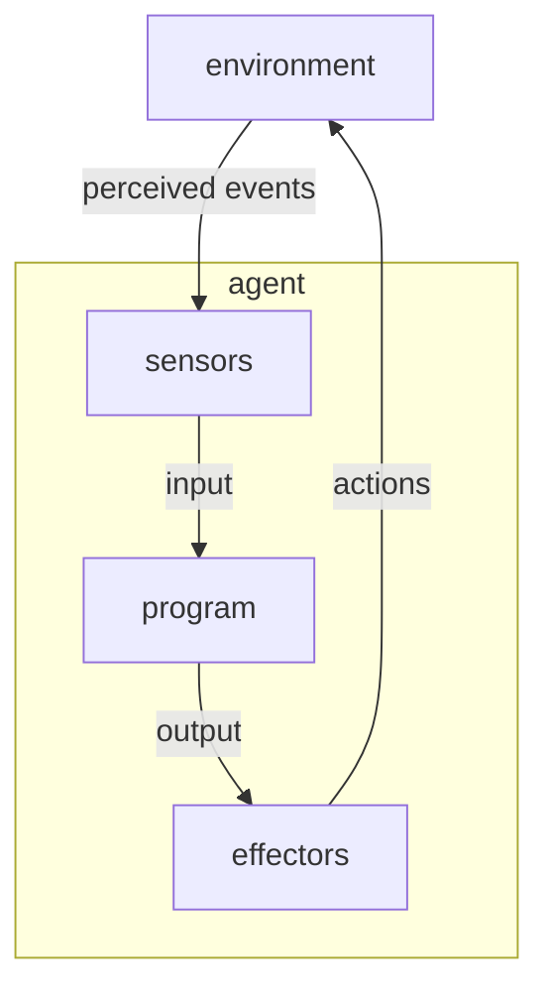

# Artificial intelligence – Intelligent agents

\[My notes from Chapter 2 of *Artificial Intelligence: A Modern Approach* by Stuart Russell and Peter Norvig (1995).\]

> An agent **perceives** its environment through sensors and **acts** upon its environment through effectors.
>
> An intelligent agent **does a good job** in acting upon its environment, by **knowing things**.

----
**Figure 2.1** – *Agents interact with environments through sensors and effectors.*

----

Contents:
- [How agents should act](how-agents-should-act)
- [Structure of intelligent agents](#structure-of-intelligent-agents)
- [Environments](#environments)

## How agents should act

Back up to: [Top](#)

## Structure of intelligent agents

Back up to: [Top](#)

## Environments

Back up to: [Top](#)

----

Back up to: [Russell and Norvig](index.md) (1995)
