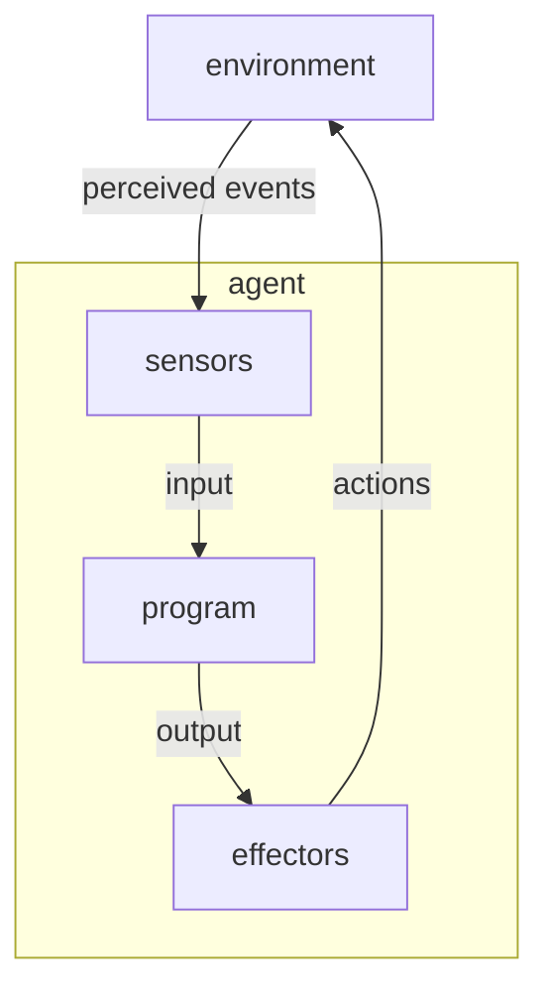

# Artificial intelligence – Intelligent agents

\[My notes from Chapter 2 of *Artificial Intelligence: A Modern Approach* by Stuart Russell and Peter Norvig (1995).\]

> An agent **perceives** its environment through sensors and **acts** upon its environment through effectors.
>
> An intelligent agent **does a good job** in acting upon its environment, by **knowing things**.

**Figure 2.1** – *Agents interact with environments through sensors and effectors.*

----

Contents:
- [How agents should act](how-agents-should-act)
- [Structure of intelligent agents](#structure-of-intelligent-agents)
- [Environments](#environments)

## How agents should act

A rational (intelligent) agent does the right thing ie. the thing that causes it to be most successful. But:
- How do we evaluate the agent’s success? What is our objective, external <mark>performance</mark> measure for how successful an agent is in its environment?
- When do we evaluate the agent’s success? 

A rational agent is not <mark>omniscient</mark> – it cannot know the *actual* outcome of its actions, just the *expected* outcome, given what has been perceived (the <mark>percept sequence</mark>).

> For each possible percept sequence, an **ideal rational agent** should do whatever action id expected to maximise its performance measure, on the basis of the evidence provided by the percept sequence and whatever built-in knowledge the agent has.

An agent can be described by its **mapping** from from percept sequences to actions.

If an agent’s actions are completely based on built-in knowledge, and it needs pay no attention to its percepts, then the agent lacks <mark>autonomy</mark>.

> A system is autonomous to the extent that its behaviour is determined by its own experience.

A rational agent needs, not just built-in knowledge, but also the ability to <mark>learn</mark>. A truly autonomous intelligent agent should be able to operate successfully in a wide range of environments, given sufficient time to adapt.

Back up to: [Top](#)

## Structure of intelligent agents

Back up to: [Top](#)

## Environments

Back up to: [Top](#)

----

Back up to: [Russell and Norvig](index.md) (1995)
