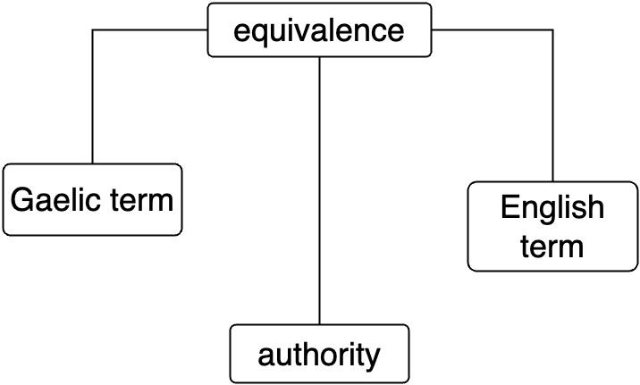

# The Briathradan data model

At the most fundamental level, Briathradan contains: **Gaelic terms** (eg. *balach*, *gille*); **English terms** (eg. *boy*, *lad*); and a **many-to-many equivalence relation** between them and the relevant authorities.

Such a simple data model allows for the two basic tasks/queries:
- What does authority X say Gaelic term Y means (in English)?
- What does authority X say is the Gaelic for (English term) Y?

This simple data model takes the following, slightly normalised tabular form:

```
| Gaelic                    |
| id  | form    | authority |
-----------------------------
| 1   | balach  | Dwelly    |
| 2   | gille   | Dwelly    |
| 3   | balach  | MacBain   |
| 4   | gille   | MacBain   |
| 5   | ballach | MacLaren  |
| ... | ...     | ...       |


| English      |
| ref | form   |
----------------
| 1   | boy    |
| 1   | lad    |
| 2   | boy    |
| 2   | lad    |
| 3   | boy    |
| 4   | lad    |
| 5   | laddie |
| ... | ...    |
```

Some SQL queries:

```
SELECT English.form, Gaelic.authority
FROM Gaelic
JOIN English
ON Gaelic.id = English.ref
WHERE Gaelic.form = 'gille';
```

```
SELECT Gaelic.form, Gaelic.authority
FROM Gaelic
JOIN English
ON Gaelic.id = English.ref
WHERE English.form = 'boy';
```

-----

Here is an ERD for this data model so far:



## Inflectional forms

A Gaelic term will often have a range of inflectional variants:
- *balach* has the plural form *balaich* and the genitive singular *balaich*
- *gille* has the plural form *gillean*

- What does authority X say that Gaelic term/form Y means?
- What does authority X say are the variant forms of Gaelic term Y?

Rather than include these as independent Gaelic terms, it makes more sense, and is more efficient and elegant, to include them in a separate table, linked to entities in the `Gaelic terms` table:

```
| variants |
| Gaelic ID | variant | class    | authority |
----------------------------------
| 1         | balaich | plural   | 1 |
| 1         | balaich | genitive | 1 |
| 2         | gillean | plural   | 1 |
| 2         | gillean | plural   | 2 |
| 2         | gillean | plural   | 2 |
| ...       | ...     | ...      |
```


## Hidden English terms?
