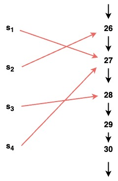

# Basic data analysis

Some introductory notes from LinkedIn Learning course *Learning Excel: Data Analysis* (Curt Frye, September 2022).

## Foundational concepts

In its simplest form a dataset can be presented as a list of numbers (integers), eg. a column of cells in a spreadsheet, like:

```
Days in transit = [23, 38, 29, 28, 30, 28, 29, 27, 27, 28, 37]
```

One basic operation on this kind of (numeric) dataset is to **sort** it:

```
Days in transit (sorted) = [23, 27, 27, 28, 28, 28, 29, 29, 30, 37, 38]
```

### Descriptive measures of a smple dataset

The most basic descriptive facts about (the distribution of values in) this kind of dataset are:
- the **mean** – the average value ie. `(23 + 38 + 29 + 28 + 30 + 28 + 29 + 27 + 27 + 28 + 37) / 11 = 29.45 days`
- the **median** – the middle value in the sorted dataset ie. `28 days`
- the **mode** – the mode common value ie. `28 days`
- the **minimum** value – the first value in the sorted dataset ie. 23 days
- the **maximum** value - the last value in the sorted dataset ie. 38 days
- the **first quartile** (or 25th percentile) – the median of the lower half of the sorted dataset
- the **third quartile** (or 75th percentile) – the median of the upper half of the sorted dataset
- the **variance** – the mean of the squared differences between each datum in the dataset and the mean
- the **standard deviation** – the square root of the variance

If the mean and the median are close together, then the data is generally very evenly distributed (with few outliers).


### Datasets as graphs

Importantly, at its most fundamental level, even this very simple kind of dataset is a graph:
- There are 11 (labelled) nodes, each of which represents a shipment.
- There is a non-finite set of (non-negative) integers, representing the number of days the shipment was in transit.
- Every shipment node is connected to exactly one integer node, by a labelled edge (ie. this is numeric data).

The basic facts are:

```
shipment(s1)
shipment(s2)
. . .
shipment(s11)
days_in_transit(s1,27)
days_in_transit(s2,26)
. . .
days_in_transit(s11,37)
```

And the dataset schema (data model?) is:

```
∀x. shipment(x) ∨ x ∈ {1, 2, 3, ...}
∀x. shipment(x) ↔ x ∉ {1, 2, 3, ...}
∀x. shipment(x) ↔ ∃y. ~shipment(y) & days_in_transit(x,y)
∀x∀y∀P. P(x,y) → days_in_transit(x,y)
```
Here is an example of a fragment of this dataset represented as a graph. The red lines encode the `days_in_transit` relation, the black lines encode the linear ordering relationship on integers.


