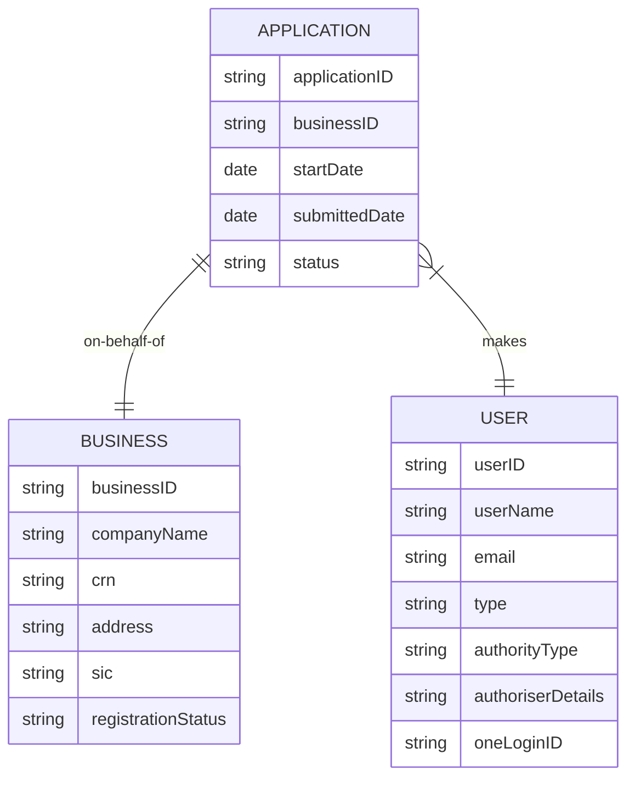

# BICS data model




```
erDiagram
    FACTORY ||--|{ METER : contains
    ENERGY-SUPPLIER |o--|{ METER : supplies
    FACTORY { string postcode }
    METER { string MPAN }
    COMPANY }|--|{ MACHINE : operates
    COMPANY { string CRN }
    METER ||--|{ MACHINE : powers
    MACHINE }|--|{ PRODUCT : makes
    PRODUCT { string HS-code}
```
