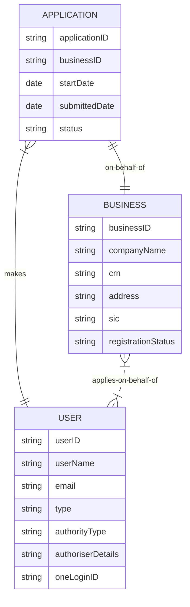

# BICS data model

## Applicaions, businesses and users

A `user` is a person making an application ie. an applicant.
- One user can make multiple applications (on behalf of different businesses).
- An application can be made by just the one user.
- If two different users try to make applications on behalf of the same business, then these are two separate applications. Only one can be submitted.
- It is unclear what the `type` attribute means on a user.
- It is unclear what the `authorityType` attribute means on a user.
- It is unclear what the `authoriserDetails` attribute means on a user.
- The `userID` attribute is not needed in a conceptual data model.

A `business` is a legal entity that an application is made on behalf of.
- The `businessID` attribute is not needed in a conceptual data model. `crn` is unique anyway.
- It is unclear what the `registrationStatus` attribute means on a business.
- A business can have up to four SIC codes, so this should be made clear.

An `application` is an event, denoting the process of an application, from start to finish.
- The `applicationID` attribute is not needed in a conceptual data model.
- `businessID` is a foreign key to a `business` entity, and hence is not needed in a conceptual data model.
- It is unclear what `status` means here.

