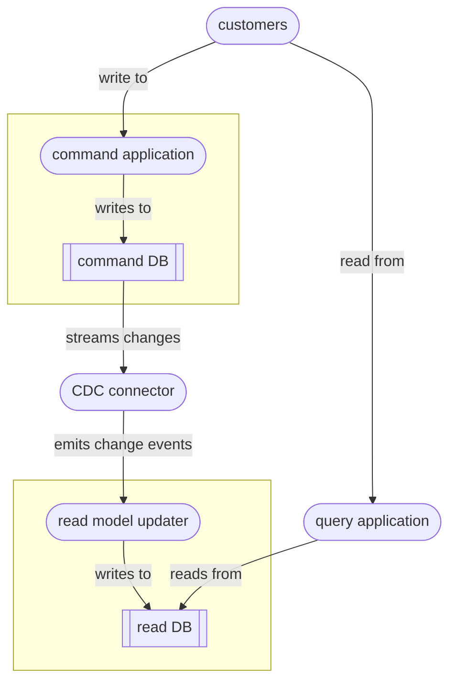

# Change Data Capture

`Change Data Capture` (CDC) is a way of adapting a traditional transactional database system to introduce read-optimised models. CDC works by monitoring changes to the underlying database and publishing those changes as events, which are then consumed by a separate process which keeps read models in sync. Using CDC means that you get some of the benefits of read-optimisation without needing to re-architect the whole database system – CDC is a ‘pragmatic on-ramp’ to read-side optimisation, but without the intentionality and semantic depth of fully [event-driven](../e/event_sourcing.md) systems.

Here is a diagram:

Some examples of popular CDC connectors are Debezium or Oracle LogMiner.

### Final thoughts

Other data-architectural patterns that attempt to solve the problem of scaling read-heavy workloads:
- [read replication](../r/read_replicas.md)
- [materialised database views](../m/materialised_views.md)
- [Command Query Responsibility Segregation](../c/CQRS.md) (CQRS)
- [event sourcing](../e/event_sourcing.md)
- domain-based decomposition, polyglot persistence 

Sources:
- Chapter 3 ‘Architecting read-side data’ of *Data Architecture* by [Pramod Sadalage](https://sadalage.com) & Premanand Chandrasekaran (O’Reilly 2026).

----

Back up to: [Maglocunus](../index.md)
