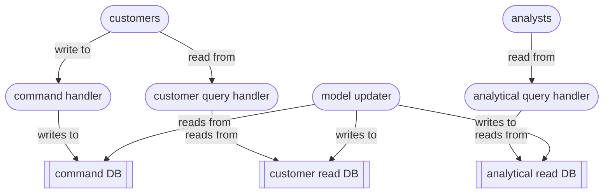

# Command Query Responsibility Segregation

`Command Query Responsibility Segregation` (CQRS)

an architectural design paper that explicitly separates the read and write sides of an application

situations where read and write data models need to evolve independently, because reads and writes have fundamentally different performance and consistency requirements

write operations prioritise data integrity and consistency - enforcing relationships, validations and transactional safety

read operations are optimised for speed, filtering and formatting – flattening and denormalising to minimise joins and improve retrieval speed

----

Back up to: [Maglocunus](../index.md)
