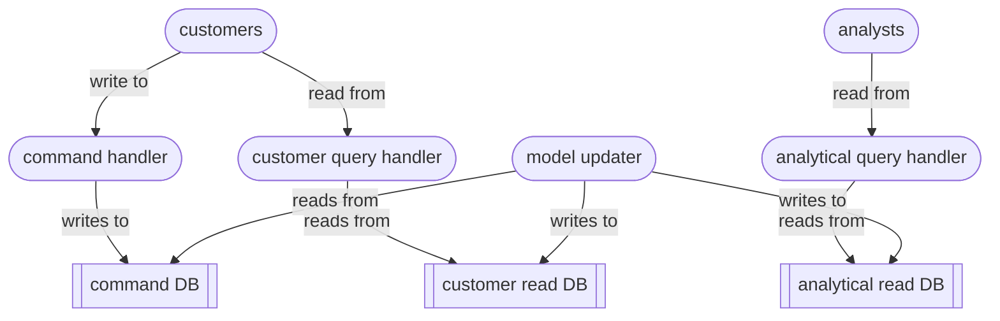

# Command Query Responsibility Segregation

`Command Query Responsibility Segregation` (CQRS)

an architectural design pattern that explicitly separates the read and write sides of an application

situations where read and write data models need to evolve independently, because reads and writes have fundamentally different performance and consistency requirements

write operations prioritise data integrity and consistency - enforcing relationships, validations and transactional safety

read operations are optimised for speed, filtering and formatting – flattening and denormalising to minimise joins and improve retrieval speed

The command handler and database deal with the transactional side of the system – focusing on data integrity and consistence, business rules, validation logic and domain invariants.

The two read handlers and databases are heavily optimised for different kinds of query.

The model updater projects changes from the write model into the read models. Possible approaches are:
- scheduled batch processing
- change data capture
- event streams

The overall system is easier to scale and to adapt to future demands.

use cqrs if

read and write access patterns are diverging
multiple audiences are consuming the data
the write model is growing in complexity
the system is being actively evolved and extended by different teams
a certain amount of refresh lag (eventual inconsistency) is tolerable

Mitigations:
- ensure clear ownership for command and query pipelines
- use automated validation to catch model drift
- use durable delivery mechanisms for model update – message queues, CDC; implement dead-letter queues and retry policies; monitor/observe/log everything
- introduce contract tests, integration tests and drift checks between read and write models; 

----

Back up to: [Maglocunus](../index.md)
