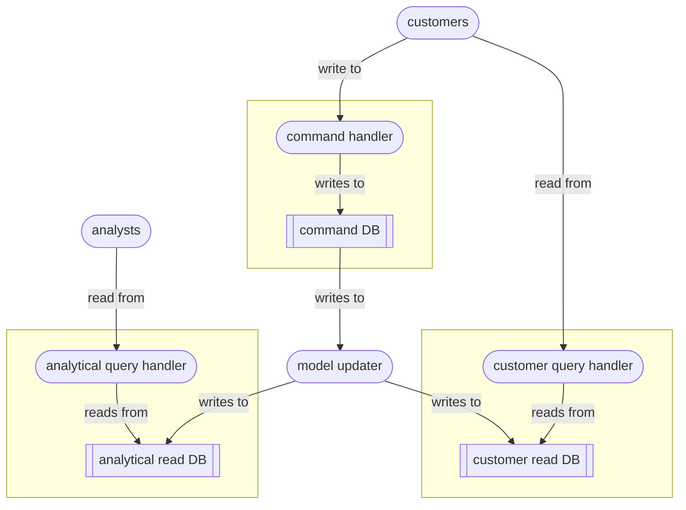

# Command Query Responsibility Segregation

`Command Query Responsibility Segregation` (CQRS) is an architectural design pattern that separates operations that change data (commands) from operations that read data (queries).

The core idea is:
- Commands modify the application’s state.
- Queries retrieve data but never modify it.
- Instead of having a single model or service do both, CQRS uses separate models, handlers, and sometimes separate databases for reads and writes.

The following diagram shows a typical CQRS deployment:

The model updater projects changes from the write model into the read models. Possible approaches are:
- scheduled batch processing
- change data capture
- event streams.

The overall system should be easier to scale and to adapt to future demands.

### Advantages and disadvantages

You should consider using CQRS if:
- read and write access patterns are diverging, with fundamentally different performance and consistency requirements
- multiple audiences are consuming the data, requiring heavy optimisation for different kinds of query, as well as flattening and denormalisation to minimise joins
- the write model is growing in complexity, and you need a stronger focus on data integrity and consistency, business rules, validation logic and domain invariants
- the system is being actively evolved and extended by different teams
- a certain amount of refresh lag (eventual inconsistency) is tolerable.

Some mitigation strategies to counter the risks of CQRS are:
- ensure clear ownership for command and query pipelines
- use automated validation to catch model drift
- use durable delivery mechanisms for model update – message queues, CDC; implement dead-letter queues and retry policies; monitor/observe/log everything
- introduce contract tests, integration tests and drift checks between read and write models.

### Final thoughts

Other data-architectural patterns that attempt to solve the problem of scaling read-heavy workloads:
- [read replication](../r/read_replicas.md)
- [materialised database views](../m/materialised_views.md)
- [Change Data Capture](../c/CDC.md) (CDC)
- event sourcing
- domain-based decomposition, polyglot persistence 

Sources:
- Chapter 3 ‘Architecting read-side data’ of *Data Architecture* by [Pramod Sadalage](https://sadalage.com) & Premanand Chandrasekaran (O’Reilly 2026).

----

Back up to: [Maglocunus](../index.md)

----

Back up to: [Maglocunus](../index.md)
