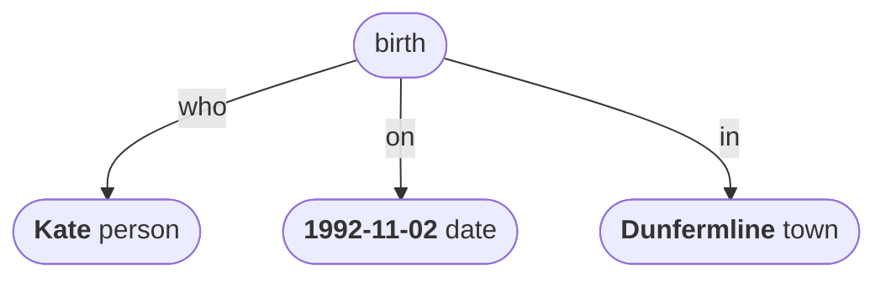
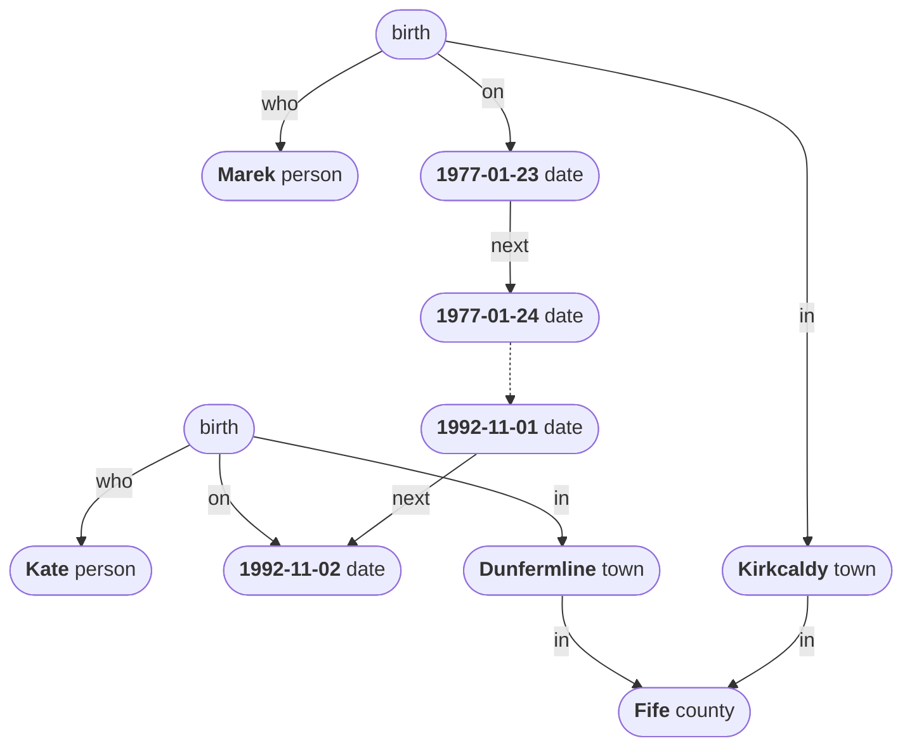
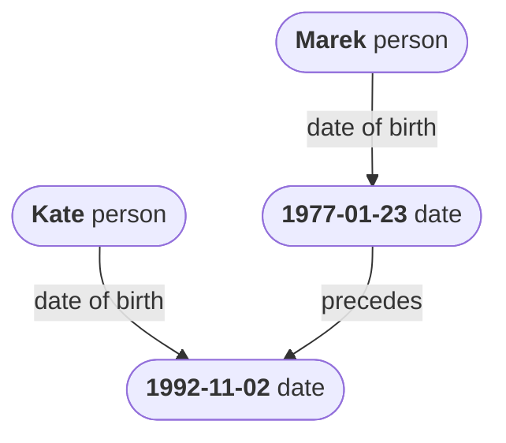
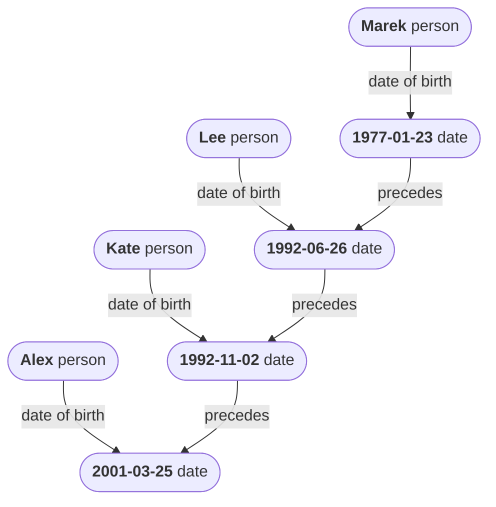
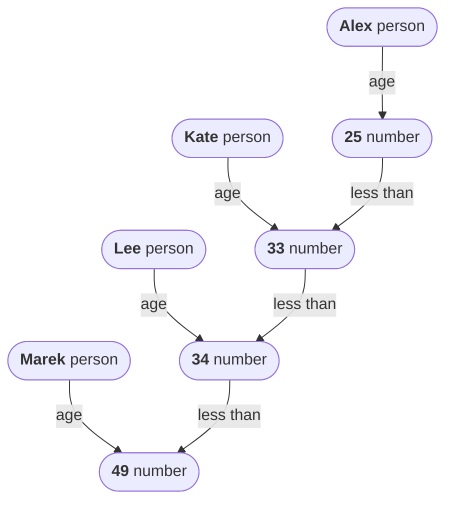
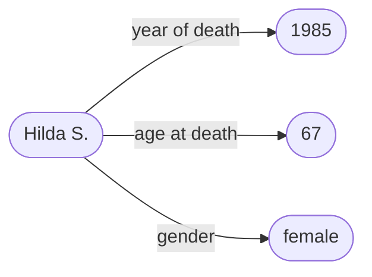

# Data

Data is, from the outside, a web of relationships between entities that exist in the world. Zooming in a bit, data can be seen as an aggregate of individual pieces of information. Each such *datum* (or data *point*) is a connection between two entities, and this connection represents some fact, measurement or observation about the world.  

The following sentence encodes some simple data:

> Kate was born in Dunfermline on the second of November 1992.

This data can be represented as a graph, consisting of entities and relationships:

The root entity here represents a specific *birth event*, which took place *on* the date and *in* the town specified, and which involved a new person named ‘Kate’ entering the world. 

Note that Kate’s birth can be viewed as an entity in our world, much like Kate herself is an entity in our world. A birth is a special kind of entity known as an *event* – something that has happened. Other *entity types* represented in the data graph are *person*, *date* and *town*.

To summarise:

> Data consists of relationships between events, people, places, times, and other types of entity.

We can expand this simple data graph by adding more entities and more relationships:

Note that, while there are two entities in this data graph labelled ‘birth’, these are not the same entity. Kate’s birth and Marek’s birth were two distinct events, happening at different times and in different places. But they were distinct events of the same type, as both were *births*. 

We can see from this data graph that Kate and Marek may have been born in different years and in different town, but they were both born in the same county. It is also clear that Marek was born before Kate, with dates being ordered by the ‘next’ relationship. The dotted line between certain pairs of dates indicates that there are lots of intervening dates and links between the two.

Fundamentally, this is all there is to data. It consists of entities of different types, connected by relationships of different kinds, all linked up in a web of information about the world. 

## Distilled data

Here is a *distilled* version of the data graph from above, where many of the entities and relationships have been removed or relabelled, allowing us to focus on just a few aspects:

This data graph zooms in on just the people and their dates of birth. We can add more instances as needed:

This graph is equivalent to the following data table:

| name  | date of birth |
| ----- | ------------- |
| Marek | 1977-01-23    |
| Lee   | 1992-06-26    |
| Kate  | 1992-11-02    |
| Alex  | 2001-03-25    |

## Derived, quantitative data

We can now take the distilled data from the previous section, and *derive* a new data graph from it. In this case we are mapping each person not to their date of birth, but to a value derived from that – the number of full years that have passed from that data to the current time, ie. their age.

This graph is equivalent to the following data table:

| name  | age |
| ----- | --- |
| Marek | 49  |
| Lee   | 34  |
| Kate  | 33  |
| Alex  | 25  |

Note that we have introduced a new entity type here – *numbers*. In the world of data, numbers are first-class entities, just like people, events, places, etc.

A relationship like *age*, which maps people to numbers, is known as *quantitative* data.

For all x if x is a person then there is some y such that x age y and this is today - x’s date of birth.

Things you can do with quantitatve data? average etc.

Qualitative data? clustered? frquency distributions.

Quantitative to qualitative?

----

Here is another example:

> Kate is 175cm tall.

Also:

> Kate is female.

## Shipman dataset

Shipman killed person X of age Y and gender Z in year W. 

mmm

mmm

mmm

----

Back up to: [Top](../index.md)
