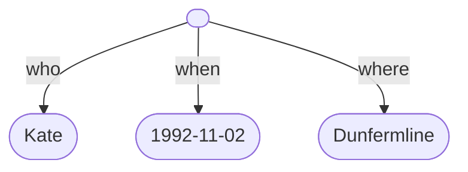
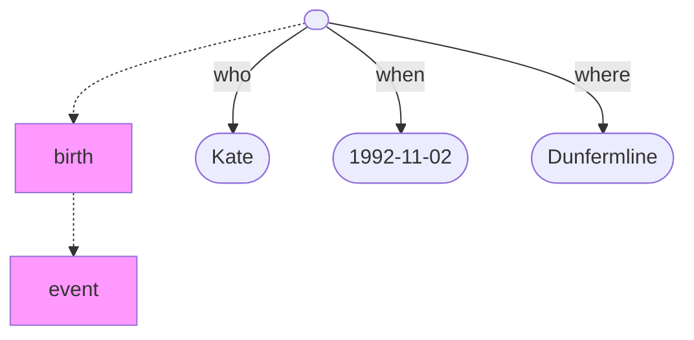
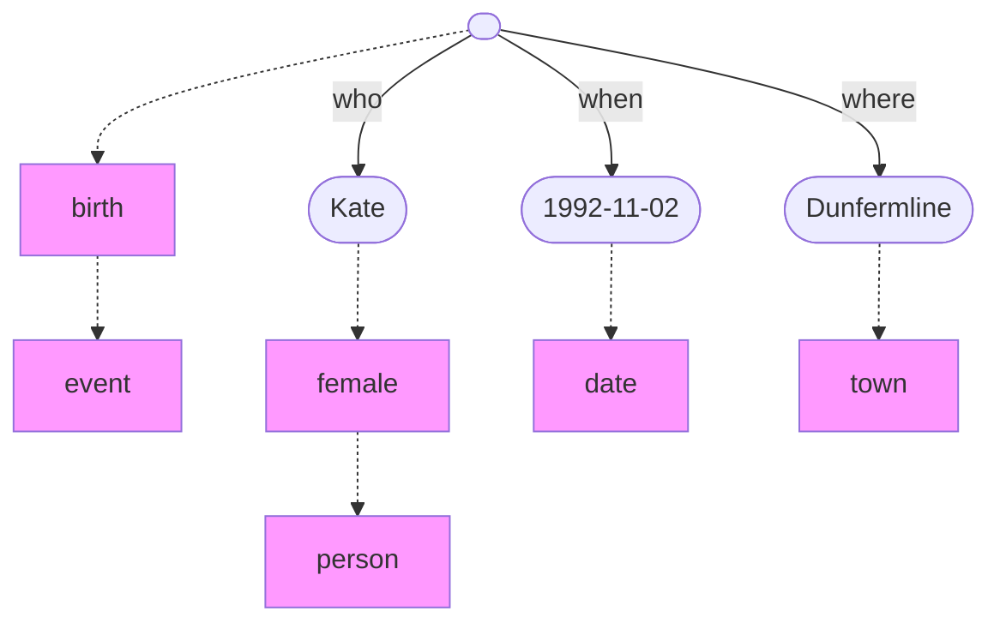
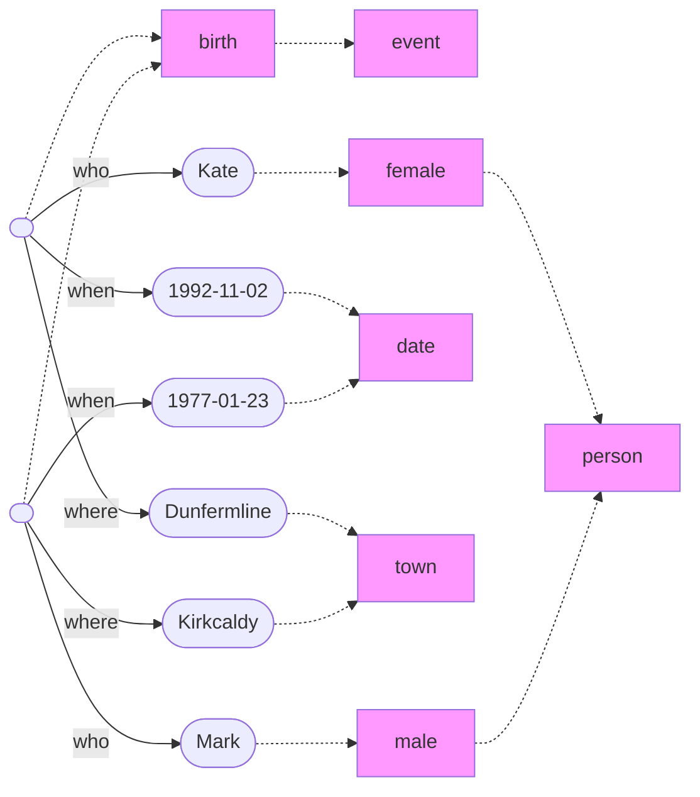
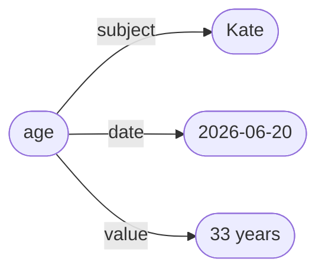
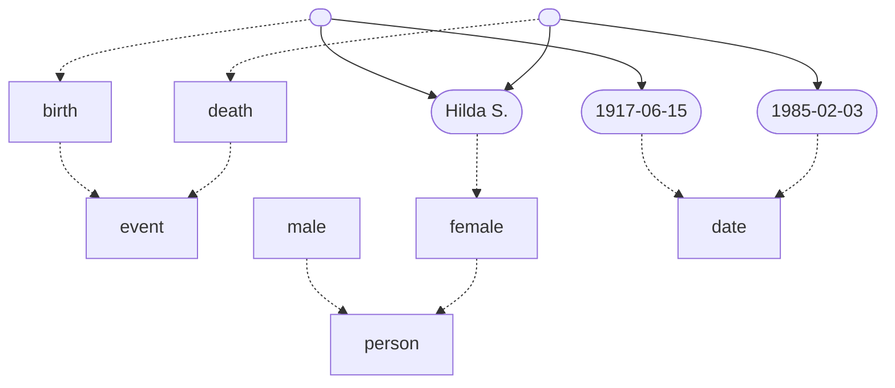
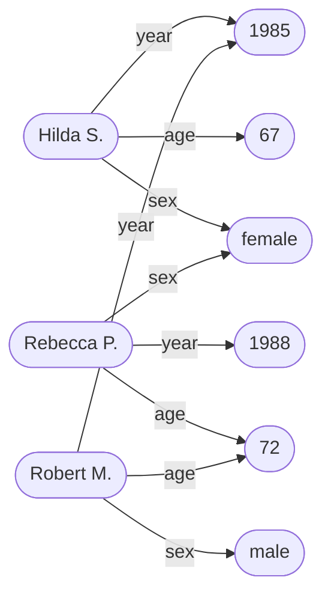

# Data

Data is, essentially, a web of relationships between entities in the world. Zooming in a bit, data can be seen as an aggregate of individual pieces of information. Each such *datum* (or data *point*) is a connection between two entities, and this connection represents some fact, measurement or observation about the world.  

The following sentence encodes some simple data:

> Kate was born in Dunfermline on the second of November 1992.

This data can be represented as a graph, consisting of entities and connections:

The unlabelled root entity here represents a specific *birth event*, which took place on the date (the *when*) and in the town (the *where*) specified, and which involved a new person named ‘Kate’ (the *who*) entering the world. 

Note that Kate’s birth can be viewed as an entity in our world, much like Kate herself is an entity in our world. A birth is a special kind of entity known as an *event* – something that has happened. We can represent this in our data graph by adding *entity types*:

Entity types are represented as rectangles, but entities themselves are represented as oblongs. The connection between an entity and its type is a dotted line. The connection between two types is also a dotted line, with one being a subtype of the other, eg. births are a subtype of event.

We can read the data graph above as saying that what happened to Kate in Dunfermline in 1992 was an instance of a *birth*, and that births are a kind of *event*.

We can add other relevant entity types to the data graph as well:

Let’s add another birth event to the data graph:

Dunfermline and Kdy are both in Fife, in Scotland.

The dates are ordered to each other.

The dates are in years?

----

Here is another instance of a datum:

> Kate was 33 years old on the twentieth of June 2006.

stative datum?

This is a *derived* datum, derived formulaically from the event datum in the previous example. This is also a *quantitative* datum, involving a *count* of the number of birthdays the person has celebrated since birth.

Derived datum:

> Kate is (currently) 33 years old.

qualitative data, counting - the number of years that have passed since Kate was born. The number of birthdays she has celebrated.

Here is another example:

> Kate is 175cm tall.

Also:

> Kate is female.
>
> Kate has dark red hair.
>
> Kate has no tattoos.
>
> Kate likes Mark.

subject = Kate
attribute = birthdate, height, sex, hair colour, number of tattoos, likes
value = 1992-11-02, 175cm, female, dark red, 0, Mark 

types:
- quantitative datum (counts and measurements)
- qualitative datum
- categorical datum
- ordinal data (events?)
- derived datum - Kate is 33 years old. (ie. a formula)

----

## Shipman dataset

Shipman killed person X of age Y and gender Z in year W. 

mmm

mmm

mmm

----

Back up to: [Top](../index.md)
