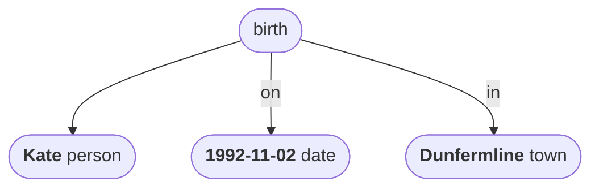
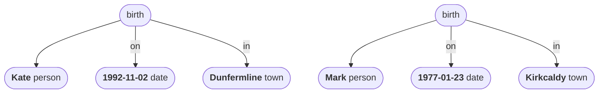
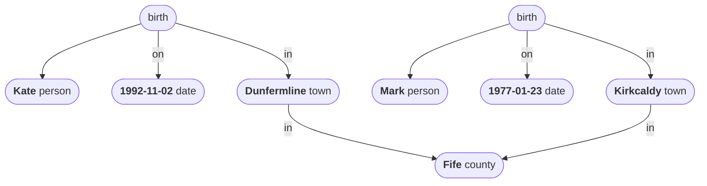
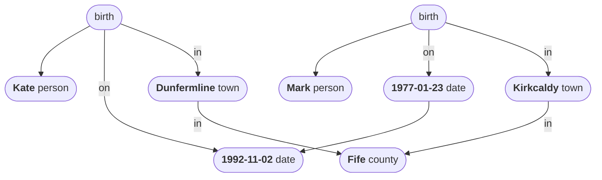

# Data

Data is, essentially, a web of relationships between entities in the world. Zooming in a bit, data can be seen as an aggregate of individual pieces of information. Each such *datum* (or data *point*) is a connection between two entities, and this connection represents some fact, measurement or observation about the world.  

The following sentence encodes some simple data:

> Kate was born in Dunfermline on the second of November 1992.

This data can be represented as a graph, consisting of entities and connections:

The root entity here represents a specific *birth event*, which took place *on* the date and *in* the town specified, and which involved a new person named ‘Kate’ entering the world. 

Note that Kate’s birth can be viewed as an entity in our world, much like Kate herself is an entity in our world. A birth is a special kind of entity known as an *event* – something that has happened. Other *entity types* represented in the data graph are *person*, *date* and *town*.

Let’s add another birth event to the data graph:

Note that, while there are two entities in this data graph labelled ‘birth’, these are not the same entity. Kate’s birth and Mark’s birth were two distinct events, happening at different times and in different places! But they were distinct events of the same type, as in both were *births*. 

Let’s add some additional geographical information to the data graph now:

Since Dunfermline and Kirkcaldy are both towns in Fife, Kate and Mark were both born in the same county.

The dates are ordered to each other.

The dates are in years?

kissed?

name and entity type together in lozenge?

entity relations separate diagram?

----

Here is another instance of a datum:

> Kate was 33 years old on the twentieth of June 2006.

stative datum?

This is a *derived* datum, derived formulaically from the event datum in the previous example. This is also a *quantitative* datum, involving a *count* of the number of birthdays the person has celebrated since birth.

Derived datum:

> Kate is (currently) 33 years old.

qualitative data, counting - the number of years that have passed since Kate was born. The number of birthdays she has celebrated.

Here is another example:

> Kate is 175cm tall.

Also:

> Kate is female.
>
> Kate has dark red hair.
>
> Kate has no tattoos.
>
> Kate likes Mark.

subject = Kate
attribute = birthdate, height, sex, hair colour, number of tattoos, likes
value = 1992-11-02, 175cm, female, dark red, 0, Mark 

types:
- quantitative datum (counts and measurements)
- qualitative datum
- categorical datum
- ordinal data (events?)
- derived datum - Kate is 33 years old. (ie. a formula)

----

## Shipman dataset

Shipman killed person X of age Y and gender Z in year W. 

mmm

mmm

mmm

----

Back up to: [Top](../index.md)
