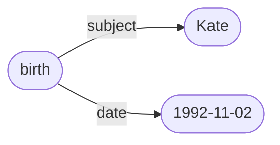
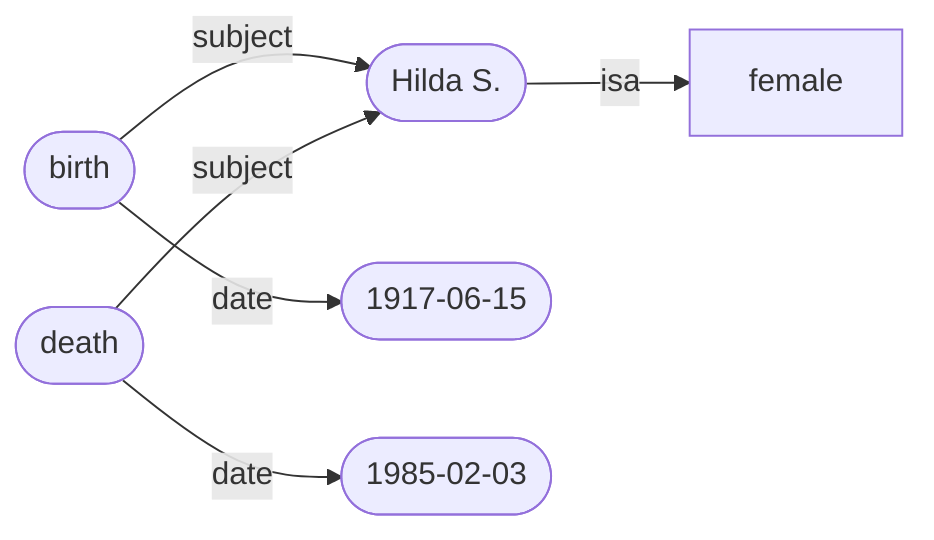

# Data

The word *data* is the plural form of the singular noun *datum*. 

Data is essentially an aggregate of objects each of which is an individual datum. A datum can be thought of as an item of information, a data point, a fact, a measurement, or an observation.

The following sentence encodes two data:

> Kate was born on the second of November 1992.

This is an *event* datum, capturing the event of someone being born (and this birth’s location in time), presumably as observed and recorded by a medical professional. The event has a type (*birth*), a subject (*Kate*), and a date (1992-11-02). 

Here is another instance of a datum:

> Kate was 33 years old on the twentieth of June 2006.

stative datum?

This is a *derived* datum, derived formulaically from the event datum in the previous example. This is also a *quantitative* datum, involving a *count* of the number of birthdays the person has celebrated since birth.

Derived datum:

> Kate is (currently) 33 years old.

qualitative data, counting - the number of years that have passed since Kate was born. The number of birthdays she has celebrated.

Here is another example:

> Kate is 175cm tall.

Also:

> Kate is female.
>
> Kate has dark red hair.
>
> Kate has no tattoos.
>
> Kate likes Mark.

subject = Kate
attribute = birthdate, height, sex, hair colour, number of tattoos, likes
value = 1992-11-02, 175cm, female, dark red, 0, Mark 

types:
- quantitative datum (counts and measurements)
- qualitative datum
- categorical datum
- ordinal data (events?)
- derived datum - Kate is 33 years old. (ie. a formula)

----

## Shipman dataset

Shipman killed person X of age Y and gender Z in year W. 

mmm

mmm

mmm

----

Back up to: [Top](../index.md)
