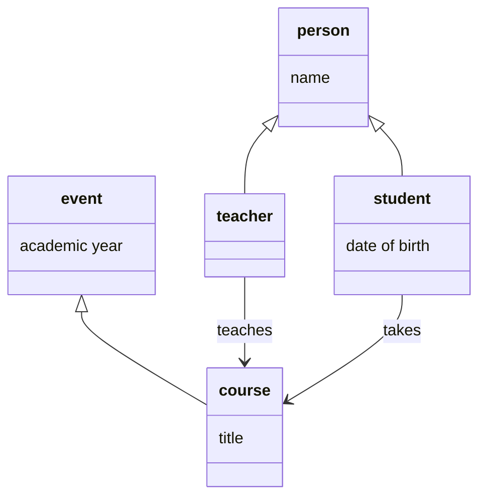
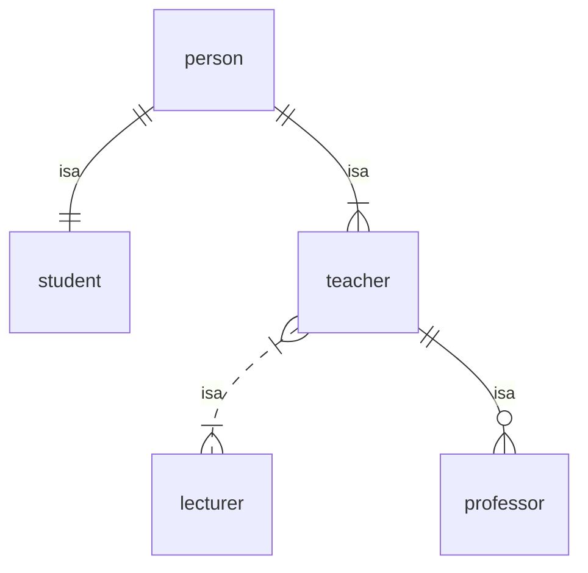
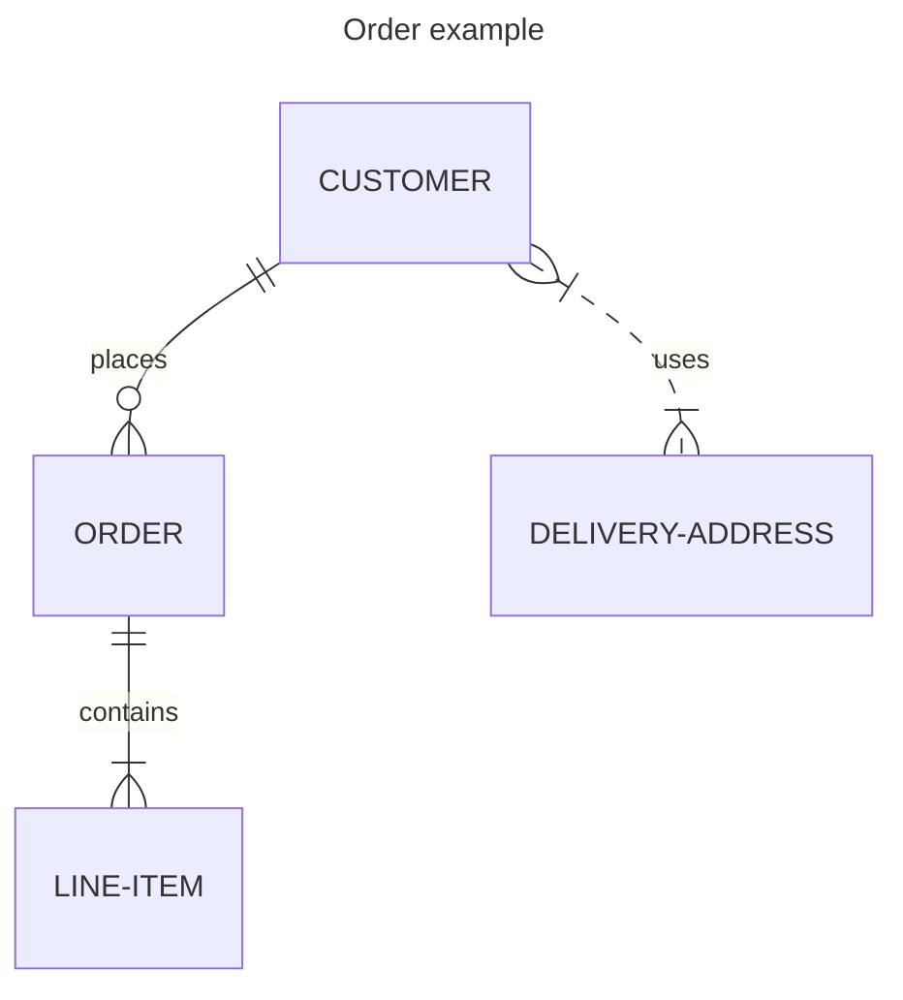

# Data models

A `data model` is a set of generic statements describing some aspect of the world.

For example, here is a simple informal data model describing some aspects of the academic world:
> Every person has a name and is either a student or a teacher.
>
> Every student has a date of birth.
>
> Students take courses and teachers teach them.
>
> Every course has a title, and runs within an academic year.

This data model contains a few distinct types of `entity`:
- *students* and *teachers* are different kinds of *person*
- *courses* are a kind of *event*

These entities are associated with particular `attributes`:
- people have *names*
- students have *dates of birth*
- events occur within *academic years*
- courses have *titles*

Finally, this data model assumes two different `relations` between entities:
- teachers *teach* courses
- students *take* courses

### Formal data models – class diagrams

There are many different ways of formalising a data model. For example, we could draw a `class diagram`:

In this diagram, each type of entity (or ‘class’ of ‘object’) is represented by its own tripartite box, with the name of the entity type in the top part of the box. The diagram contains five boxes representing the entity types ‘person’, ‘student’, ‘teacher’, ‘event’, and ‘course’.

The unlabelled arrows between entity types represent the ‘inheritance’ or ‘subtype’ relation, so:
- Every student is a person.
- Every teacher is a person.
- Every course is an event.

The middle part of each box represents the attributes associated with the entity type, so:
- Every person has a name.
- Every student has a date of birth.
- Every event happens within an academic year.
- Every course has a title.

If entity type *A* is a subtype of entity type *B*, and *B* has an associated attribute, then *A* ‘inherits’ that attribute from *B*, for example:
- Every student is a person, and every person has a name, so every student also has a name.

The labelled arrows between entity types represent relations, so:
- Teachers teach courses.
- Students take courses.

### Formal data models – entity-relation diagrams

Another way of formalising a data model is by drawing an `entity-relation diagram`:

----

----
mmmm

### Formal data models – logics

---

Also known as an ontology (or schema?)

----

Back up to: [Top](../index.md)
