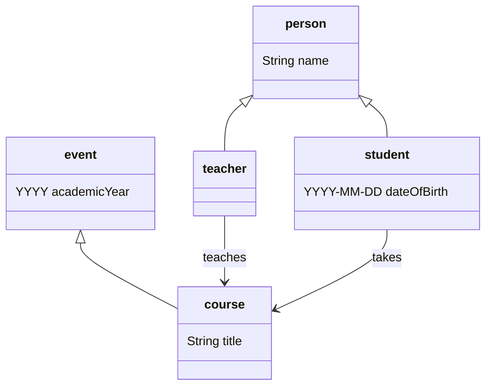
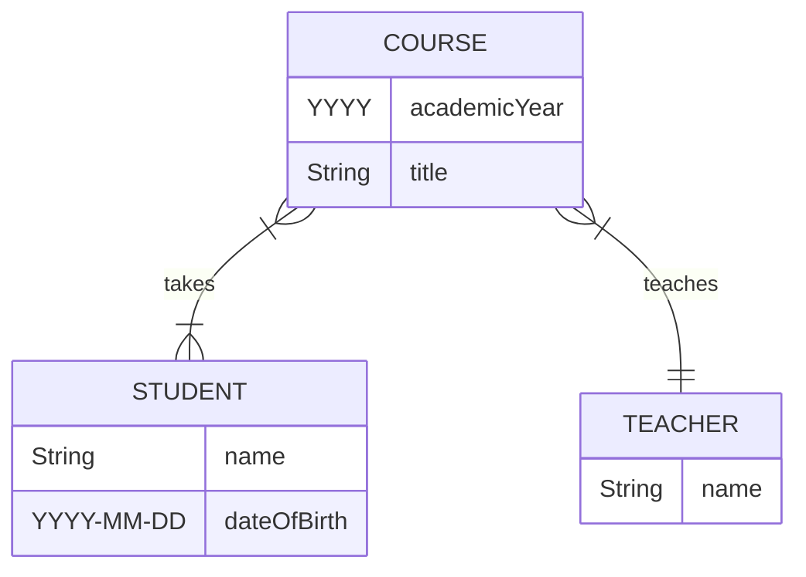

# Data models

A `data model` is a set of generic statements describing some aspect of the world.

For example, here is a simple informal data model describing some aspects of the academic world:
> Every person has a name and is either a student or a teacher.
>
> Every student has a date of birth.
>
> Students take courses and teachers teach them.
>
> Every course has a title, and runs within an academic year.

This data model contains a few distinct types of `entity`:
- *Students* and *teachers* are different kinds of *person*.
- *Courses* are a kind of *event*.

These entities are associated with particular `attributes`:
- People have *names*.
- Students have *dates of birth*.
- Events occur within *academic years*.
- Courses have *titles*.

Finally, this data model assumes two different `relations` between entities:
- Teachers *teach* courses.
- Students *take* courses.

A `data base` consists of a `data model` and a `data set`.

### Class diagrams

There are many different ways of formalising a data model. For example, we could draw a `class diagram`:



In this diagram, each type of entity (or ‘class’ of ‘object’) is represented by its own tripartite box, with the name of the entity type in the top part of the box. The diagram contains five boxes representing the entity types ‘person’, ‘student’, ‘teacher’, ‘event’, and ‘course’.

The unlabelled arrows between entity types represent the ‘inheritance’ or ‘subtype’ relation, so:
- Every student is a person.
- Every teacher is a person.
- Every course is an event.

The middle part of each box represents the attributes associated with the entity type, so:
- Every person has a name.
- Every student has a date of birth.
- Every event happens within an academic year.
- Every course has a title.

If entity type *A* is a subtype of entity type *B*, and *B* has an associated attribute, then *A* ‘inherits’ that attribute from *B*, for example:
- Every student is a person, and every person has a name, so every student also has a name.

The labelled arrows between entity types represent relations, so:
- Teachers teach courses.
- Students take courses.

### Entity-relationship diagrams

Another way of formalising a data model is by drawing an `entity-relationship diagram` (or `ER diagram`):



As with class diagrams, in an ER diagram every entity type is represented by a box, again with the name of the entity type in the top part of the box. The ER diagram contains three boxes ‘student’, ‘teacher’, and ‘course’

Note that, unlike the class diagram above, this ER diagram does not contain entity types for ‘person’ or ‘event’. This is because ER diagrams cannot represent inheritance or subtypes relations between entity types – there is no way of saying ‘every student is a person’. This is one way in which ER diagrams are *less expressive* than class diagrams.

As with class diagrams, the lower part of the boxes lists the attributes associated with the entity type, so:
- Every teacher has a name.
- Every student has a name and a date of birth.
- Every course has a title and happens within an academic year.

As with class diagrams, the labelled arrows between entity types represent relations, so as before:
- Teachers teach courses.
- Students take courses.

However, the way relations are encoded in ER diagrams is *more expressive* than class diagrams since they include information about `cardinality`. So from the ER diagram we can read off the following cardinality information:
- Every course is taken by one or more students.
- Every student takes one or more courses.
- Every course is taught by exactly one teacher.
- Every teacher teaches one or more courses.

### RDF Schema

Classes:

```
:Person, :Student, :Teacher, :Event, :Course a rdfs:Class .
:Student, :Teacher rdfs:subClassOf :Person .
:Course rdfs:subClassOf :Event .
```

Properties:

```
:teaches, :takes a rdf:Property .
:teaches rdfs:domain :Teacher ; rdfs:range :Course .
:takes rdfs:domain :Student ; rdfs:range :Course .
```

Attributes:

```
:hasName, :hasDoB, :hasTitle, :inAcademicYear a rdf:Property .
:hasName rdfs:domain :Person ; rdfs:range xsd:String .
:hasDoB rdfs:Domain :Student ; rdfs:range xsd:Date .
:hasTitle rdfs:domain :Course ; rdfs:range xsd:String .
:inAcademicYear rdfs:Domain :Event ; rdfs:range xsd:Year .
```

Cardinality in OWL?

### Formal data models – logics

```
∀x.student(x) → person(x)
∀x.teacher(x) → person(x)
∀x.course(x) → event(x)

∀x.person(x) → ∃y.name(x,y)
∀x.student(x) → ∃y.dateOfBirth(x,y)
∀x.event(x) → ∃y.academicYear(x,y)
∀x.course(x) → ∃y.title(x,y)
∀x.course(x) → ∃y.teacher(y) ∧ teaches(y,x)
∀x.course(x) → ∃y.student(y) ∧ takes(y,x)
```

cardinality?

Closing the world:

```
∀x.person(x) → (student(x) ∨ teacher(x))
∀x.student(x) → ¬teacher(x)
∀x.teacher(x) → ¬student(x)
```
everything is an event or a person

every event is a course

a person is not an event, and vice versa

every teacher teaches a course


### Document Type Definitions

```
<!ELEMENT student EMPTY>
<!ELEMENT teacher EMPTY>
<!ELEMENT course (teacher, student+)>

<!ATTLIST student
  name CDATA #REQUIRED
  dateOfBirth Date #REQUIRED >

<!ATTLIST teacher
  name CDATA #REQUIRED >

<!ATTLIST course
  title CDATA #REQUIRED >
```

XML:

```
<course title="Informatics 1">
  <teacher name="Dr Mark McConville"/>
  <student name="Kate Alexandra Ranson" dateOfBirth="1992-11-03"/>
  <student name="Julie Sharon Port" dateOfBirth="1983-06-20"/>
  <student name="Jayne Shaw" dateOfBirth="1969-02-14"/>
</course>
```

inheritance via parameter entities?

```
<!ENTITY % person.common "name, age">

<!-- 'Inheriting' the common elements into an Employee -->
<!ELEMENT employee (%person.common;, employee_id)>

<!-- 'Inheriting' the common elements into a Customer -->
<!ELEMENT customer (%person.common;, loyalty_tier)>
```

DTDs are only good for **physical** data models (as XML documents).

----

Back up to: [Top](../index.md)
