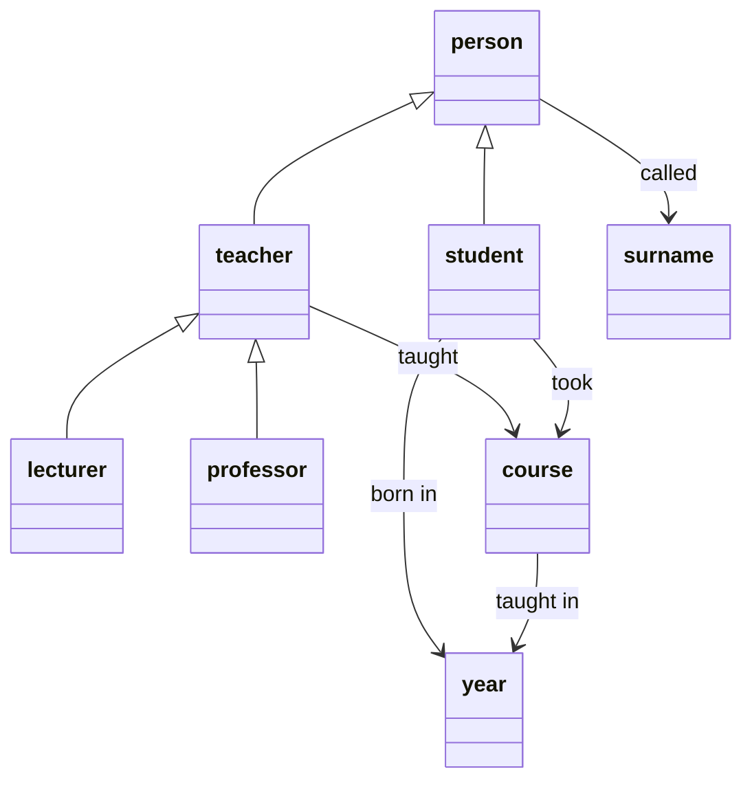
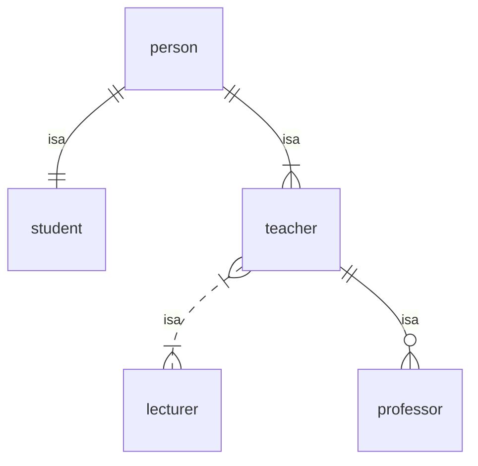
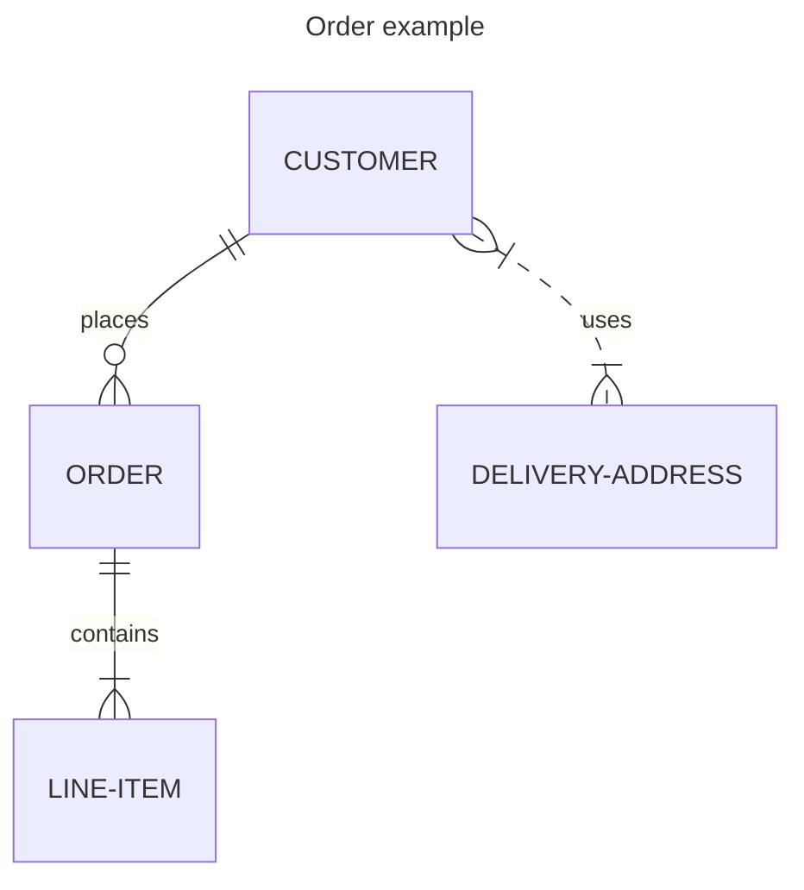

# Data models

A `data model` is a set of generic statements describing some aspect of the world.

For example, here is a simple data model describing some aspects of the academic world:
> There are people, each of whom is either a student or a teacher.
>
> Every person has a surname. 
>
> Every student has a year of birth.
>
> Every teacher is either a lecturer or a professor.
>
> There are completed courses, each of which had a name and a teacher, and each of which was completed during a single calendar year, by at least one student.

This data model contains a few distinct types of `entity`:
- *student* and *teacher* are different kinds of *person*

Every course has a subject and a level.

Student John Smith got an A in course 'Informatics 1' in 2005.

`got_grade(s9764747,INF1-2005,A)`

`taught(05145533,INF1-2005)`

undergraduate, postgraduate

Types of entity: student, teacher: people; course: event; year, title, surname

class inheritance diagram vs. class association diagram

----

----
mmmm

- a vocabulary of entity types and relationships
- a set of pure relational statements, each of which makes a generalisation about the entity types and relationships.

Also known as an ontology (or schema?)

----

Back up to: [Top](../index.md)
