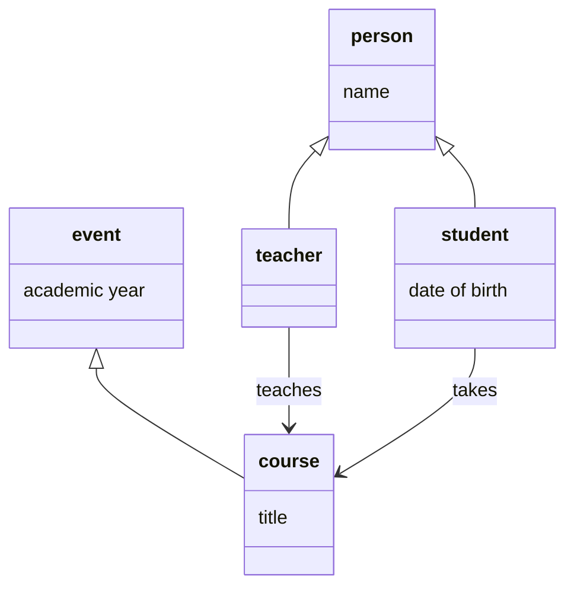
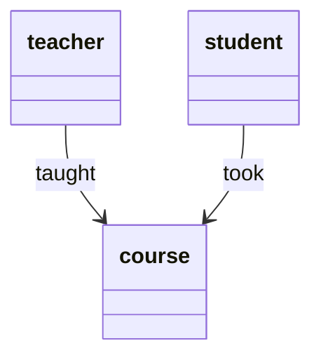
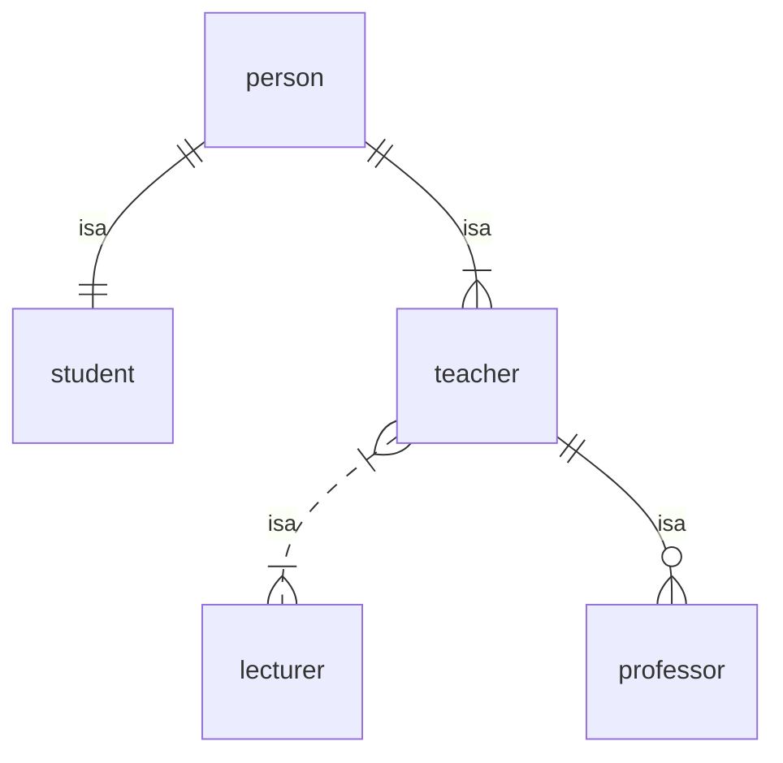
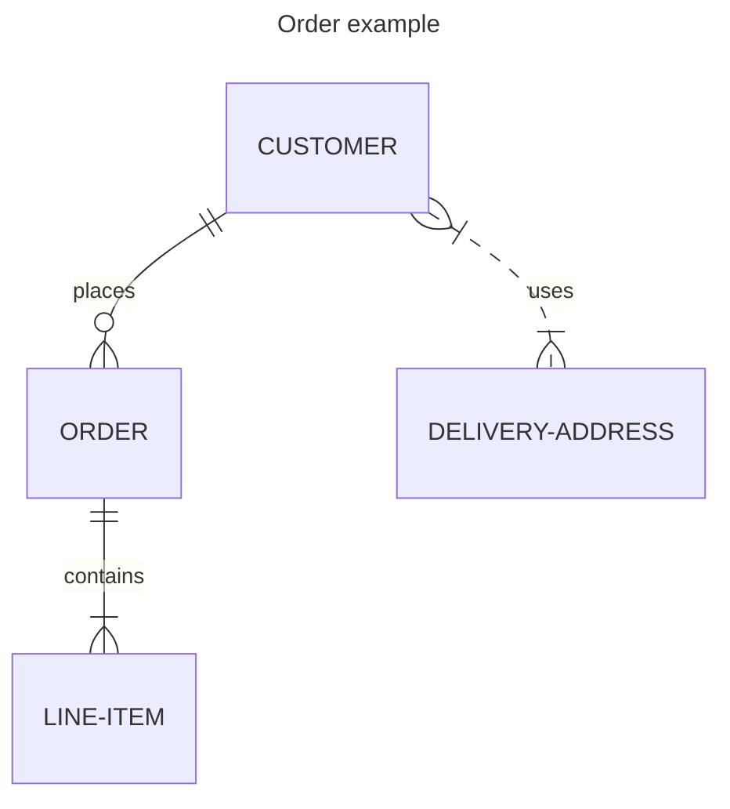

# Data models

A `data model` is a set of generic statements describing some aspect of the world.

For example, here is a simple informal data model describing some aspects of the academic world:
> There are students and teachers, each of whom has a name.
>
> Every student has a date of birth.
>
> Students take courses, run by a teacher during a particular academic year, and each of which has a title.

This data model contains a few distinct types of `entity`:
- *students* and *teachers* are different kinds of *person*
- *courses* are a kind of *event*

These entities are associated with particular `attributes`:
- people have *names*
- students have *dates of birth*
- events occur during *academic years*
- courses have *titles*

relations?

### Formal data models

FOL?

Some aspects of this data model can be formalised as a class diagram:

Every course has a subject and a level.

Student John Smith got an A in course 'Informatics 1' in 2005.

`got_grade(s9764747,INF1-2005,A)`

`taught(05145533,INF1-2005)`

undergraduate, postgraduate

Types of entity: student, teacher: people; course: event; year, title, surname

class inheritance diagram vs. class association diagram

----

----
mmmm

- a vocabulary of entity types and relationships
- a set of pure relational statements, each of which makes a generalisation about the entity types and relationships.

Also known as an ontology (or schema?)

----

Back up to: [Top](../index.md)
