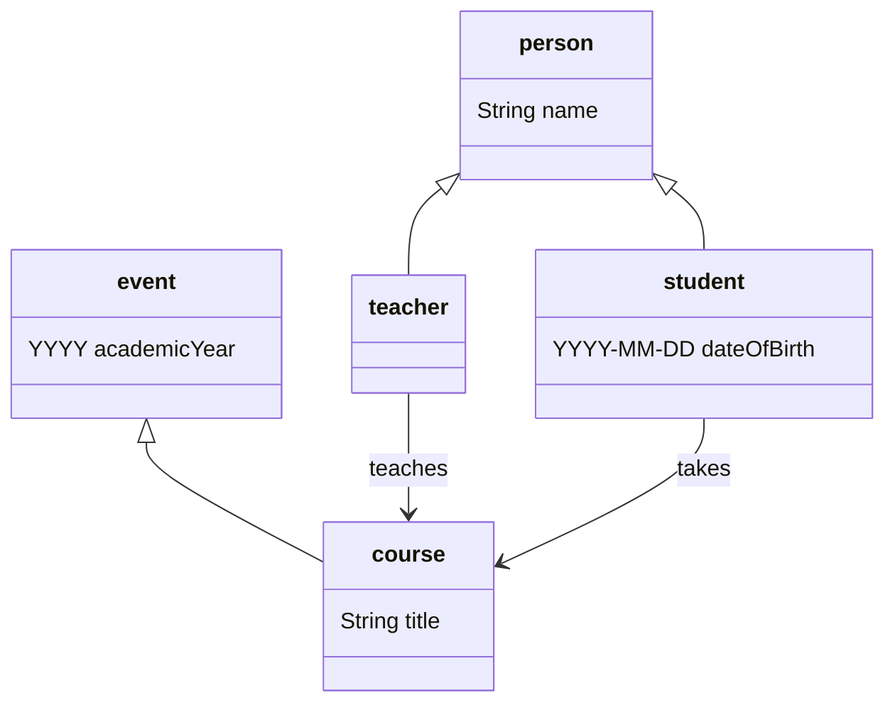
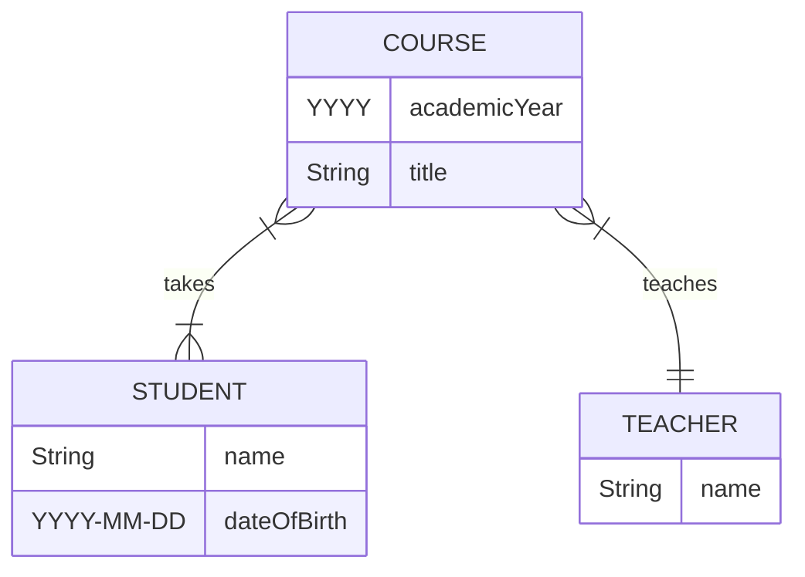
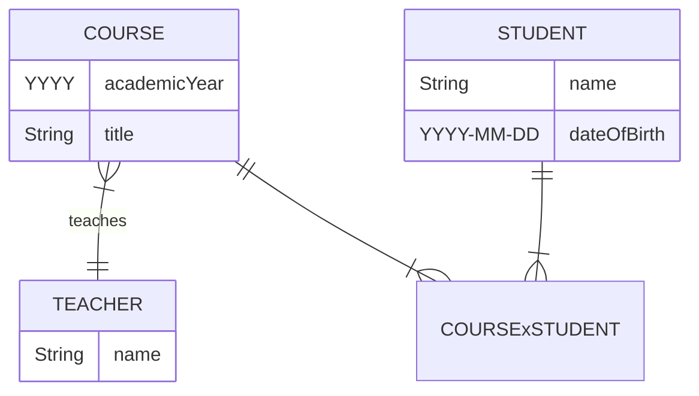
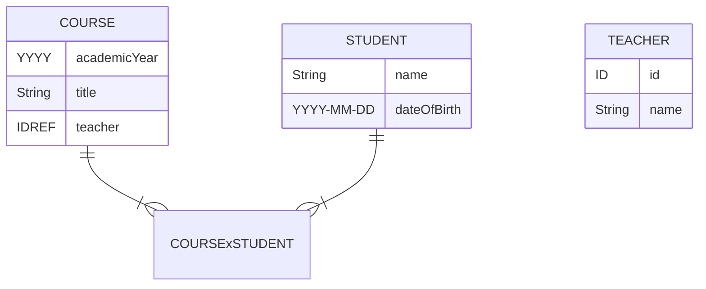
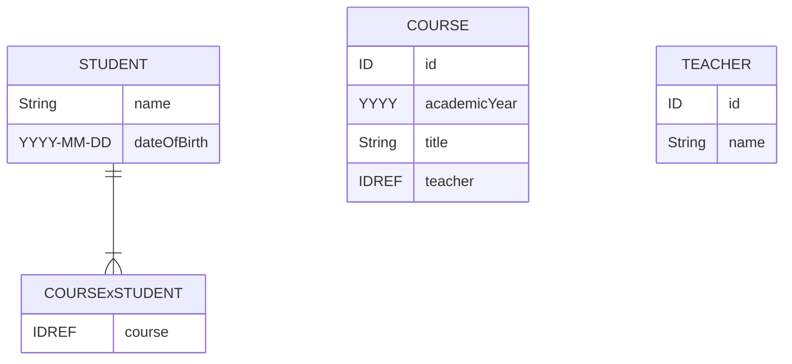
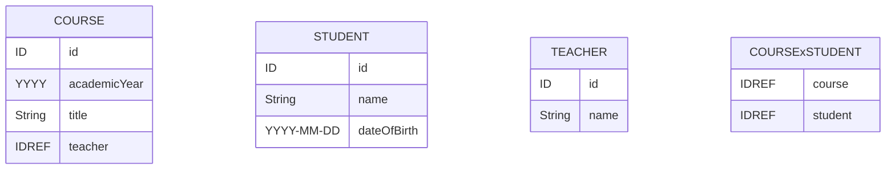

# Data models

A `data model` is a set of generic statements describing some (small and finite) aspect of the world.

For example, here is a simple informal data model describing some features of the academic world:
> Every person has a name and is either a student or a teacher.
>
> Every student has a date of birth.
>
> Students take courses and teachers teach them.
>
> Every course has a title, and runs within an academic year.

Obviously, this data model is incomplete. For example, we can be sure that teachers also have dates of birth. 
The important point is that a teacher’s date of birth is not particularly relevant in the academic world.

This informal data model implies at least five distinct types of `entity`:
- *Students* and *teachers* are different kinds of *person*.
- *Courses* are a kind of *event*.

These entities can be associated with particular `attributes`:
- People have *names*.
- Students have *dates of birth*.
- Events occur within *academic years*.
- Courses have *titles*.

Finally, this data model assumes two different `relations` between entities:
- Teachers *teach* courses.
- Students *take* courses.

Fundamentally, data modelling is all about identifying and cataloguing these three things – `entity types`, `attributes`, and `relations`.

## Formalising data models

There are lots of different systems for formalising a data model. Here we will discuss four:
- class diagrams
- entity-relationship diagrams
- first order logic
- RDF Schema

### Class diagrams

The following class diagram formalises some importants aspects of our informal data model:



In this diagram, each type of entity (or ‘class’ of ‘object’) is represented by its own tripartite box, with the name of the entity type in the top part of the box. The diagram contains five boxes representing the entity types ‘person’, ‘student’, ‘teacher’, ‘event’, and ‘course’.

The unlabelled arrows between entity types represent the ‘inheritance’ or ‘subtype’ relation, so:
- Every student is a person.
- Every teacher is a person.
- Every course is an event.

The middle part of each box represents the attributes associated with the entity type, so:
- Every person has a name.
- Every student has a date of birth.
- Every event happens within an academic year.
- Every course has a title.

If entity type *A* is a subtype of entity type *B*, and *B* has an associated attribute, then *A* ‘inherits’ that attribute from *B*, for example:
- Every student is a person, and every person has a name, so every student also has a name.

The labelled arrows between entity types represent relations, so:
- Teachers teach courses.
- Students take courses.

### Entity-relationship diagrams

The following entity-relationship (ER) diagram also formalises some key aspects of our informal data model:



As with class diagrams, in an ER diagram every entity type is represented by a box, again with the name of the entity type in the top part of the box. The ER diagram contains three boxes ‘student’, ‘teacher’, and ‘course’

Note that, unlike the class diagram above, this ER diagram does not contain entity types for ‘person’ or ‘event’. This is because ER diagrams cannot represent inheritance or subtypes relations between entity types – there is no way of saying ‘every student is a person’. In this respect at least, ER diagrams are *less expressive* than class diagrams.

The lower part of the boxes lists the attributes associated with the entity type, so:
- Every teacher has a name.
- Every student has a name and a date of birth.
- Every course has a title and happens within an academic year.

Again, as with class diagrams, the labelled arrows between entity types represent relations, so as before:
- Teachers teach courses.
- Students take courses.

However, the way relations are encoded in ER diagrams is *more expressive* than class diagrams since they include information about `cardinality`. So from the ER diagram we can read off the following cardinality information (from the little decorations at the ends of each of the lines connecting entity types):
- Every course is taken by one or more students.
- Every student takes one or more courses.
- Every course is taught by exactly one teacher.
- Every teacher teaches one or more courses.

### First order logic

We have seen that class diagrams and entity-relationship diagrams can each formalise important aspects of a data model but thy each have important gaps too – class diagrams cannot express cardinatlity constraints, and ER diagrams cannot express inheritance.

In constrast, first order logic (FOL) is an extremely powerful mathematical tool that can say almost anything you would ever want to say about a data model.

Entity types and subtypes can be captured in FOL as follows: 

```
∀x.student(x) → person(x)  -- every student is also a person
∀x.teacher(x) → person(x)  -- every teacher is also a person
∀x.course(x) → event(x)  -- every course is also an event
```

Adding attributes:

```
∀x.person(x) → ∃y.name(x,y)  -- every person has a name
∀x.student(x) → ∃y.dateOfBirth(x,y)  -- every student has a date of birth
∀x.event(x) → ∃y.academicYear(x,y)  -- every event is associated with an academic year
∀x.course(x) → ∃y.title(x,y)  -- every course has a title
```

Expressing relations:

```
∀x.course(x) → ∃y.teacher(y) ∧ teaches(y,x)  -- every course has at least one teacher who teaches it
∀x.course(x) → ∃y.student(y) ∧ takes(y,x)  -- every course has at least one students who takes it
```

And finally we can add the additional cardinality constraint on teachers:

```
∀x∀y∀z.teaches(x,z) ∧ teaches(y,z) → x=y  -- every course has no more than one teacher who teaches it
```

### RDF Schema

Outside the world of databases, data models are generally known as `ontologies`. RDF Schema is a W3C standard ontology language that serves to formalise a data model.

RDF Schema (RDFS) can capture entity types and subtypes (ie ‘classes’ and ‘subclasses’):

```
:Person, :Student, :Teacher, :Event, :Course a rdfs:Class .
:Student, :Teacher rdfs:subClassOf :Person .
:Course rdfs:subClassOf :Event .
```

This can be read as follows:
- People, students, teachers, events and courses are all types of entity.
- Students and teachers are types of person.
- Courses are types of event.

Relations are known as ‘properties’ in RDFS: 

```
:teaches, :takes a rdf:Property .
:teaches rdfs:domain :Teacher ; rdfs:range :Course .
:takes rdfs:domain :Student ; rdfs:range :Course .
```

In other words:
- ‘teaches’ and ‘takes’ are both relations between entity types.
- Teachers teach courses.
- Students take courses.

Attributes are just treated as special kinds of property in RDFS:

```
:name, :dateOfBirth, :title, :academicYear a rdf:Property .
:name rdfs:domain :Person ; rdfs:range xsd:String .
:dateOfBirth rdfs:Domain :Student ; rdfs:range xsd:Date .
:title rdfs:domain :Course ; rdfs:range xsd:String .
:academicYear rdfs:Domain :Event ; rdfs:range xsd:Year .
```

In other words:
- People have names.
- Students have dates of birth.
- Courses have titles.
- Events happen within an academic year.

The RDFS statements listed here together say pretty much the same thing as the class diagram above - they can express inheritance and other kinds of relations but not cardinality.

### OWL (Web Ontology Language)

We can use the W3C standard Web Ontology Language (OWL) to add cardinality statement to an RDFS data model.

For example:


Cardinality in OWL?

owl:cardinality (Exactly): Constrains a property to have exactly N distinct values (e.g., a Person must have exactly 2 parents).

owl:minCardinality (At Least): Constrains a property to have at least N values (e.g., a Car must have at least 3 wheels).

owl:maxCardinality (At Most): Constrains a property to have at most N values (e.g., an Academic Paper can have at most 5 authors

```
_:courseTeacherRestriction a owl:Restriction ;
                           owl:onProperty :teaches ;
                           owl:minCardinality "1"^^xsd:nonNegativeInteger .
```

Exclusive subclasses?

Manchester syntax?


## Physical data models

### Tabularisation

Tabularisation is the process of taking a ‘conceptual’ data model, usually in the form of an ER diagram, and converting it into a ‘physical’ data model suitable for implementing as a standard relational, SQL-style database.

Let’s start with the ER diagram from before:


The first stage in tabularisation involves identifying any many-to-many relations in the data model and turning them into two one-to-many relations with an intervening ‘join’ entity type.

The data model here contains one many-to-many relation – the ‘takes’ relation between courses and students. Remember that one student can take multiple courses and one course can be taken by multiple students. 

In order to eliminate this many-to-many relation, a new entity type called ‘COURSExSTUDENT’ is introduced into the data model, with many-to-one relations to both COURSE and STUDENT:



The next step involves converting all the one-to-many relations into attributes on the two related entity types.

For example, there is a one-to-many relation between TEACHER and COURSE — one teacher can teach multiple courses (but each course only has one teacher).
- We add a unique identifier attribute (ie. a ‘primary key’) to the TEACHER entity type.
- We add a ‘teacher’ attribute to the COURSE entity type, whose value must be an identifier reference (ie. a ‘foreign key’) to the TEACHER entity type.
- We can then remove the one-to-many ‘teaches’ relation link itself. 

So we get:



Next:



Next:



Now we have a fully tabularised, relation-free ‘physical’ data model that can be implemented straightforwardly in a relational database management system (RDBMS) like MySQL or PostgreSQL.

SQL-DDL database definition language:

```
CREATE TABLE student (
    id  INTEGER  PRIMARY KEY,
    name  VARCHAR(100)  not null,
    dateOfBirth  DATE  not null
);

CREATE TABLE teacher (
    id  INTEGER  PRIMARY KEY,
    name  VARCHAR(100)  not null,
);


```


----

### Document Type Definitions

```
<!ELEMENT student EMPTY>
<!ELEMENT teacher EMPTY>
<!ELEMENT course (teacher, student+)>

<!ATTLIST student
  name CDATA #REQUIRED
  dateOfBirth Date #REQUIRED >

<!ATTLIST teacher
  name CDATA #REQUIRED >

<!ATTLIST course
  title CDATA #REQUIRED >
```

XML:

```
<course title="Informatics 1">
  <teacher name="Dr Mark McConville"/>
  <student name="Kate Alexandra Ranson" dateOfBirth="1992-11-03"/>
  <student name="Julie Sharon Port" dateOfBirth="1983-06-20"/>
  <student name="Jayne Shaw" dateOfBirth="1969-02-14"/>
</course>
```

inheritance via parameter entities?

```
<!ENTITY % person.common "name, age">

<!-- 'Inheriting' the common elements into an Employee -->
<!ELEMENT employee (%person.common;, employee_id)>

<!-- 'Inheriting' the common elements into a Customer -->
<!ELEMENT customer (%person.common;, loyalty_tier)>
```

DTDs are only good for **physical** data models (as XML documents).

A `data base` consists of a `data model` and a `data set`.

----

Back up to: [Top](../index.md)
