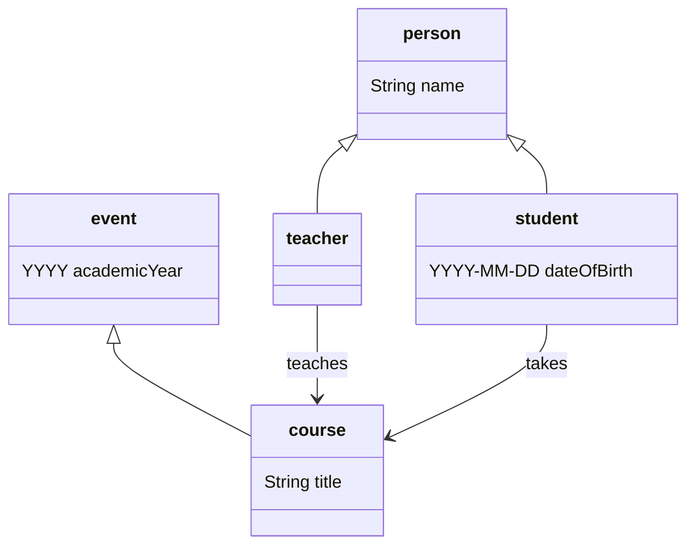
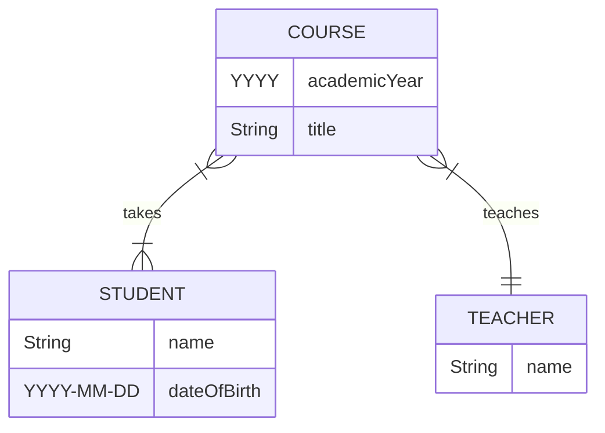
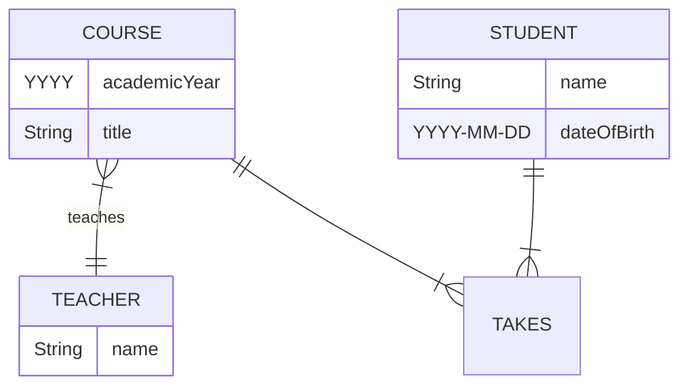
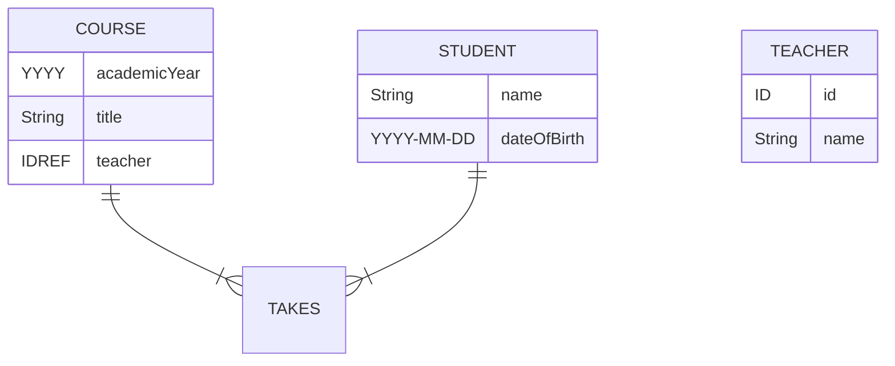
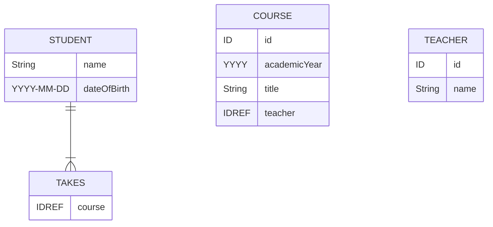
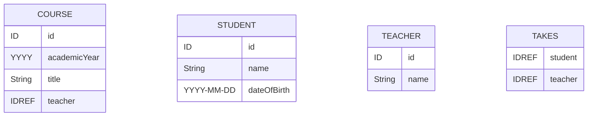

# Data models

A `data model` is a set of generic statements describing some (small, finite) aspect of the world.

Contents:
- [Entities, attributes, relations](#entities-attributes-relations)
- [Formalising a data model](#formalising-a-data-model)
  - [Class diagrams](#class-diagrams)
  - [Entity-relationship diagrams](#entity-relationship-diagrams)
  - [First order logic](#first-order-logic)
  - [RDF Schema](#rdf-schema)
- [Materialising a data model](#materialising-a-data-model)
- Reverse-engineering a data model

## Entities, attributes, relations

Here is a simple informal data model describing some features of the academic world:
> Every person has a name and is either a student or a teacher.
>
> Every student has a date of birth.
>
> Students take courses and teachers teach them.
>
> Every course has a title, and runs within an academic year.

This data model is clearly incomplete. For example, we can be sure that teachers also have dates of birth. 
However, we are assuming that a teacher’s date of birth is not relevant enough in the academic world to be worth including in our model.

This informal data model implies at least five distinct types of `entity`:
- *Students* and *teachers* are different kinds of *person*.
- *Courses* are a kind of *event*.

These entities can be associated with particular `attributes`:
- People have *names*.
- Students have *dates of birth*.
- Events occur within *academic years*.
- Courses have *titles*.

Finally, this data model assumes two different `relations` between entities:
- Teachers *teach* courses.
- Students *take* courses.

Fundamentally, data modelling is all about identifying and cataloguing these three things – types of `entity`, their `attributes`, and `relations` between them.

Back up to: [Top](#)

## Formalising a data model

There are lots of different ways of formalising a data model. Here we will discuss four:
- [Class diagrams](#class-diagrams)
- [Entity-relationship diagrams](#entity-relationship-diagrams)
- [First order logic](#first-order-logic)
- [RDF Schema](#rdf-schema)

### Class diagrams

The following class diagram formalises some importants aspects of our informal data model from above:



In this diagram, each type of entity (or ‘class’ of ‘object’) is represented by its own tripartite box, with the name of the entity type in the top part of the box. The diagram contains five boxes representing the entity types ‘person’, ‘student’, ‘teacher’, ‘event’, and ‘course’.

The unlabelled arrows between entity types represent the ‘inheritance’ or ‘subtype’ relation, so:
- Every student is a person.
- Every teacher is a person.
- Every course is an event.

The middle part of each box represents the attributes associated with the entity type, so:
- Every person has a name.
- Every student has a date of birth.
- Every event happens within an academic year.
- Every course has a title.

If entity type *A* is a subtype of entity type *B*, and *B* has an associated attribute, then *A* ‘inherits’ that attribute from *B*, for example:
- Every student is a person, and every person has a name, so every student also has a name.

The labelled arrows between entity types represent relations, so:
- Teachers teach courses.
- Students take courses.

### Entity-relationship diagrams

Another way of formalising a data model is via an entity-relationship (ER) diagram.

The following ER diagram also formalises some key aspects of our informal data model:



As with class diagrams, in an ER diagram every entity type is represented by a box, again with the name of the entity type in the top part of the box. 
This ER diagram formalises three entity types ‘student’, ‘teacher’, and ‘course’

Note that, unlike the class diagram above, this ER diagram does not contain entity types for ‘person’ or ‘event’. This is because ER diagrams cannot represent inheritance or subtype relations between entity types – there is no way of saying ‘every student is a person’. In this respect at least, ER diagrams are *less expressive* than class diagrams.

The lower part of the boxes lists the attributes associated with the entity type, so:
- Every teacher has a name.
- Every student has a name and a date of birth.
- Every course has a title and happens within an academic year.

Again, as with class diagrams, the labelled arrows between entity types represent relations, so as before:
- Teachers teach courses.
- Students take courses.

However, the way relations are encoded in ER diagrams is *more expressive* than class diagrams since they include information about `cardinality` – the number of entities than can participate in the relation. 
So, from the ER diagram we can read off the following cardinality information (from the little decorations at the ends of each of the lines connecting entity types):
- Every course is taken by *one or more* students.
- Every student takes *one or more* courses.
- Every course is taught by *exactly one* teacher.
- Every teacher teaches *one or more* courses.

### First order logic

We have seen that class diagrams and entity-relationship diagrams can each formalise important aspects of a data model. However, they each have significant gaps too – class diagrams cannot express cardinatlity constraints, and ER diagrams cannot express inheritance.

First order logic (FOL) is an extremely powerful mathematical tool that can express almost anything you would ever want to say about a data model.

Entity types and subtypes can be captured in FOL as follows: 

```
∀x.student(x) → person(x)     -- every student is also a person
∀x.teacher(x) → person(x)     -- every teacher is also a person
∀x.course(x) → event(x)       -- every course is also an event
```

FOL can encode attributes on entity types like this:

```
∀x.person(x) → ∃y.name(x,y)           -- every person has a name
∀x.student(x) → ∃y.dateOfBirth(x,y)   -- every student has a date of birth
∀x.event(x) → ∃y.academicYear(x,y)    -- every event is associated with an academic year
∀x.course(x) → ∃y.title(x,y)          -- every course has a title
```

FOL can also express relations between entities:

```
∀x.course(x) → ∃y.teacher(y) ∧ teaches(y,x)   -- every course has at least one teacher who teaches it
∀x.course(x) → ∃y.student(y) ∧ takes(y,x)     -- every course has at least one students who takes it
```

And finally we can also use FOL to formalise cardinality constraints on both relations and attributes:

```
∀x∀y∀z.teaches(x,z) ∧ teaches(y,z) → x=y    -- every course has no more than one teacher who teaches it
∀x∀y∀z.name(x,y) ∧ name(x,z) → y=z          -- a person can have no more than one name
```

### RDF Schema

Outside the world of data analysis and engineering, data models are generally known as `ontologies`, and as such are familiar to philosophers, information scientists, knowledge engineers, Semantic Web developers and AI researchers. Thus, we can also use standard ontology languages to formalise a data model, like the W3C’s RDF Schema (RDFS).

Like first order logic, RDF Schema (RDFS) can capture entity types and subtypes (ie ‘classes’ and ‘subclasses’):

```
:Student, :Teacher rdfs:subClassOf :Person .    -- every student and every teacher is also a person
:Course rdfs:subClassOf :Event .                -- every course is also an event
```

Relations are known as ‘properties’ in RDFS: 

```
:teaches rdfs:domain :Teacher ; rdfs:range :Course .    -- teachers teach courses
:takes rdfs:domain :Student ; rdfs:range :Course .      -- students take courses
```

Attributes are just treated as special kinds of property in RDFS:

```
:name rdfs:domain :Person .            -- people have names
:dateOfBirth rdfs:domain :Student .    -- students have dates of birth
:title rdfs:domain :Course .           -- courses have titles
:academicYear rdfs:Domain :Event .     -- events are associated with academic years
```

Like class diagrams, RDFS statements can express inheritance and other kinds of relations but not cardinality. 
However, the W3C standard Web Ontology Language (OWL) allows precise cardinality statements to be added to RDFS properties.

Back up to: [Top](#)

## Materialising a data model

We have seen that data model is a set of generic statements describing an aspect of the world, and that we can express a data model informally in natural language. We can then formalise the data model in a standard diagrammatic notation like class diagrams or entity-relationship diagrams, or perhaps in a more technical notation like first order logic or RDFS.

However, if we want to implement a data model in an actual database management system like Oracle, MySQL, MongoDB or eXist-db, then we need to do more than just formalise it. We will need to `materialise` the data model into a form than can be implemented in our database management system of choice – converting our initial `conceptual` data model into the right kind of `physical` data model.

### Tabularisation for SQL

Database management systems like Oracle, MySQL and PostgreSQL are known as `relational` database systems, and they are interrogated by data analysts using the Structured Query Language (SQL). 

Relational databases are based around tables of data and thus the process of materialising a conceptual data model for implementation in a SQL database can be termed ‘tabularisation’.

We can explify the tabularisation process by starting from the previous ER diagram representing the conceptual data model:


The first stage in tabularisation involves:
1. identifying any *many-to-many* relations in the data model, and then
2. turning each one into two *one-to-many* relations with an intervening ‘join’ entity type.

Note that the data model above contains the one many-to-many relation – the ‘takes’ relation between courses and students. Remember that one student can take multiple courses and one course can be taken by multiple students. 

In order to eliminate this many-to-many relation, a new entity type called ‘TAKES’ is introduced into the data model, with one-to-many relations from both COURSE and STUDENT:



The second step in tabularisation involves converting each of the one-to-many relations into ID and IDREF attributes on the two linked entity types.

For example, there is a one-to-many relation ‘teaches’ between TEACHER and COURSE — one teacher can teach multiple courses, but each course only has one teacher. So:
1. We add a unique identifier attribute (ie. a ‘primary key’) to the TEACHER entity type.
2. We add a ‘teacher’ attribute to the COURSE entity type, whose value must be an identifier reference (ie. a ‘foreign key’) to the TEACHER entity type.
3. We can then remove the one-to-many ‘teaches’ relation link itself. 

So we get the following semi-tabularised data model:



Next, we do the same for the one-to-many relation between COURSE and TAKES:



And finally, we tabularise the one-to-many relation between STUDENT and TAKES:



Now we have a fully tabularised, relation-free ‘physical’ data model that can be implemented straightforwardly in a relational database management system (RDBMS) like MySQL or PostgreSQL, using the following commands in SQL Database Definition Language (DDL):

```
CREATE TABLE course (
    id INTEGER PRIMARY KEY,
    academicYear DATE NOT NULL,
    title VARCHAR(100) NOT NULL,
    teacher INTEGER NOT NULL,
    FOREIGN KEY (teacher) REFERENCES teacher(id)
);

CREATE TABLE student (
    id INTEGER PRIMARY KEY,
    name VARCHAR(100) NOT NULL,
    dateOfBirth  DATE NOT NULL
);

CREATE TABLE teacher (
    id INTEGER PRIMARY KEY,
    name VARCHAR(100) NOT NULL
);

CREATE TABLE takes (
    student INTEGER NOT NULL,
    course INTEGER NOT NULL,
    FOREIGN KEY (student) REFERENCES student(id),
    FOREIGN KEY (course) REFERENCES course(id)
);
```

ID constraint in FOL?


### Materialisation for XML (or JSON)

Straight from conceptual data model.


As a DTD?


```
<!ELEMENT student EMPTY>
<!ELEMENT teacher EMPTY>
<!ELEMENT course (teacher, student+)>

<!ATTLIST student
  name CDATA #REQUIRED
  dateOfBirth Date #REQUIRED >

<!ATTLIST teacher
  name CDATA #REQUIRED >

<!ATTLIST course
  title CDATA #REQUIRED >
```

XML:

```
<university>

<courses>
  <course title="Informatics 1" academicYear="2005" teacher="t1">
    <student idref="s1"/>
    <student idref="s2"/>
  </course>
</courses>

<students>
  <student id="s1" name="Kate Alexandra Ranson" dateOfBirth="1992-11-03"/>
  <student id="s2" name="Julie Sharon Port" dateOfBirth="1983-06-20"/>
  <student id="s3" name="Jayne Shaw" dateOfBirth="1969-02-14"/>
</students>

<teachers>
  <teacher id="t1" name="Dr Mark McConville"/>
</teachers>

</university>

```

inheritance via parameter entities?

```
<!ENTITY % person.common "name, age">

<!-- 'Inheriting' the common elements into an Employee -->
<!ELEMENT employee (%person.common;, employee_id)>

<!-- 'Inheriting' the common elements into a Customer -->
<!ELEMENT customer (%person.common;, loyalty_tier)>
```

DTDs are only good for **physical** data models (as XML documents).

A `data base` consists of a `data model` and a `data set`.

----

Back up to: [Top](../index.md)
