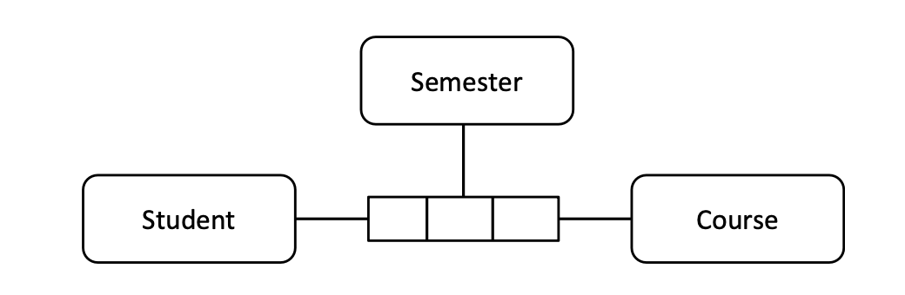

# Data model components

> This document contains my notes from Chapter 5 §1.3.3 of the *Data Management Body of Knowledge* 2nd edition (DAMA-DMBoK 2017).

Most data models contain the same basic building blocks:
- entities
- relationships
- attributes
- domains

Back up to: [Data modelling](index.md)

## Entities

Definition:

> Entities are things about which an organisation collects information.

eg. people, organisations, products, services, times, dates, locations, events, transactions, documents, quantities.

Recommended usage:

> **Entity instance** A (eg. Jane) is an instance of **entity** B (eg. Employee).

Alternative usages:

> Entity A is an instance of entity-type B.
>
> Object A is an instance of class B.

Entities are generally depicted as **rectangles** (perhaps with rounded corners) with their names inside.

**Entity definitions** are core Metadata for any data model, and should exhibit:
- clarity
- accuracy
- completeness

## Relationships

Definition:

> A relationship is an association between entities.

Relationships are generally depicted as (directed?) **lines** between entities, with their names as labels.

### Cardinality

Relationships can have a **cardinality**:
- **one-to-one** – each A is associated with one B, and each B is associated with one A
  - [total functional, total injective] *exactly one to exactly one* – each A is associated with exactly one B, and each B is associated with exactly one A
  - [functional, total injective] *exactly one to no more than one* – each A is associated with zero or one B, and each B is associated with exactly one A
  - [total functional, injective] *no more than one to exactly one* – each A is associated with exactly one B, and each B is associated with zero or one A
  - [functional, injective] *no more than one to no more than one* – each A is associated with zero or one B, and each B is associated with zero or one A
- **one-to-many** – each A is associated with more than one B, but each B is associated with just one A
  -  [total injective] *exactly one to zero or more* – each A is associated with any number of B, and each B is associated with exactly one A
  -  [total injective] *exactly one to one or more* – each A is associated with at least one B, and each B is associated with exactly one A
  -  [total injective] *exactly one to more than one* – each A is associated with at least two B, and each B is associated with exactly one A
  -  [injective] *no more than one to zero or more* – each A is associated with any number of B, and each B is associated with at most one A
  -  [injective] *no more than one to one or more* – each A is associated with at least one B, and each B is associated with at most one A
  -  [injective] *no more than one to more than one* – each A is associated with at least two B, and each B is associated with at most one A
- **many-to-one** – each A is associated with one B, but each B is associated with more than one A
  - [total functional] *zero or more to exactly one* – each A is associated with exactly one B, and each B is associated with any number of B
  - [functional] *zero or more to no more than one* – each A is associated with at most one B, and each B is associated with any number of B
  - [total functional] *one or more to exactly one* – each A is associated with exactly one B, and each B is associated with at least one B
  - [functional] *one or more to no more than one* – each A is associated with at most one B, and each B is associated with at least one B
  - [total functional] *more than one to exactly one* – each A is associated with exactly one B, and each B is associated with at least two B
  - [functional] *more than one to no more than one* – each A is associated with at most one B, and each B is associated with at least two B
- **many-to-many** – each A is associated with more than one B, and each B is associated with more than one B
  - *zero or more to zero or more* – each A is associated with any number of B, and each B is associated with any number of A
  - *zero or more to one or more* – each A is associated with at least one B, and each B is associated with any number of A
  - *zero or more to more than one* – each A is associated with at least two B, and each B is associated with any number of A
  - *one or more to zero or more* – each A is associated with any number of B, and each B is associated with at least one A
  - *one or more to one or more* – each A is associated with at least one B, and each B is associated with at least one A
  - *one or more to more than one* – each A is associated with at least two B, and each B is associated with at least one A
  - *more than one to zero or more* – each A is associated with any number of B, and each B is associated with at least two A
  - *more than one to one or more* – each A is associated with at least one B, and each B is associated with at least two A
  - *more than one to more than one* – each A is associated with at least two B, and each B is associated with at least two A

Here is an example in IE notation:

This can be expressed in first order logic as follows:

> `∀x. ∀y. attend(x,y) → student(x) & course(y)`

Here is another example:

Again in first order logic:

> `∀x. ∀y. attend(x,y) → student(x) & course(y)`
>
> `∀x. ∀y. teach(x,y) → instructor(x) & course(y)`

### Arity

Relationships have an **arity**:
- **unary** – both linked instances are of the same entity ie. the entity is associated with itself
- **binary** – the two linked instances are of distinct entities
- **ternary** – the relationship associates three entities with each other

Unary relationships are also known as ‘recursive’ or ‘self-referencing’:
- a one-to-many unary relationship is known as a ‘hierarchy’
- a many-to-many unary relationship is known as a ‘network’ or ‘graph’

Here is an example of a hierarchical unary relationship in IE notation:

This can be expressed in first order logic as follows:

> `∀x. ∀y. require(x,y) → course(x) & course(y)`
>
> `∀x. ∀y. ∀z. require(x,z) & require(y,z) → x=y` 

Here is an example of a network-style unary relationship:

Again in first order logic:

> `∀x. ∀y. require(x,y) → course(x) & course(y)`

Here is an example of a binary relationship as a UML class diagram:

This can be summarised in first order logic as follows:

> `∀x. ∀y. attend(x,y) → student(x) & course(y)`

Here is an example of a ternary relationship in object-role notation:

This can be summarised in first order logic as follows:

> `∀x. ∀y. ∀z. register(x,y,z) → student(x) & course(y) & semester(z)`

Or at a lower level of abstraction as:

> `∀e. registration(e) → ∃x. student(x) & arg1(e,x)`
>
> `∀e. ∀x. ∀y. registration(e) & arg1(e,x) & arg1(e,y) → x=y`
>
> `∀e. registration(e) → ∃x. course(x) & arg2(e,x)`
>
> `∀e. ∀x. ∀y. registration(e) & arg2(e,x) & arg2(e,y) → x=y`
> 
> `∀e. registration(e) → ∃x. semester(x) & arg3(e,x)`
>
> `∀e. ∀x. ∀y. registration(e) & arg3(e,x) & arg3(e,y) → x=y`

## Attributes

Definition:

> An attribute is a property that identifies, describes or measures an entity.

Attributes are generally depicted as list within the entity rectangle.

### Keys

A **key** (or **identifier**) is a set of one or more attributes that uniquely defines an instance of an entity.

Keys can be classified based on *construction*:
- A **simple key** consists of exactly one attribute.
  - A **surrogate key** is a system-generated simple key, usually an automatically incremented integer.
- A **composite key** consists of two or more attributes.
  - A **compound key** is a composite key each of whose attributes is a ‘foreign key’ – a reference to a simple key of another entity.

A **candidate key** is a minimal key – no subset of a candidate key is a key. 
- The **primary key** is the candidate key that is chosen to be *the* unique identifier.
- The **alternate key** is any candidate key that is not the primary key.

A **business key** (or **natural key**) is a candidate key that a business professional would use.

A **dependent entity** is one whose primary key includes a foreign key (to an instance of another entity).

Dependent entities are often represented as rectangles with rounded corners.

The relationship between a dependent entity and any entity which supplies part of its primary key is an **identifying relationship**.

Here is an example in IE notation of a reified logical/physical data model (where a X conceptual relationship has been reified as an entity with foreign keys):

The logical layer of this model is summarised in first order logic as follows:

> `∀x. student(x) → ∃y. student-first-name(x,y)`
>
> `∀x. ∀y. ∀z. student-first-name(x,y) & student-first-name(x,z) → y=z`
>
> `∀x. student(x) → ∃y. student-last-name(x,y)`
>
> `∀x. ∀y. ∀z. student-last-name(x,y) & student-last-name(x,z) → y=z`
>
> `∀x. student(x) → ∃y. student-birth-date(x,y)`
>
> `∀x. ∀y. ∀z. student-birth-date(x,y) & student-birth-date(x,z) → y=z`  
  
> `∀x. course(x) → ∃y. course-name(x,y)`
>
> `∀x. ∀y. ∀z. course-name(x,y) & course-name(x,z) → y=z`

> `∀e. registration(e) → ∃x. registration-date(e,x)`
>
> `∀e. ∀x. ∀y. registration-date(e,x) & registration-date(e,y) → x=y`
>
> `∀e. registration(e) → ∃x. student(x) & register(e,x)`
>
> `∀e. ∀x. ∀y. register(e,x) & register(e,y) → x=y`
>
> `∀e. registration(e) → ∃x. course(x) & have-registered(e,x)`
>
> `∀e. ∀x. ∀y. have-registered(e,x) & have-registered(e,y) → x=y`

The physical layer adds the primary and foreign keys:

> `∀x. student(x) → ∃y. student-number(x,y)`
>
> `∀x. ∀y. ∀z. student-number(x,y) & student-number(x,z) → y=z`
>
> `∀x. ∀y. ∀z. student(x) & student(y) & student-number(x,z) & student-number(y,z) → x=y`

> `∀x. course(x) → ∃y. course-code(x,y)`
>
> `∀x. ∀y. ∀z. course-code(x,y) & course-code(x,z) → y=z`
>
> `∀x. ∀y. ∀z. course(x) & course(y) & course-code(x,z) & course-code(y,z) → x=y`

> `∀e. registration(e) → ∃x. student-number(e,x)`
>
> `∀e. ∀x. registration(e) & student-number(e,x) → ∃y. student(y) & student-number(y,x)`
>
> `∀e. registration(e) → ∃x. course-code(e,x)`
>
> `∀e. ∀x. registration(e) & course-code(e,x) → ∃y. course(y) & course-code(y,x)`

## Domains

Definition:

> A domain is complete set of possible values that an attribute can be assigned.
>
> A domain can be further restricted with **constraints**.

Ways of defining domains:
- data types (eg. integer, string)
- data formats (eg. templates, masks)
- lists (ie. enumerations)
- ranges
- rules

