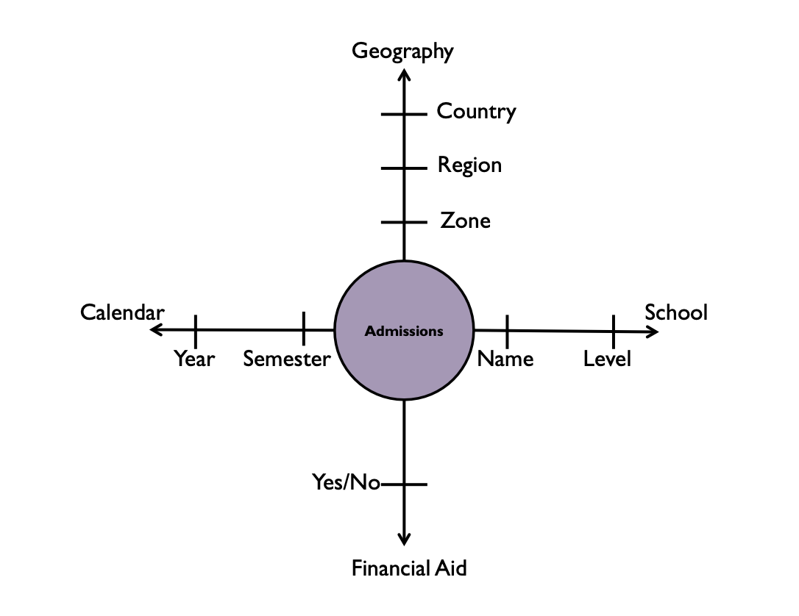
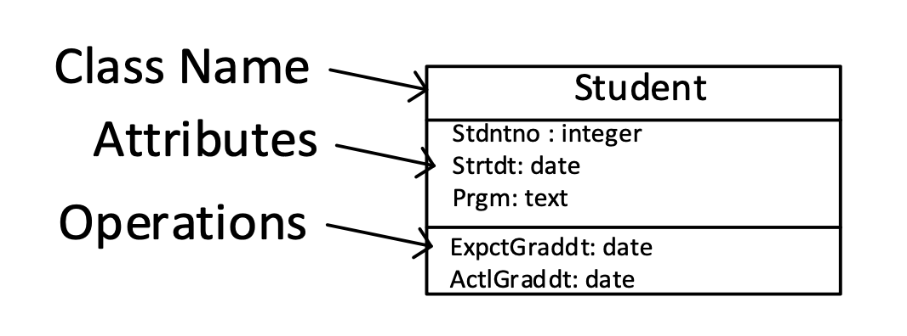
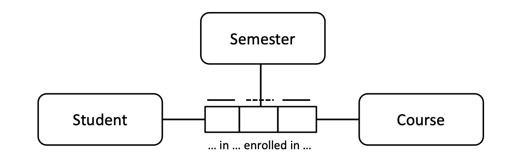
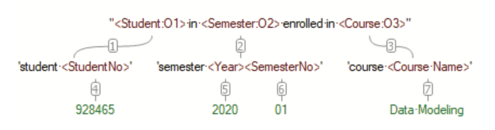

# Data modeling schemes

The six most common schemes to represent data (models) are:
- relational
  - Information Engineering (IE)
  - Integration Definition for Information Modeling (IDEF1X)
  - Barker Notation
  - Chen
- dimensional
- object-oriented
  - Unified Modeling Language (UML)
- fact-based
  - Object Role Modeling (ORM, ORM2)
- time-based
  - Data Vault
  - Anchor Modeling 
- noSQL
  - Document
  - Column
  - Graph
  - Key-Value

## Relational

Relational data models are optimised for operational/transactional systems, which require entering information quickly and having it stored accurately, with ‘one fact in one place’.

Here is an Information Engineering (IE) notation representation of a simple relational data model:

This can be summarised as follows:
- Only students attend.
- Only courses are attended.
- Every student attends zero or more courses.
- Every course is attended by zero or more students.

In first order logic:

> `∀x. ∀y. attend(x,y) → student(x) & course(y)`

## Dimensional

Dimensional data models are optimised for querying and analysing large amounts of data.

This is an example of a dimensional data model (represented in Axis Notation) for the domain of university admissions:

Admissions can be viewed along four distinct dimensions:
- geographical zone
- school
- financial
- semester

**Fact tables**:

> Within a dimensional scheme, the rows of a fact table correspond to particular measurements and are numeric.

**Dimension tables**:

> Dimension tables represent the important objects of the business and contain mostly textual descriptions.

Dimension tables are entry points or links into the fact tables, and hence must have a unique identifier for each row.

Three types of change to a dimension table:
- Overwrite
- New row
- New column

**Snowflaking**:

> Snowflaking is the term given to normalizing the flat, single-table, dimensional structure in a star schema into the respective component hierarchical or relational structures.

**Grain**:

> The term *grain* stands for the meaning or description of a single row of data in a fact table; \[...\] the most detail any row will have. Defining the grain of a fact table is one of the ket steps in dimensional design.

**Conformed dimensions**:

> Conformed dimensions are built with the entire organization in mind, instead of just a particular project; this allows these dimensions to be shared across dimensional models, due to containing consistent terminology and values.

**Conformed facts**:

> Conformed facts use standardized definitions of terms across individual marts. Developers need to be keenly aware of things that may be named the same but actually represent different concepts across organizations or, conversely, things that are named differently but are actually the same concept cross organizations.

## Object-oriented (UML)

The UML **class model** (ie. ‘class diagrams’) is a notation for databases.

Here is an example:

Note that a UML class diagram includes information about operations (ie. methods).

A first order logic interpretation of this class diagram (ignoring the methods) is as follows:

> `∀x. student(x) → ∃y. stdntno(x,y)`
>
> `∀x. ∀y. ∀z. stdntno(x,y) & stdntno(x,z) → y=z`
>
> `∀x. ∀y. stdntno(x,y) → integer(y)`

> `∀x. student(x) → ∃y. strtdt(x,y)`
>
> `∀x. ∀y. ∀z. strtdt(x,y) & strtdt(x,z) → y=z`
>
> `∀x. ∀y. strtdt(x,y) → date(y)`

> `∀x. student(x) → ∃y. prgm(x,y)`
>
> `∀x. ∀y. ∀z. prgm(x,y) & prgm(x,z) → y=z`
>
> `∀x. ∀y. prgm(x,y) → text(y)` 

## Fact-based modeling (FBM) 

Fact-based languages view the world in terms of objects, the facts that relate or characterise those objects, and each role that each object plays in each fact.

**Object-role modeling (ORM2)**:

Here is an example of an ORM2 data model:

This model can be (at least partially) represented in first order logic as:

> `∀x. ∀y. ∀z. in_enrolled_in(x,y,z) → student(x) & course(y) & semester(z)`

\[MM: note clear what the dotted and non-dotted lines above the boxes mean here.\]

**Fully communication oriented modeling (FCO-IM)**:

Here is an example of an FCO-IM data model:

## Time-based

###### 1.3.4.5.1. Data vault

###### 1.3.4.5.2. Anchor modeling 

## NoSQL

###### 1.3.4.6.1. Document

###### 1.3.4.6.2. Key-value

###### 1.3.4.6.3. Column-oriented

###### 1.3.4.6.4. Graph

