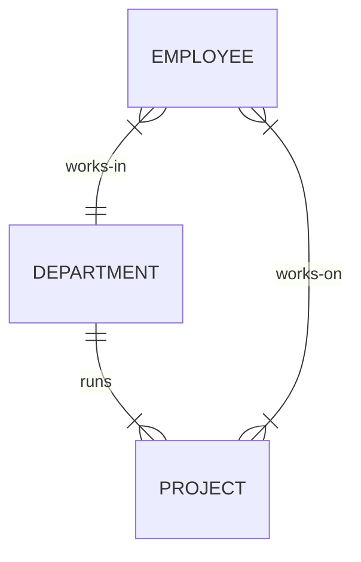
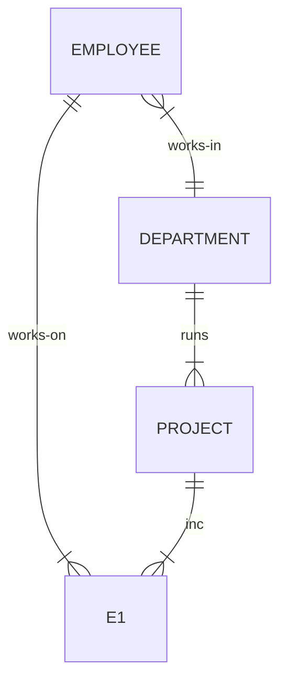

# Hierarchical data models

cf. [data models](../d/data_models.md)

```mermaid
erDiagram
    EMPLOYEE }|--|| DEPARTMENT : works-in
    DEPARTMENT ||--|{ PROJECT : runs
    EMPLOYEE }|--|{ PROJECT : works-on
```

mmm

```mermaid
erDiagram
    EMPLOYEE }|--|| DEPARTMENT : works-in
    DEPARTMENT ||--|{ PROJECT : runs
    EMPLOYEE ||--|{ E1 : works-on
    PROJECT ||--|{ E1 : inc
```

----

Back up to: [Maglocunus](../index.md)
