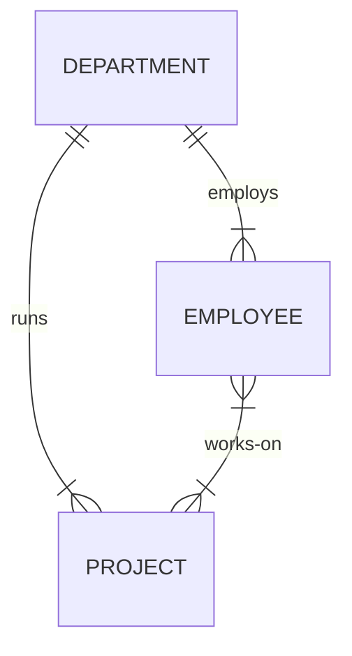
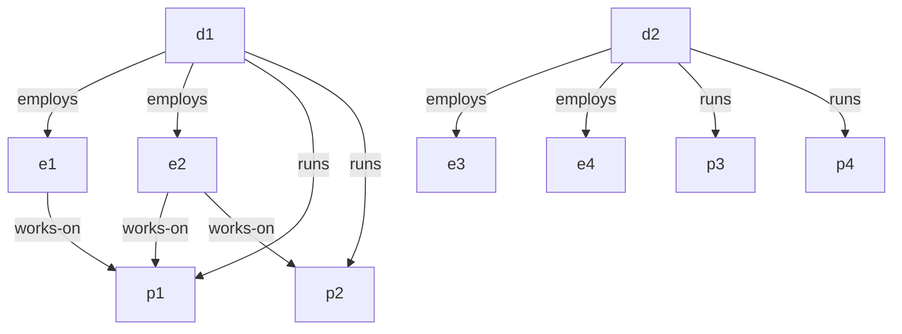
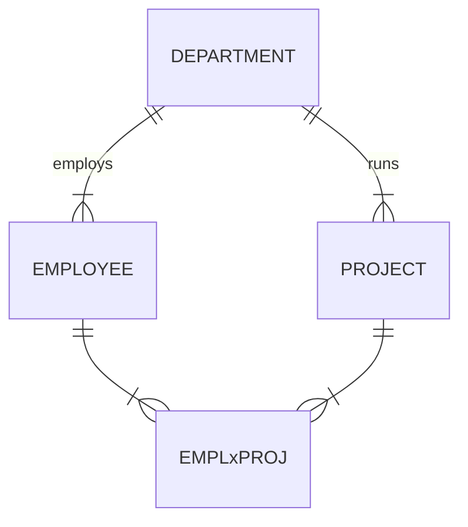
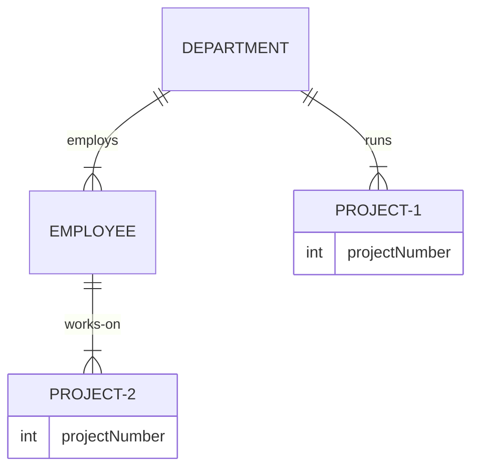

# Hierarchical data models

cf. [data models](../d/data_models.md)

```mermaid
erDiagram
  DEPARTMENT ||--|{ EMPLOYEE : employs
  DEPARTMENT ||--|{ PROJECT : runs
  EMPLOYEE }|--|{ PROJECT : works-on
```

mmm

```mermaid
graph
  d1
  d2
  d1 -- employs --> e1
  d1 -- employs --> e2
  d2 -- employs --> e3
  d2 -- employs --> e4
  d1 -- runs --> p1
  d1 -- runs --> p2
  d2 -- runs --> p3
  d2 -- runs --> p4
  e1 -- works-on --> p1
  e2 -- works-on --> p1
  e2 -- works-on --> p2
```

mmm

```mermaid
erDiagram
    DEPARTMENT ||--|{ EMPLOYEE : employs
    DEPARTMENT ||--|{ PROJECT : runs
    EMPLOYEE ||--|{ EMPLxPROJ : " "
    PROJECT ||--|{ EMPLxPROJ : " "
```

mmm

```mermaid
erDiagram
    DEPARTMENT ||--|{ EMPLOYEE : employs
    DEPARTMENT ||--|{ PROJECT-1 : runs
    EMPLOYEE ||--|{ PROJECT-2 : works-on
    PROJECT-1 { int projectNumber}
    PROJECT-2 { int projectNumber}
```

----

Back up to: [Maglocunus](../index.md)
