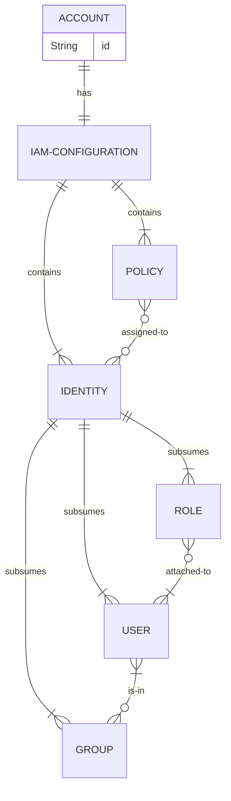

# Identity and Access Management in AWS

a service that allows you to manage secure access to your AWS resources, for both internal and external users.


IAM entities:

users
- associated with a name and credential
- usually a human user

groups
- consists of users
- simplifies access management by assigning permission to groups rather than to individuals

You can use externally-provided identities with AWS (eg. from Microsoft Active Directory, or any other identity provider that support OPenID Connect (OIDC) or Security Assertion Markup Language (SAML) 2.0).

policies
- a JSON document that contains permissions
- can be associated with an identity or with a resource


Here is an example of a policy that assigns read (get, list, describe) permissions for S3 buckets, and can be assigned to a user:
```
{
  "Version": "2012-10-17",
  "Statement": [
    {
      "Effect": "Allow",
      "Action": [ "s3:Get*", "s3:List*", "s3:Describe*"],
      "Resource": "*"
    }
  ]
}
```
Multiple policies can be assigned to a user, with cumulative effect.


IAM roles
- an identity with permissions
- not uniquely associated with a user
- can be assumed by any user who needs it
- have policies associated with them

You can attach an IAM role to an EC2 instance to grant it access to an S3 bucket.

You can attach an IAM role to a Lambda function to allow it to publish notifications to an SNS topic

You can use IAM roles to grant other AWS accounts access to permission to perform actions (eg. upload objects to an S3 bucket) in your account




----

Back up to: [Maglocunus](../index.md)
