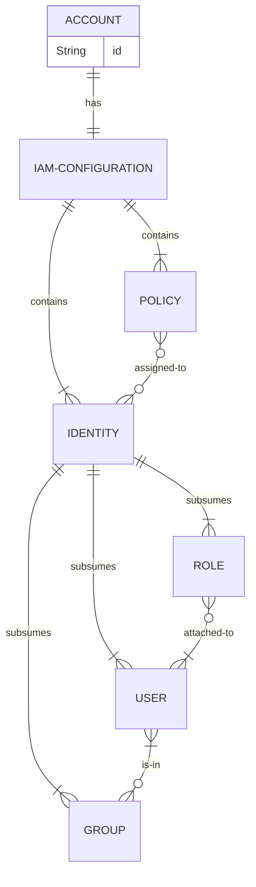

# Identity and Access Management in AWS

`Identity and Access Management` (IAM) is an [AWS](../a/AWS.md) service that allows you to manage secure access to your cloud resources, for both internal and external users.

AWS IAM can be summarised by the following entity-relationship diagram:



Note that:
- Users are associated with a name and credentials, and usually mean human users.
- Groups consists of users, and simplify access management by assigning permissions to groups rather than to individuals.
- Policies are JSON documents that contain permissions.
- Multiple policies can be assigned to an identity, with cumulative effect.
- Roles are not uniquely associated with a user, but can be assumed by any user who needs it.

Here is an example of a policy that assigns read (get, list, describe) permissions for S3 buckets, and can be assigned to a user:
```
{
  "Version": "2012-10-17",
  "Statement": [
    {
      "Effect": "Allow",
      "Action": [ "s3:Get*", "s3:List*", "s3:Describe*"],
      "Resource": "*"
    }
  ]
}
```

You can use externally-provided identities with AWS:
- Microsoft Active Directory
- any other identity provider that support OPenID Connect (OIDC) or Security Assertion Markup Language (SAML) 2.0.

Roles can be atached to, and policies assigned to a resource as well as an identity:
- You can attach a role to an EC2 instance to grant it access to an S3 bucket.
- You can attach a role to a Lambda function to allow it to publish notifications to an SNS topic.

You can also roles to grant other AWS accounts permission to perform actions (eg. upload objects to an S3 bucket) in your account.

----

Back up to: [Maglocunus](../index.md)
