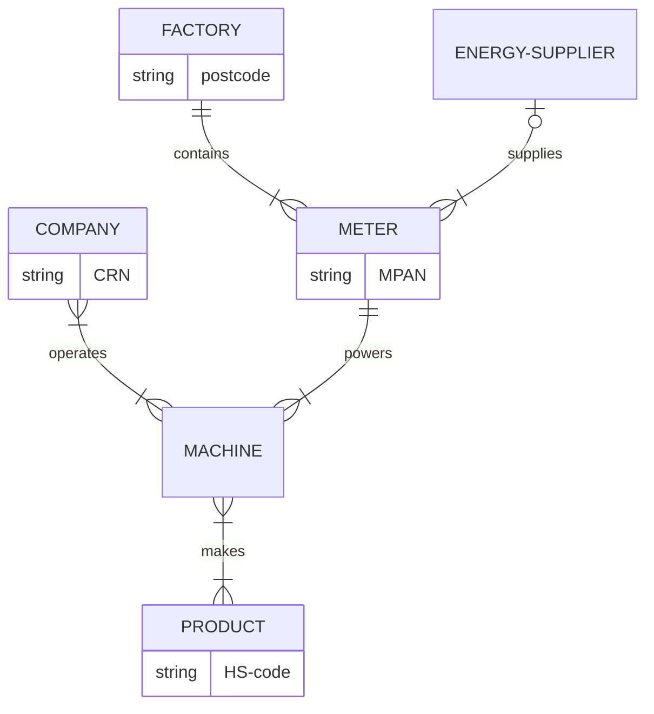

# Maglocunus

Contents:
- [Continuous Integration / Continuous Delivery](ci-cd.md) (CI/CD)
- [data](d/data.md)
- [Databricks](d/Databricks.md)
- [data models](d/data_models.md)

----




----

## Storage and retrieval

### Data structures that power your database

There are two main kinds of storage engine underlying databases:
- log-structured storage engines
- page-oriented storage engines (eg. B-trees).

The simplest kind of database is a <mark>key-value store</mark>:
- every record consists of a key (eg. an integer) followed by a value (eg. a JSON document), perhaps separated by a comma
- adding a new record appends the new key-value pair to the end of a text file
- updating a key also just appends a new key-value pair to the text file – only the last occurence of a key counts

For example:
```
1234, {"name": "London", "attractions": ["Big Ben", "London Eye"]}
42, {"name": "San Francisco", "attractions": ["Golden Gate Bridge"]}
42, {"name": "San Francisco", "attractions": ["Exploratorium"]}
```

An append-only data file is known as a <mark>log</mark>:
- appending to a file is generally very efficient.

However, looking up a key in this kind of (unindexed) log-based key-value store has terrible performance – you need to scan the entire log from start to finish.

An <mark>index</mark> is an additional structure that is derived from the primary data – metadata.
- An index incurs overheads on writes – the index needs to be updated with every write.
- But a well-chosen index can significantly speed up reads.

#### Hash indexes

A common kind of index consists of an in-memory <mark>hash map</mark> (or hash table):
- Every key is mapped to a byte offset in the text file – the location at which the value can be found, eg. `1234: 0, 42: 64`.
- To look up a key, first get the byte offset from the index, and then go straight to that location in the file on disk.
- To add or update a value, first append the new key-value pair, and then update the index.

How can we avoid running out of disk space if we keep appending to a log file?
1. **segmentation** – When a log file reaches a certain size (eg. 1024 records), we close it and start a new one.
2. **compaction** – When a log file has been segmented, (in the background) we throw away duplicate keys, retaining just the last update for each key.
3. **merging** – When a segmented log file has been compacted, we can merge it with the previous segment.

Every segment has its own in-memory hash map index. To look up a value, we start with the most recent segment’s index, and work backwards if needed.

Some important issues:
- file format – CSV is not the best format for a log; binary formats are faster.
- deleting records – To delete a key, add a ‘tombstone’ record to the log file. This tells the merging process to discard all previous values.
- crash recovery – When the database server is restarted, all in-memory indexes are lost and need to be rebuilt. Some implementations store a snapshot of each segment’s hash map on disk to speed up this process.
- partially written records – The database program may crash halfway through appending a record to the log file. You can use checksums to identify and ignore such records.
- concurrency control – It is common to have just one writer thread in an implementation, but multiple reader threads.

Advantages of an append-only approach:
- Appending and merging are *sequential* write operations, which are much faster than random writes, especially on magnetic spinning hard drives.
- Concurrency and crash recovery are much simpler if files are append-only.
- Merging old segments avoids the problem of data files getting fragmented over time.

Limitations of hash tables indexes:
- The hash table must fit in memory, so the number of keys is limited.
- Range queries are not efficient, eg. scanning all keys between `kitty00000` and `kitty99999`.

#### SSTables and LSM-trees

A Sorted String Table (SSTable) is a data file where the key-value pairs are sorted by key. 

Advantages of SSTables over log segments with hash indexes:
- Merging segments is simple and efficient, essentially just *mergesort*.
- You only need a sparse index in memory, since you can jump to the nearest key you hae in the index.
- You can split the records into blocks and compress them before writing to disk, indexing just the start of each block, and thus saving disk space.

##### Constructing and maintaining SSTables

Memtables.

##### Making an LSM-tree out of SSTables

##### Performance optimisations

#### B-Trees

##### Making B-trees reliable

##### B-tree optimisations

#### Comparing B-trees and LSM-trees

##### Advantages of LSM-trees

##### Downsides of LSM-trees


#### Other indexing structures

### Transaction processing or analytics?

#### Data warehousing

#### Stars and snowflakes: schemas for analytics

### Column-oriented storage

#### Column compression

#### Sort order in column storage

#### Writing to column-oriented storage

#### Aggregation: data cubes and materialised views

-----

### The Mayfair Set ep. 1

Colonel David Stirling was a Scottish aristocrat and WWII hero, founder of the SAS (a new way of fighting war, risky/reckless and pirate-like).

After the war he moved to Rhodesia and sought to oppose Black Nationalism in Africa and maintain British power and influence – good government is better thah self-government.

In the late 1950s, he moved back to London and got involved with the Mayfair Set – a group of gamblers based around John Aspinall’s Claremont Club in Mayfair – right-wingers who were disillusioned with Britain’s post-war moderate governments, and who believed in direct, risky/reckless action (like merchant adventures or pirates):
- James Goldsmith
- Tiny Rowland
- Lord Lucan,
- Jim Slater.

In September 1962, Egypt invaded the Yemen.

----
