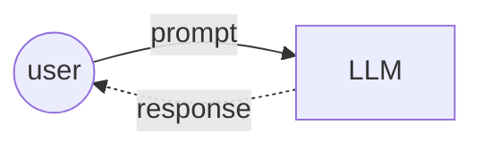
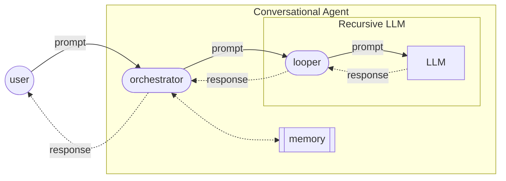
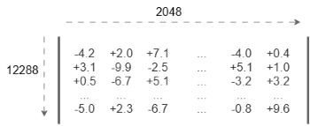
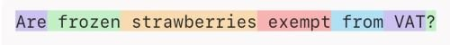
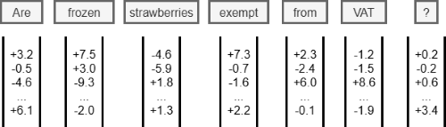
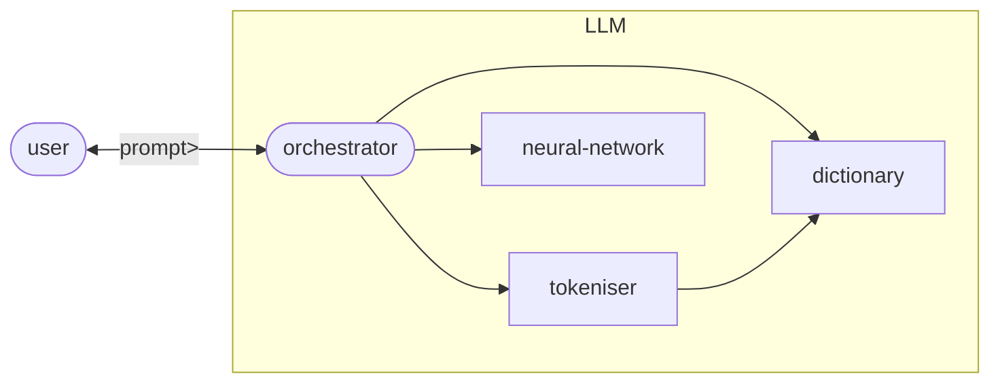

# Large language models

A `large language model` (LLM) is a neural network-based, generative AI, software application which (strictly speaking):
1. accepts a text as input – the 'prompt'
2. performs billions of calculations behind the scenes
3. then generates a single token (word) in response. 

The response token should constitute a sensible, relevant and appropriate continuation of the prompt.

Here is a diagram showing how a user interacts with an LLM:

For example, if you feed the following prompt into an LLM:

> Are frozen strawberries exempt from

It is highly likely that you will get a response token like one of the following:

> tax, VAT, tariffs

But highly unlikely that the response token will be something like:

> giraffes, happiness, Tuesday

----

Contents:
- [Recursive LLMs](#recursive-llms)
- [Conversational LLMs](#conversational-llms)

----

## Recursive LLMs

An LLM neural network on its own will generate just one output token for any given prompt. However, these basic LLMs are almost always embedded within a loop application which recursively generates longer response texts consisting of multiple tokens. 

The following diagram shows the architecture of a recursive LLM:

The different elements in this diagram interact as follows:
1. The user submits an initial prompt to the LLM looper.
2. The looper submits the current prompt on to the LLM.
3. The LLM generates a response consisting of a single token, and sends this token back to the looper.
4. The looper appends the newly generated token to the end of the prompt, thus creating a slightly longer prompt.
5. The looper repeats steps 2–4 until it is happy it has a complete response for the user.
6. The looper removes the original user prompt from the start of current prompt, and sends this truncated response back to the user.

For example, when I submitted the following prompt to a well-known (recursive) LLM:

> Are frozen strawberries exempt from VAT?

I got back the following response:

> Yes, frozen strawberries are zero-rated for VAT in the UK—provided they are sold as food for human consumption and not as part of a catering supply.

This response was actually generated iteratively, token-by-token, by the neural network, as follows:

> Are frozen strawberries exempt from VAT?
>
> Are frozen strawberries exempt from VAT? Yes
>
> Are frozen strawberries exempt from VAT? Yes,
>
> Are frozen strawberries exempt from VAT? Yes, frozen
>
> Are frozen strawberries exempt from VAT? Yes, frozen strawberries
>
> Are frozen strawberries exempt from VAT? Yes, frozen strawberries are
>
> Are frozen strawberries exempt from VAT? Yes, frozen strawberries are zero
>
> Are frozen strawberries exempt from VAT? Yes, frozen strawberries are zero-
>
> Are frozen strawberries exempt from VAT? Yes, frozen strawberries are zero-rated
>
> ...
>
> Are frozen strawberries exempt from VAT? Yes, frozen strawberries are zero-rated for VAT in the UK—provided they are sold as food for human consumption and not as part of a catering supply.

The looper then removed my original prompt from the start and returned just the tokens generated by the LLM to me.

Back up to: [Top](#)

## Conversational LLMs

A recursive LLM will accept just the one prompt from a user, generate a single response text in return, and then stop. However, recursive LLMs are often embedded in a conversational loop, which manages extended, multi-turn dialogues with the user. These conversational LLMs (sometime called ‘chatbots’) need to maintain an ongoing memory of the entire conversation thus far, so as to generate sensible, appropriate responses.

The following diagram shows the architecture of a simple conversational LLM:

The components in this diagram interact as follows:
1. The user submits her/his next prompt to the conversation orchestrator.
2. The orchestrator appends this prompt to the ongoing conversation memory.
3. The orchestrator then retrieves the whole conversation memory this far, including the new user prompt, and submits it as a complex prompt to the LLM looper.
4. The looper works with the LLM to recursively generate a complete response, and then sends this back to the orchestrator.
5. The orchestrator again appends this response to the conversation memory.
6. The orchestrator then sends the looper’s response back to the user, and awaits her/his next prompt.

Maintaining a conversational memory in this way allows the LLM to generate conversationally coherent, contextually appropriate responses that can refer back to previous things mentioned in the dialogue, for example:

> Are frozen strawberries exempt from VAT?
>
> Yes, frozen strawberries are zero-rated for VAT in the UK—provided they are sold as food for human consumption and not as part of a catering supply.
>
> What about raspberries?
>
> Plain frozen raspberries are also zero-rated for VAT in the UK.

When generating a response to the second user prompt here (`What about raspberries?`), the recursive LLM is actually generating a response to the whole conversation thus far, and hence is able to interpret the elliptical question `What about raspberries?` as:

> Are frozen raspberries exempt from VAT?

Note that an LLM neural network can only accept input prompts up to a specific finite length, known as the LLM’s ‘context window’. If the conversation gets too long, there is the chance that it might overshoot this context window and need to be truncated by the looper.

Back up to: [Top](#)

----

which accepts a sequence of text tokens (token embeddings) as input and outputs a text token (embedding), or alternatively a function from the vocabulary to probabilities.

Note that the discussion below will use OpenAI's (2020) GPT-3 LLM as a working example. This is the most recent GPT model whose internal structure is properly understood. More recent LLMs differ from this basic model mainly by being much bigger, or having more sophisticated orchestrator agents.

### Input

The input to GPT-3's neural network is a sequence of 2,048 token embeddings, each of which is a vector containing 12,288 decimal numbers.

Here is an example input matrix:

Recall what happens when you enter the following prompt into the LLM:

> Are frozen strawberries exempt from VAT?

First of all, this prompt is tokenised into a sequence of seven tokens:

Then each of these tokens is replaced by its token embedding - a 12,288-dimensional vector representing its meaning:

Since the input for the neural network needs to contain exactly 2,048 vectors, an appropriate number (2,041) of dummy 'padding' vectors are added to the start.

Next, each of these 2,048 vectors is modified slightly to encode its position in the sequence. This is done by adding or subtracting a specific number to or from each position in the matrix.

Now, the whole matrix, 2,048 columns by 12,288 rows, is ready to be fed into the LLM's neural network, all at once.

### The output

If the input to GPT-3's neural network is a 2,048-column by 12,288-row matrix of decimal numbers, then what is its output?

The answer is the same - the output of this LLM's neural network is also a matrix of decimal numbers, 2,048 columns by 12,288 rows. However, the numbers in the output matrix should be different from the ones that went in, obviously!

This 'black box' view of the GPT-3 neural network is summarised here:

> mmm

We'll come back to what happens inside the neural network later, but first let's consider what happens once it has produced its output matrix:

We know that the output of the LLM's neural network is a matrix of 2,048 by 12,288 decimal numbers.
But we saw previously that the job of the neural network is to predict the next token in the input sequence.
How do we make these two conceptions of the output fit together?

### Back to the orchestrator

Once the neural network has produced its 2048 x 12288 output matrix, this is sent back to the LLM's orchestrator agent:

The orchestrator takes the final, rightmost column (or vector) in the output matrix and uses this specifically as the output embedding which encodes the next token. It does this by doing a reverse look-up of the LLM's internal dictionary.

So, given the following output matrix from the neural network:

The output embedding is derived by discarding everything but the rightmost column in the matrix:

[ +4.0, +11.1, +0.3, ... , +0.8 ]

This embedding vector is then 'unembedded' by computing its (cosine) similarity to all the token embeddings stored in the dictionary. The generated next token (eg. "Yes") is selected from among those with the highest similarity to the output embedding.

Once the LLM has generated this next token, it then keeps getting the neural network to generate new tokens until it is satisfied that it has a complete response to the original prompt.

### The takeaway

So:

The job of the neural network inside the GPT-3 LLM is to predict the next token given the preceding 2048 tokens.

Or rather, to predict the next token embedding, given the preceding 2048 token embeddings.

The neural network inputs and outputs matrices of 2048 x 12288 decimal numbers.

The rightmost column in the output matrix is its prediction of the next token embedding.

This is then 'unembedded' by the orchestrator to identify the actual next token.

## LLM architecture

What goes on inside a Large Language Model (LLM) after you submit a prompt? How does an LLM analyse your input and generate its response?

This diagram shows the high-level internal architecture of a standard LLM, such as those belonging to OpenAI's GPT series:

An LLM consists of four sub-components:

- a dictionary, which stores linguistic 'tokens' (ie. words and bits of words), along with their meanings
- a tokeniser, which splits up an input prompt into these tokens
- a neural network, which predicts the next token for the response
- an orchestrator, which controls interactions with the other components.

I will now run through the whole LLM workflow, from beginning to end, and show briefly how each of these sub-components makes its contribution.

## Tokenisation

When a prompt is submitted to an LLM, the orchestrator immediately sends it on to the tokeniser to be split up into words and bits of words.

What the tokeniser does is:

1. Takes the sequence of characters that make up the prompt text.
2. Consults the dictionary to see what tokens are recognised by the LLM.
3. Tries to guess where are the significant token boundaries between the characters in the prompt.
4. Sends this proposed sequence of tokens back to the orchestrator.

For example, I typed the following 40-character prompt into OpenAI's GPT-4 tokeniser:

> Are frozen strawberries exempt from VAT?

The tokeniser then returned a sequence of seven tokens:

- "Are", " frozen", " strawberries", " exempt", " from", "VAT", "?"

These tokens are all drawn from GPT-4's internal dictionary:

ID	token	description
- 13938	"Are"	the string "Are", starting with a capital A
- 32638	" frozen"	the string "frozen" preceded by a space
- 106502	" strawberries"	the string "strawberries" preceded by a space
- 72064	" exempt"	the string "exempt" preceded by a space
- 591	" from"	the string "from" preceded by a space
- 56356	" VAT"	the string "VAT", all in capitals, preceded by a space
- 30	"?"	the question mark

Every LLM has its own internal dictionary of tokens that it has learned to recognise. GPT-4 recognises around 200,000 distinct words and bits of words. In comparison, the 2019 GPT-2 LLM only recognised around 50,000 distinct tokens. LLM dictionaries are getting bigger as the LLMs themselves get bigger (and better).

Tokenisation is important. Much of the unexpected behaviour you will come across when using an LLM-based tool ultimately comes down to the way tokenisation works (or occasionally doesn't work).

## Token embeddings

The next thing the orchestrator does is look up the 'meaning' of each identified token in the LLM's internal dictionary.

In an LLM, these meanings are known as 'token embeddings'. Meanings are represented, not as natural language definitions as in a human-readable dictionary, but rather as very long lists of decimal (floating point) numbers. For example, GPT-4 uses token embeddings with 12,288 distinct dimensions - its 'meanings' are lists of 12,288 decimal numbers, each of which represents a value on a different axis of meaning.

So, the meaning of the first token in our example prompt "Are" might be something like:

[+1.6, -0.4, -3.9, +95.0, +7.3, ... , +34.5]

Token embeddings are important because they allow the LLM to generalise more effectively across distinct but related tokens like "big", "large", "sizable", "huge", etc. These words look different on the surface, but the numbers in their meaning lists will be very closely related.

Once every token in our prompt has been 'embedded', the orchestrator will end up with a sequence of seven token embeddings, one for each of the tokens in the prompt:

[+1.6, -0.4, -3.9, ... , +34.5] = Are

[-9.5, +14.2, +0.3, ... , -3.2] = _frozen

[-23.1, -0,7, +14.8, ... , +55.9] = _strawberries

[+16.0, +99.5, +63.1, ... , -0.1] = _exempt

[+3.8, -16.3, -10.0, ... , +8.9] = _from

[-7.9, -33.8, -13.3, ... , -2.2] = _VAT

[0.0, +0.1, -0.3, ... , -45,7] = ?

Note here that I am representing spaces at the start of tokens with the underscore _ to make them easier to see.

We are now ready to feed the embedded prompt into the neural network itself.

## The neural network

Next, the orchestrator feeds the sequence of token embeddings into its neural network, and then waits for the network to run the statistics and generate an output.

Simplifying slightly, the output of the neural network is a prediction of the most likely next token to continue the sequence.

In this particular case, when the neural network is given the input prompt "Are _frozen _strawberries _exempt _from _VAT ?" (as token embeddings), it runs through its calculations and then predicts that the next token is most likely to be "Yes".

Are _frozen _strawberries _exempt _from _VAT ? Yes

## The token generation loop

Once the orchestrator is satisfied that the response is complete, it sends it back to the user (or more precisely to whichever software agent it received the prompt from in the first place).

## Summing up

You have now had a whistlestop tour of how an LLM generates a response from a prompt. You know that a few different specialised sub-components are involved and that each performs a different part of the overall task.

You are well on the way to understanding how LLMs operate internally, by predicting the next word from the preceding words, without having any obvious way of knowing whether what they are saying is true or not.

If you still want to dive deeper into how the different LLM sub-agents work, check out the next steps below.

----

Back up to: [Maglocunus](../index.md)
