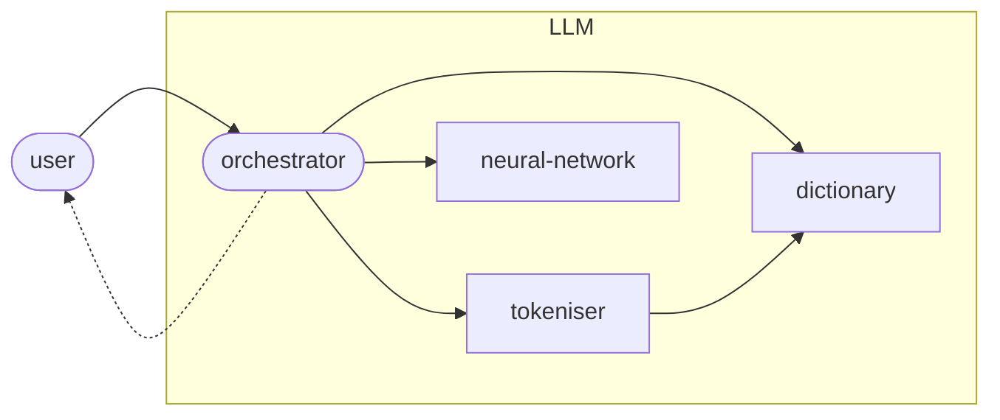

# Large language models (LLMs)

What goes on inside a Large Language Model (LLM) after you submit a prompt? How does an LLM analyse your input and generate its response?

This diagram shows the high-level internal architecture of a standard LLM, such as those belonging to OpenAI's GPT series:

An LLM consists of four sub-components:

- a dictionary, which stores linguistic 'tokens' (ie. words and bits of words), along with their meanings
- a tokeniser, which splits up an input prompt into these tokens
- a neural network, which predicts the next token for the response
- an orchestrator, which controls interactions with the other components.

I will now run through the whole LLM workflow, from beginning to end, and show briefly how each of these sub-components makes its contribution.

## Tokenisation

When a prompt is submitted to an LLM, the orchestrator immediately sends it on to the tokeniser to be split up into words and bits of words.

What the tokeniser does is:

1. Takes the sequence of characters that make up the prompt text.
2. Consults the dictionary to see what tokens are recognised by the LLM.
3. Tries to guess where are the significant token boundaries between the characters in the prompt.
4. Sends this proposed sequence of tokens back to the orchestrator.

For example, I typed the following 40-character prompt into OpenAI's GPT-4 tokeniser:

> Are frozen strawberries exempt from VAT?

The tokeniser then returned a sequence of seven tokens:

- "Are", " frozen", " strawberries", " exempt", " from", "VAT", "?"

These tokens are all drawn from GPT-4's internal dictionary:

ID	token	description
- 13938	"Are"	the string "Are", starting with a capital A
- 32638	" frozen"	the string "frozen" preceded by a space
- 106502	" strawberries"	the string "strawberries" preceded by a space
- 72064	" exempt"	the string "exempt" preceded by a space
- 591	" from"	the string "from" preceded by a space
- 56356	" VAT"	the string "VAT", all in capitals, preceded by a space
- 30	"?"	the question mark

Every LLM has its own internal dictionary of tokens that it has learned to recognise. GPT-4 recognises around 200,000 distinct words and bits of words. In comparison, the 2019 GPT-2 LLM only recognised around 50,000 distinct tokens. LLM dictionaries are getting bigger as the LLMs themselves get bigger (and better).

Tokenisation is important. Much of the unexpected behaviour you will come across when using an LLM-based tool ultimately comes down to the way tokenisation works (or occasionally doesn't work).

## Token embeddings

The next thing the orchestrator does is look up the 'meaning' of each identified token in the LLM's internal dictionary.

In an LLM, these meanings are known as 'token embeddings'. Meanings are represented, not as natural language definitions as in a human-readable dictionary, but rather as very long lists of decimal (floating point) numbers. For example, GPT-4 uses token embeddings with 12,288 distinct dimensions - its 'meanings' are lists of 12,288 decimal numbers, each of which represents a value on a different axis of meaning.

So, the meaning of the first token in our example prompt "Are" might be something like:

[+1.6, -0.4, -3.9, +95.0, +7.3, ... , +34.5]

Token embeddings are important because they allow the LLM to generalise more effectively across distinct but related tokens like "big", "large", "sizable", "huge", etc. These words look different on the surface, but the numbers in their meaning lists will be very closely related.

Once every token in our prompt has been 'embedded', the orchestrator will end up with a sequence of seven token embeddings, one for each of the tokens in the prompt:

[+1.6, -0.4, -3.9, ... , +34.5] = Are

[-9.5, +14.2, +0.3, ... , -3.2] = _frozen

[-23.1, -0,7, +14.8, ... , +55.9] = _strawberries

[+16.0, +99.5, +63.1, ... , -0.1] = _exempt

[+3.8, -16.3, -10.0, ... , +8.9] = _from

[-7.9, -33.8, -13.3, ... , -2.2] = _VAT

[0.0, +0.1, -0.3, ... , -45,7] = ?

Note here that I am representing spaces at the start of tokens with the underscore _ to make them easier to see.

We are now ready to feed the embedded prompt into the neural network itself.

## The neural network

Next, the orchestrator feeds the sequence of token embeddings into its neural network, and then waits for the network to run the statistics and generate an output.

Simplifying slightly, the output of the neural network is a prediction of the most likely next token to continue the sequence.

In this particular case, when the neural network is given the input prompt "Are _frozen _strawberries _exempt _from _VAT ?" (as token embeddings), it runs through its calculations and then predicts that the next token is most likely to be "Yes".

Are _frozen _strawberries _exempt _from _VAT ? Yes

## The token generation loop

Once the neural network has suggested the next token, control passes back to the LLM's orchestrator agent.

So far, the LLM has just generated a single token for the response. In order to generate a complete response, the orchestrator repeats the last few steps until it is happy it has generated enough:

1. Embed the new token sequence.
2. Get the neural network to predict the next token from these token embeddings.
3. Add this token to the end of the token sequence.
4. In this way, the response is generated incrementally, one token at a time, by repeatedly asking the neural network to predict the next token from the context:

Are _frozen _strawberries _exempt _from _VAT ? Yes ,

Are _frozen _strawberries _exempt _from _VAT ? Yes , _frozen

Are _frozen _strawberries _exempt _from _VAT ? Yes , _frozen _strawberries

Are _frozen _strawberries _exempt _from _VAT ? Yes , _frozen _strawberries _are

Are _frozen _strawberries _exempt _from _VAT ? Yes , _frozen _strawberries _are _zero

Are _frozen _strawberries _exempt _from _VAT ? Yes , _frozen _strawberries _are _zero -rated

...

Once the orchestrator is satisfied that the response is complete, it sends it back to the user (or more precisely to whichever software agent it received the prompt from in the first place).

## Summing up

You have now had a whistlestop tour of how an LLM generates a response from a prompt. You know that a few different specialised sub-components are involved and that each performs a different part of the overall task.

You are well on the way to understanding how LLMs operate internally, by predicting the next word from the preceding words, without having any obvious way of knowing whether what they are saying is true or not.

If you still want to dive deeper into how the different LLM sub-agents work, check out the next steps below.

----

Back up to: [Maglocunus](../index.md)
