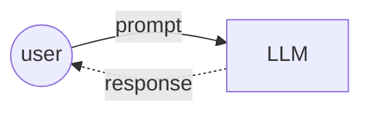
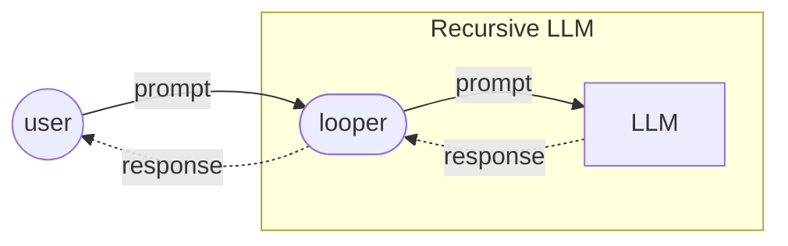
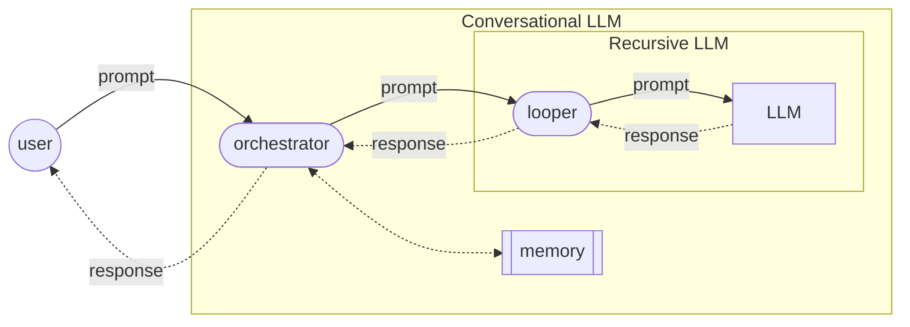
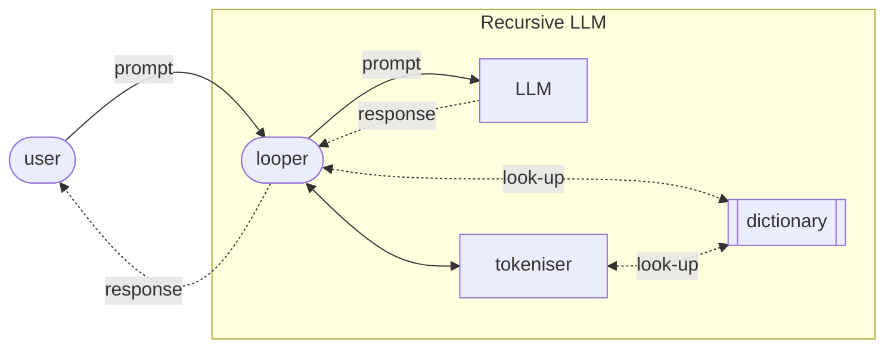
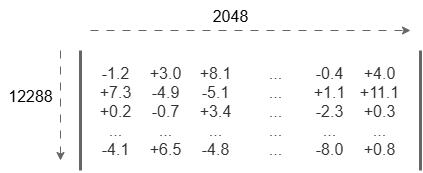

# Large language models

A `large language model` (LLM) is a neural network-based, generative AI software application which (in the strictest sense):
1. accepts a text as input – the 'prompt'
2. performs billions of calculations behind the scenes
3. then generates a single token (word) in response. 

The response token should constitute a sensible, relevant and appropriate continuation of the prompt.

Here is a diagram showing how a user interacts with an LLM:

For example, if you feed the following prompt into an LLM:

> Are frozen strawberries exempt from

It is highly likely that you will get a response token like one of the following:

> tax, VAT, tariffs

But highly unlikely that the response token will be something like:

> giraffes, happiness, Tuesday

----

Contents:
- [Recursive LLMs](#recursive-llms)
- [Conversational LLMs](#conversational-llms)
- [LLM architecture](#llm-architecture)
- [An example](#an-example)

----

## Recursive LLMs

An LLM neural network on its own will generate just one output token for any given prompt. However, these basic LLMs are almost always embedded within a loop application which recursively generates longer response texts consisting of multiple tokens. 

The following diagram shows the architecture of a recursive LLM:

The different elements in this diagram interact as follows:
1. The user submits an initial prompt to the LLM looper.
2. The looper submits the current prompt on to the LLM.
3. The LLM generates a response consisting of a single token, and sends this token back to the looper.
4. The looper appends the newly generated token to the end of the prompt, thus creating a slightly longer prompt.
5. The looper repeats steps 2–4 until it is happy it has a complete response for the user.
6. The looper removes the original user prompt from the start of current prompt, and sends this truncated response back to the user.

For example, when I submitted the following prompt to a well-known (recursive) LLM:

> Are frozen strawberries exempt from VAT?

I got back the following response:

> Yes, frozen strawberries are zero-rated for VAT in the UK—provided they are sold as food for human consumption and not as part of a catering supply.

This response was actually generated iteratively, token-by-token, by the neural network, as follows:

> Are frozen strawberries exempt from VAT?
>
> Are frozen strawberries exempt from VAT? Yes
>
> Are frozen strawberries exempt from VAT? Yes,
>
> Are frozen strawberries exempt from VAT? Yes, frozen
>
> Are frozen strawberries exempt from VAT? Yes, frozen strawberries
>
> Are frozen strawberries exempt from VAT? Yes, frozen strawberries are
>
> Are frozen strawberries exempt from VAT? Yes, frozen strawberries are zero
>
> Are frozen strawberries exempt from VAT? Yes, frozen strawberries are zero-
>
> Are frozen strawberries exempt from VAT? Yes, frozen strawberries are zero-rated
>
> ...
>
> Are frozen strawberries exempt from VAT? Yes, frozen strawberries are zero-rated for VAT in the UK—provided they are sold as food for human consumption and not as part of a catering supply.

The looper then removed my original prompt from the start and returned just the tokens generated by the LLM to me.

Back up to: [Top](#)

## Conversational LLMs

A recursive LLM will accept just the one prompt from a user, generate a single response text in return, and then stop. However, recursive LLMs are often embedded in a conversational loop, which manages extended, multi-turn dialogues with the user. These conversational LLMs (sometime called ‘chatbots’) need to maintain an ongoing memory of the entire conversation thus far, so as to generate sensible, appropriate responses.

The following diagram shows the architecture of a simple conversational LLM:

The components in this diagram interact as follows:
1. The user submits her/his next prompt to the conversation orchestrator.
2. The orchestrator appends this prompt to the ongoing conversation memory.
3. The orchestrator then retrieves the whole conversation memory this far, including the new user prompt, and submits it as a complex prompt to the LLM looper.
4. The looper works with the LLM to recursively generate a complete response, and then sends this back to the orchestrator.
5. The orchestrator again appends this response to the conversation memory.
6. The orchestrator then sends the looper’s response back to the user, and awaits her/his next prompt.

Maintaining a conversational memory in this way allows the LLM to generate conversationally coherent, contextually appropriate responses that can refer back to previous things mentioned in the dialogue, for example:

> Are frozen strawberries exempt from VAT?
>
> Yes, frozen strawberries are zero-rated for VAT in the UK—provided they are sold as food for human consumption and not as part of a catering supply.
>
> What about raspberries?
>
> Plain frozen raspberries are also zero-rated for VAT in the UK.

When generating a response to the second user prompt here (`What about raspberries?`), the recursive LLM is actually generating a response to the whole conversation thus far, and hence is able to interpret the elliptical question `What about raspberries?` as:

> Are frozen raspberries exempt from VAT?

Note that an LLM neural network can only accept input prompts up to a specific finite length, known as the LLM’s ‘context window’. For a typical 2022 LLM like OpenAIs GPT-3, the context window was fixed at 2048 tokens, though nowadays context windows are much much longer. If the conversation gets too long, there is the chance that it might overshoot this context window and need to be truncated by the looper.

Back up to: [Top](#)

## LLM architecture

Let’s go back to the architecture of a recursive LLM, which was previously represented in the following simple diagram:

We will now add some extra detail to this diagram:

In addition to the LLM neural network (which predicts the next token for the response), a recursive LLM has two more essential sub-components:
- a `tokeniser` – an application which splits up the input prompt into tokens (ie. words and bits of words)
- a `dictionary` – a datastore containing all the tokens that the LLM knows, each with a numerical representation of its ‘meaning’.

These subcomponents interact as follows:
1. The user submits an initial prompt to the LLM looper.
2. The looper sends this prompt to the tokeniser, which then sends it back to the looper as a list of tokens (each of which is contained in the dictionary).
3. The looper then sends each of these tokens to the LLM dictionary, which sends back the numerical vector representing its meaning.
4. The looper submits the current prompt on to the LLM, as a list of vectors.
5. The LLM generates a response consisting of a single vector, and sends this vector back to the looper.
6. The looper appends the newly generated vector to the end of the current prompt, thus creating a slightly longer list of vectors.
7. The looper repeats steps 4–6 until it is happy it has a complete response for the user.
8. The looper then sends each vector in the finalised vector list to the dictionary.
9. For each vector, the dictionary sends back a sample of tokens with relevant meanings.
10. The looper chooses one of these new tokens at random, and uses it to assemble a response for the user.
11. The looper sends the response back to the user.

Back up to: [Top](#)

## An example

For example, I typed the following 40-character prompt into the same well-known LLM:

> Are frozen strawberries exempt from VAT?

**Firstly**, the LLM’s tokeniser returned a sequence of seven tokens:

These tokens are all drawn from the LLM’s internal dictionary:

| token ID | token | description | meaning |
| -- | -- | -- | -- |
| 13938	| `Are`	| the string *Are*, starting with a capital *A* | `[+3.2, -0.5, -4.6, ... , +6.1]` |
| 32638 | ` frozen`	| the string *frozen* preceded by a space | `[+7.5, +3.0, -9.3, ... , -2.0]` |
| 106502 | ` strawberries` | the string *strawberries* preceded by a space | `[-4.6, -5.9, +1.8, ... , +1.3]` |
| 72064	| ` exempt`	| the string *exempt* preceded by a space | `[+7.3, -0.7, -1.6, ... , +2.2]` |
| 591	| ` from`	| the string *from* preceded by a space | `[+2.3, -2.4, +6.0, ... , -0.1]` |
| 56356	| ` VAT` | the string *VAT*, all in capitals, preceded by a space | `[-1.2, -1.5, +8.6, ... , -1.9]` |
| 30 | `?` | the question mark | `[+0.2, -0.2, +0.6, ... , +3.4]` |

**Secondly**, this list of tokens was translated into a list of numerical vectors, again by looking each one up in the dictionary:

In an LLM, these meaning vectors are known as *token embeddings*. Meanings are represented, not as natural language definitions as in a human-readable dictionary, but rather as very long lists of decimal numbers. For example, OpenAI’s 2023 GPT-4 LLM used token embeddings with 12,288 distinct dimensions – its ‘meanings’ are lists of 12,288 decimal numbers, each of which represents a value on a different axis of meaning.

Token embeddings are important because they allow the LLM to generalise more effectively across distinct but related tokens like `big`, `large`, `huge`, `sizeable`, etc. These words look different on the surface, but the numbers in their meaning lists will be very closely related.

**Thirdly**, this sequence of seven semantic vectors (token embeddings) is almost ready to be fed into the LLM proper (ie. the neural network), to generate the first token in the response.

Before doing this, the looper will need to pad out these vectors with dummy vectors at the start, to ensure that the neural network has enough input vectors in its context window to do its job properly. For example, OpenAI’s GPT-3 LLM has a context window of 2,048, so an additional 2,041 dummy vectors would need to be added.

Next, each of these 2,048 input vectors is modified slightly to encode its position in the sequence. This is done by adding or subtracting a specific amount to or from each position in the matrix.

Then, the entire matrix, 2,048 vectors of 12,288 decimal numbers, is fed into the neural network, all at once.

After the neural network has performed billions of simple calculations on the numbers in the input vector matrix, through dozens of processing layers, it produces an output in the same format — a matrix of 2,048 token embeddings (each of which is a vector of 12,288 decimal numbers). Something like this:

It is only the *rightmost* vector in this matrix that is sent back to the looper to represent the predicted next token in the sequence:

> `[+4.0, +11.1, +0.3, ... , +0.8]`

**Fourthly**, 

Back up to: [Top](#)

----

The orchestrator takes the final, rightmost column (or vector) in the output matrix and uses this specifically as the output embedding which encodes the next token. It does this by doing a reverse look-up of the LLM's internal dictionary.

This embedding vector is then 'unembedded' by computing its (cosine) similarity to all the token embeddings stored in the dictionary. The generated next token (eg. "Yes") is selected from among those with the highest similarity to the output embedding.

Once the LLM has generated this next token, it then keeps getting the neural network to generate new tokens until it is satisfied that it has a complete response to the original prompt.

### The takeaway

So:

The job of the neural network inside the GPT-3 LLM is to predict the next token given the preceding 2048 tokens.

Or rather, to predict the next token embedding, given the preceding 2048 token embeddings.

The neural network inputs and outputs matrices of 2048 x 12288 decimal numbers.

The rightmost column in the output matrix is its prediction of the next token embedding.

This is then 'unembedded' by the orchestrator to identify the actual next token.

## Token embeddings

## The neural network

Next, the orchestrator feeds the sequence of token embeddings into its neural network, and then waits for the network to run the statistics and generate an output.

Simplifying slightly, the output of the neural network is a prediction of the most likely next token to continue the sequence.

In this particular case, when the neural network is given the input prompt "Are _frozen _strawberries _exempt _from _VAT ?" (as token embeddings), it runs through its calculations and then predicts that the next token is most likely to be "Yes".

Are _frozen _strawberries _exempt _from _VAT ? Yes

## The token generation loop

Once the orchestrator is satisfied that the response is complete, it sends it back to the user (or more precisely to whichever software agent it received the prompt from in the first place).

## Summing up

You have now had a whistlestop tour of how an LLM generates a response from a prompt. You know that a few different specialised sub-components are involved and that each performs a different part of the overall task.

You are well on the way to understanding how LLMs operate internally, by predicting the next word from the preceding words, without having any obvious way of knowing whether what they are saying is true or not.

If you still want to dive deeper into how the different LLM sub-agents work, check out the next steps below.

----

Back up to: [Maglocunus](../index.md)
