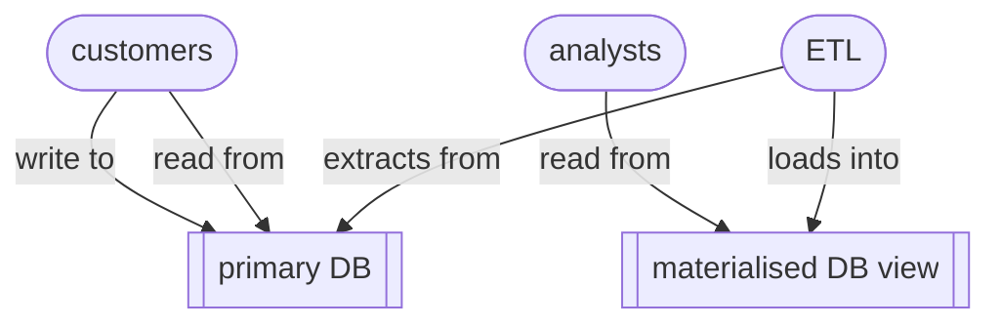

# Materialised database views

A `materialised view` is a database object that stores the results of a query as actual data, rather than running the query every time it is requested – a precomputed physical table that is automatically or manually refreshed.

Materialised views are a read-side data-architectural pattern that allows you to optimise *read-heavy, analytical workloads*. The trade-off is that materialised may briefly return ‘stale’ data due to refresh lag.

Materialised views differ from ordinary database views. When you create a (non-materialised) view, only the SQL query itself is stored in the database system:
```
CREATE VIEW high_value_orders AS SELECT * FROM Orders WHERE total > 1000
```
When you query the view `SELECT * FROM high_value_orders`, the stored SQL query is re-run every time. The view itself contains no data.

However, when you create a materialised view:
```
CREATE MATERIALIZED VIEW monthly_sales AS SELECT month, SUM(total) AS sales FROM Orders GROUP BY month;
```
The query is run and the results stored in a database table. A subsequent query then reads from this stored table – pre-aggregated, pre-filtered etc.

The architecture of such as system looks like this:



### Strategies, triggers, modes

There are two different strategies *refreshing* a materialised view:
- *complete manual refresh* – ETL is triggered by an administrator or by a process
- *complete scheduled refresh* – ETL is triggered every hour, or every night etc.
- *incremental refresh* – only new or changed data is refreshed

Complete refreshes involve deleting old contents, running the query again, and store the new results, and can be slow to run. Incremental refreshed are faster to run but more difficult to implement, needing timestamps, change logs etc.

In addition, there are different refresh *modes*:
- *synchronous* refresh – the triggering process waits until the view is fully updated (trading responsiveness for freshness)
- *asynchronous* refresh – the refresh runs in the background while the systems continues to serve requests (trading freshness for responsiveness).

### Advantages and disadvantages

Materialized views are useful when queries are:
- computationally expensive
- involve many joins
- aggregate large datasets
- executed frequently
- based on data that changes relatively slowly.

The trade off is that materialised views may contain ‘stale’ data, depending on the frequency with which they are refreshed.

Some mitigation strategies to counter the risks of materialised views are:
- choosing a good refresh strategy
- swap-based refreshes – the old view is replaced only when the refresh is complete
- scheduling refreshes during low-traffic periods

### Final thoughts

Many relational database systems support materialised views, including Oracle (very sophisticated implementation), PostgreSQL (manual refresh), Snowflake (automated refresh), Google BigQuery (for analytics), Microsoft SQL Server (via ‘indexed views’).

Other data-architectural patterns that attempt to solve the problem of scaling read-heavy workloads:
- [read replication](../r/read_replicas.md)
- [Command Query Responsibility Segregation](CQRS.md) (CQRS)
- Change Data Capture (CDC)
- event sourcing
- domain-based decomposition, polyglot persistence

Sources:
- Chapter 3 ‘Architecting read-side data’ of *Data Architecture* by [Pramod Sadalage](https://sadalage.com) & Premanand Chandrasekaran (O’Reilly 2026).

----

Back up to: [Maglocunus](../index.md)
