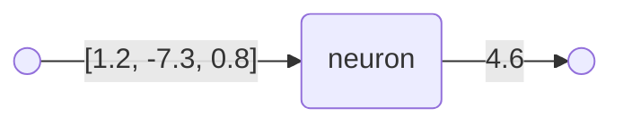
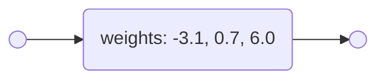

# Artificial neurons

An artificial neuron is a very simple computational model of how a biological neuron works.

Mathematically, an artificial neuron can be seen as a function from vectors of real numbers to real numbers.

For example:

An artificial neuron has three internal parameters:
- a vector of weights, one per element in the input vector
- a bias
- an activation function

Let’s take these one at a time.

cf. [activation functions](activation_functions.md)

See also:
- Wikipedia page on [artificial neurons](https://en.wikipedia.org/wiki/Artificial_neuron)

----

Back to: [Index](index.md)
