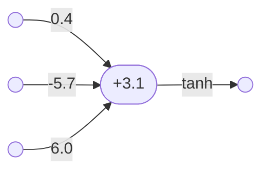

# Artificial neurons

An artificial neuron is a very simple computational model of how a biological neuron works.

Mathematically, an artificial neuron can be seen as a function from vectors of real numbers to real numbers.

The function underlying an artificial neuron has the following form:
- $f(x_1,x_2,\ldots,x_n) = g((x_1,x_2,\ldots,x_n) \cdot (w_1,w_2,\ldots,w_n) + b) = g(\sum_{i=1}^{n} x_i w_i + b)$

Where:
- each $w_i$ is a number which is used to weight the corresponding input $x_i$ up or down.
- $b$ is a number which is used to bias the total of the weighted inputs up or down.
- $g$ is an [activation function](activation_functions.md), used to modulate the output.

The artificial neuron: 
1. takes each input $x_i$ in turn
2. multiplies it by the relevant weight $w_i$
3. adds all the weighted inputs together
4. adds on the bias $b$
5. passes the whole thing through the activation function $g$
6. outputs the result.

Here is an example of an artificial neuron:
- $f(x_1,x_2,x_3) = \tanh((x_1,x_2,x_3) \cdot (0.4,-5.7,6.0) + 3.1) = \tanh(0.4x_1 - 5.7x_2 + 6x_3 + 3.1)$
- ie. $f = \lambda(x_1,x_2,x_3).\tanh(0.4x_1 - 5.7x_2 + 6x_3 + 3.1)$

In this artificial neuron:
- the weights are $(0.4,-5.7,6.0)$
- the bias is $3.1$
- the activation function is the hyperbolic tangent function.

Here is a diagram representing this artificial neuron:

See also:
- Wikipedia page on [artificial neurons](https://en.wikipedia.org/wiki/Artificial_neuron)

----

Back to: [Index](index.md)
