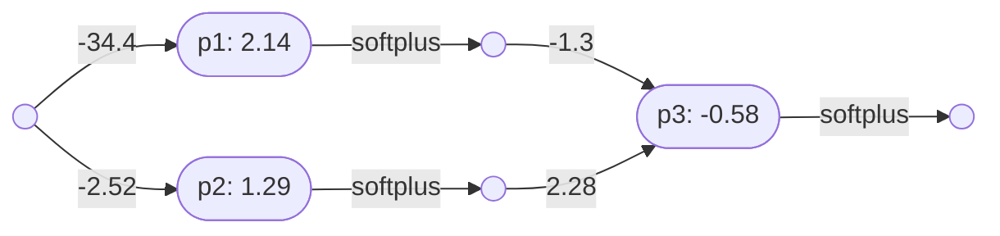
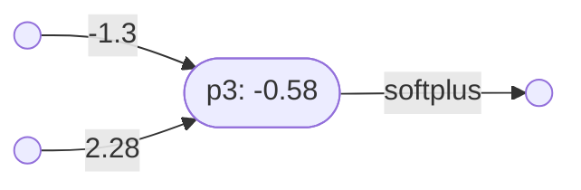

# Neural networks

## A very simple neural network

Here is a diagram of a simple neural network, taken from the StatQuest tutorial [Essential main ideas of neural networks](https://www.youtube.com/watch?v=CqOfi41LfDw):

This neural network has one input and one output. In other words, its ‘type’ is $\mathbb{R}\to\mathbb{R}$. 

### The perceptrons

This simple network consists of three perceptrons, $p_1$, $p_2$ and $p_3$.

#### Perceptron *p1*

Here is perceptron $p_1$, with one input:

Note that:
- $p_1 = \lambda x(\mathbf{softplus}(2.14 - 34.4x)) \vdash \mathbb{R}\to\mathbb{R}$

#### Perceptron *p2*

Here is perceptron $p_2$, with one input:

Note that:
- $p_2 = \lambda x(\mathbf{softplus}(1.29 - 2.52x)) \vdash \mathbb{R}\to\mathbb{R}$

#### Perceptron *p3*

Here is perceptron $p_3$ with two inputs:

Note that:
- $p_3 = \lambda(x,y)(\mathbf{softplus}(2.28y - 1.3x -0.58)) \vdash \mathbb{R}\times\mathbb{R}\to\mathbb{R}$

### The first layer *l1*

This simple neural network consists of two layers.

Here is the first layer $l_1$:

The first layer is itself a neural network, with one input and two outputs. It consists of two perceptrons, $p_1$ and $p_2$.

Note that:
- $p_1 = \lambda x(\mathbf{softplus}(2.14 - 34.4x)) \vdash \mathbb{R}\to\mathbb{R}$
- $p_2 = \lambda x(\mathbf{softplus}(1.29 - 2.52x)) \vdash \mathbb{R}\to\mathbb{R}$
- $| = \lambda(p,q)\lambda x(p(x),q(x)) \vdash (\mathbb{R}\to\mathbb{R}) \times (\mathbb{R}\to\mathbb{R}) \to (\mathbb{R}\to\mathbb{R}\times\mathbb{R})$
- $l_1 = p_1|p_2$
- $l_1 = (\lambda(p,q)\lambda x(p(x),q(x))) (p_1,p_2)$
- $l_1 = \lambda x(p_1(x),p_2(x))$
- $l_1 = \lambda x(\lambda y(\mathbf{softplus}(2.14 - 34.4y))(x),\lambda y(\mathbf{softplus}(1.29 - 2.52y))(x))$
- $l_1 = \lambda x(\mathbf{softplus}(2.14 - 34.4x), \mathbf{softplus}(1.29 - 2.52x)) \vdash \mathbb{R}\to\mathbb{R}\times\mathbb{R}$

Note that another combinator is thus also possible, where both $p$ and $q$ are one-input perceptrons:
- $p\\|q = \lambda(x,y)(p(x),q(y)) \vdash \mathbb{R}\times\mathbb{R}\to\mathbb{R}\times\mathbb{R}$

### The second layer

The second layer in the neural network above is just the perceptron $p_3$.

So: 
- $l_1 = p_1|p_2 = \lambda x(\mathbf{softplus}(2.14 - 34.4x), \mathbf{softplus}(1.29 - 2.52x)) \vdash \mathbb{R}\to\mathbb{R}\times\mathbb{R}$
- $p_3 = \lambda(x,y)(\mathbf{softplus}(2.28y - 1.3x -0.58)) \vdash \mathbb{R}\times\mathbb{R}\to\mathbb{R}$
- $\circ = \lambda(n,m)\lambda x(m(n(x))) \vdash (\mathbb{R}\to\mathbb{R}\times\mathbb{R}) \times (\mathbb{R}\times\mathbb{R}\to\mathbb{R}) \to \mathbb{R}\to\mathbb{R}$
- $N_1 = l_1\circ p_3$
- $N_1 = (\lambda(n,m)\lambda x(m(n(x))))(l_1,p_3)$
- $N_1 = \lambda x(p_3(l_1(x)))$
- $N_1 = \lambda x(\lambda(y,z)(\mathbf{softplus}(2.28z - 1.3y -0.58))(\lambda y(\mathbf{softplus}(2.14 - 34.4y),\mathbf{softplus}(1.29 - 2.52y))(x)))$
- $N_1 = \lambda x(\lambda(y,z)(\mathbf{softplus}(2.28z - 1.3y -0.58))(\mathbf{softplus}(2.14 - 34.4x),\mathbf{softplus}(1.29 - 2.52x)))$
- $N_1 = \lambda x(\mathbf{softplus}(2.28(\mathbf{softplus}(1.29 - 2.52x)) - 1.3(\mathbf{softplus}(2.14 - 34.4x)) - 0.58))$
- $N_1 = (p_1|p_2)\circ p_3 \vdash \mathbb{R}\to\mathbb{R}$  

----

Back to: [Index](index.md)
