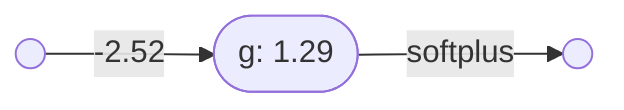

# Neural networks

## A very simple neural network

Here is a diagram of a simple neural network (taken from StatQuest):

This neural network has one input and one output. 

### The individual neurons

This simple network consists of three artificial neurons, which I've called $f$, $g$ and $h$.

#### Neuron *f*

Here is artificial neuron $f$:

Note that:
- $f = \lambda x.\mathbf{softplus}(2.14 - 34.4x)$

#### Neuron *g*

Here is artificial neuron $g$:

Note that:
- $g = \lambda x.\mathbf{softplus}(1.29 - 2.52x)$

#### Neuron *h*

Here is artificial neuron $h$:

Note that:
- $h = \lambda(x,y).\mathbf{softplus}(2.28y - 1.3x -0.58)$

### The first layer

This simple neural network consists of two layers.

Here is the first layer:

The first layer is itself a neural network, with one input and two outputs, and consisting of two neurons.

----

Back to: [Index](index.md)
