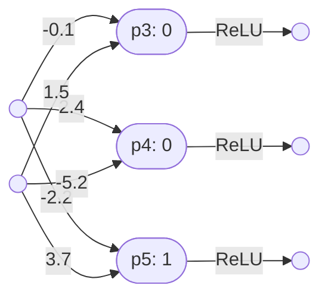

# Neural networks

## A very simple neural network

Here is a diagram of a simple neural network, taken from the StatQuest tutorial [Essential main ideas of neural networks](https://www.youtube.com/watch?v=CqOfi41LfDw):

This neural network has one input and one output. In other words, its ‘type’ is $\mathbb{R}\to\mathbb{R}$. 

### The perceptrons

This simple network consists of three perceptrons, $p_1$, $p_2$ and $p_3$.

#### Perceptron *p1*

Here is perceptron $p_1$, with one input:

Note that:
- $p_1 = \lambda x(\mathbf{softplus}(2.14 - 34.4x)) \vdash \mathbb{R}\to\mathbb{R}$

#### Perceptron *p2*

Here is perceptron $p_2$, with one input:

Note that:
- $p_2 = \lambda x(\mathbf{softplus}(1.29 - 2.52x)) \vdash \mathbb{R}\to\mathbb{R}$

#### Perceptron *p3*

Here is perceptron $p_3$ with two inputs:

Note that:
- $p_3 = \lambda(x,y)(\mathbf{softplus}(2.28y - 1.3x -0.58)) \vdash (\mathbb{R},\mathbb{R})\to\mathbb{R}$

### The first layer *l1*

This simple neural network consists of two layers.

Here is the first layer $l_1$:

The first layer is itself a neural network, with one input and two outputs. It consists of two perceptrons, $p_1$ and $p_2$.

Note that:
- $p_1 = \lambda x(\mathbf{softplus}(2.14 - 34.4x)) \vdash \mathbb{R}\to\mathbb{R}$
- $p_2 = \lambda x(\mathbf{softplus}(1.29 - 2.52x)) \vdash \mathbb{R}\to\mathbb{R}$
- $| = \lambda(p,q)\lambda x(p(x),q(x)) \vdash (\mathbb{R}\to\mathbb{R},\mathbb{R}\to\mathbb{R}) \to (\mathbb{R}\to(\mathbb{R},\mathbb{R}))$
- $l_1 = p_1|p_2$
- $l_1 = (\lambda(p,q)\lambda x(p(x),q(x))) (p_1,p_2)$
- $l_1 = \lambda x(p_1(x),p_2(x))$
- $l_1 = \lambda x(\lambda y(\mathbf{softplus}(2.14 - 34.4y))(x),\lambda y(\mathbf{softplus}(1.29 - 2.52y))(x))$
- $l_1 = \lambda x(\mathbf{softplus}(2.14 - 34.4x), \mathbf{softplus}(1.29 - 2.52x)) \vdash \mathbb{R}\to(\mathbb{R},\mathbb{R})$

Note the following combinator used here:
- $| = \lambda(p,q)\lambda x(p(x),q(x)) \vdash (\mathbb{R}\to\mathbb{R},\mathbb{R}\to\mathbb{R}) \to (\mathbb{R}\to(\mathbb{R},\mathbb{R}))$

The $|$ combinator combines two $\mathbb{R}\to\mathbb{R}$ perceptrons (or networks), in parallel, into a single $\mathbb{R}\to(\mathbb{R},\mathbb{R})$ layer.

Note that another combinator is thus also possible, to combine two $\mathbb{R}\to\mathbb{R}$ perceptrons/networks in parallel, but this time into a $(\mathbb{R},\mathbb{R})\to(\mathbb{R},\mathbb{R})$ layer:
- $\\| = \lambda(p,q)\lambda(x,y)(p(x),q(y)) \vdash (\mathbb{R}\to\mathbb{R},\mathbb{R}\to\mathbb{R}) \to ((\mathbb{R},\mathbb{R})\to(\mathbb{R},\mathbb{R}))$
- $p\\|q = \lambda(x,y)(p(x),q(y)) \vdash (\mathbb{R},\mathbb{R})\to(\mathbb{R},\mathbb{R})$

### The second layer

The second layer in the neural network above is just the perceptron $p_3$.

So: 
- $l_1 = p_1|p_2 = \lambda x(\mathbf{softplus}(2.14 - 34.4x), \mathbf{softplus}(1.29 - 2.52x)) \vdash \mathbb{R}\to(\mathbb{R},\mathbb{R})$
- $p_3 = \lambda(x,y)(\mathbf{softplus}(2.28y - 1.3x -0.58)) \vdash (\mathbb{R},\mathbb{R})\to\mathbb{R}$
- $\circ = \lambda(n,m)\lambda x(m(n(x))) \vdash (\mathbb{R}\to(\mathbb{R},\mathbb{R})), ((\mathbb{R},\mathbb{R})\to\mathbb{R}) \to (\mathbb{R}\to\mathbb{R})$
- $N_1 = l_1\circ p_3$
- $N_1 = (\lambda(n,m)\lambda x(m(n(x))))(l_1,p_3)$
- $N_1 = \lambda x(p_3(l_1(x)))$
- $N_1 = \lambda x(\lambda(y,z)(\mathbf{softplus}(2.28z - 1.3y -0.58))(\lambda y(\mathbf{softplus}(2.14 - 34.4y),\mathbf{softplus}(1.29 - 2.52y))(x)))$
- $N_1 = \lambda x(\lambda(y,z)(\mathbf{softplus}(2.28z - 1.3y -0.58))(\mathbf{softplus}(2.14 - 34.4x),\mathbf{softplus}(1.29 - 2.52x)))$
- $N_1 = \lambda x(\mathbf{softplus}(2.28(\mathbf{softplus}(1.29 - 2.52x)) - 1.3(\mathbf{softplus}(2.14 - 34.4x)) - 0.58))$
- $N_1 = (p_1|p_2)\circ p_3 \vdash \mathbb{R}\to\mathbb{R}$  

Note that this introduced a new combinator $\circ$ which composes two compatible network layers in series:
- $\circ = \lambda(n,m)\lambda x(m(n(x))) \vdash (\mathbb{R}\to(\mathbb{R},\mathbb{R})), ((\mathbb{R},\mathbb{R})\to\mathbb{R}) \to (\mathbb{R}\to\mathbb{R})$

## A more complex neural network

Here is a diagram of a slightly more complex neural network, taken from another StatQuest tutorial [Multiple inputs and outputs](https://www.youtube.com/watch?v=83LYR-1IcjA):

This neural network has two inputs and three outputs. In other words, its type is $\mathbb{R}\times\mathbb{R}\to\mathbb{R}\times\mathbb{R}\times\mathbb{R}$. 

### The perceptrons

The five perceptrons in this network are:
- $p_1 = \lambda(x,y)(\mathbf{ReLU}(0.6y - 2.5x + 1.6)) \vdash (\mathbb{R},\mathbb{R})\to\mathbb{R}$
- $p_2 = \lambda(x,y)(\mathbf{ReLU}(0.4y - 1.5x + 0.7)) \vdash (\mathbb{R},\mathbb{R})\to\mathbb{R}$
- $p_3 = \lambda(x,y)(\mathbf{ReLU}(1.5y - 0.1x)) \vdash (\mathbb{R},\mathbb{R})\to\mathbb{R}$
- $p_4 = \lambda(x,y)(\mathbf{ReLU}(2.4x - 5.2y)) \vdash (\mathbb{R},\mathbb{R})\to\mathbb{R}$
- $p_5 = \lambda(x,y)(\mathbf{ReLU}(3.7y - 2.2x + 1)) \vdash (\mathbb{R},\mathbb{R})\to\mathbb{R}$

### The first layer

Here is the first layer in this network:

Here are the two perceptrons:
- $p_1 = \lambda(x,y)(\mathbf{ReLU}(0.6y - 2.5x + 1.6)) \vdash (\mathbb{R},\mathbb{R})\to\mathbb{R}$
- $p_2 = \lambda(x,y)(\mathbf{ReLU}(0.4y - 1.5x + 0.7)) \vdash (\mathbb{R},\mathbb{R})\to\mathbb{R}$

And these are the combinators we know about so far:
- $| = \lambda(p,q)\lambda x(p(x),q(x)) \vdash (\mathbb{R}\to\mathbb{R},\mathbb{R}\to\mathbb{R}) \to (\mathbb{R}\to(\mathbb{R},\mathbb{R}))$
- $\\| = \lambda(p,q)\lambda(x,y)(p(x),q(y)) \vdash (\mathbb{R}\to\mathbb{R},\mathbb{R}\to\mathbb{R}) \to ((\mathbb{R},\mathbb{R})\to(\mathbb{R},\mathbb{R}))$
- $\circ = \lambda(n,m)\lambda x(m(n(x))) \vdash (\mathbb{R}\to(\mathbb{R},\mathbb{R}),(\mathbb{R},\mathbb{R})\to\mathbb{R}) \to (\mathbb{R}\to\mathbb{R})$

So we are going to need a new combinator here, to combine two $(\mathbb{R},\mathbb{R})\to\mathbb{R}$ in parallel, with full connectivity:
- $\otimes = \lambda(p,q)\lambda(x,y)(p(x,y),q(x,y)) \vdash ((\mathbb{R},\mathbb{R})\to\mathbb{R},(\mathbb{R},\mathbb{R})\to\mathbb{R}) \to ((\mathbb{R},\mathbb{R})\to(\mathbb{R},\mathbb{R}))$

So:
- $l_1 = p_1\otimes p_2 \vdash (\mathbb{R},\mathbb{R})\to(\mathbb{R},\mathbb{R})$
- $l_1 = (\lambda(p,q)\lambda(x,y)(p(x,y),q(x,y)))(p_1,p_2)$
- $l_1 = \lambda(x,y)(p_1(x,y),p_2(x,y)))$
- $l_1 = \lambda(x,y)(\lambda(z,w)(\mathbf{ReLU}(0.6w - 2.5z + 1.6))(x,y),\lambda(z,w)(\mathbf{ReLU}(0.4w - 1.5z + 0.7))(x,y)))$
- $l_1 = \lambda(x,y)(\mathbf{ReLU}(0.6y - 2.5x + 1.6),\mathbf{ReLU}(0.4y - 1.5x + 0.7)))$

### The second layer

Here is the second layer in the network:

Here are the three perceptrons:
- $p_3 = \lambda(x,y)(\mathbf{ReLU}(1.5y - 0.1x)) \vdash (\mathbb{R},\mathbb{R})\to\mathbb{R}$
- $p_4 = \lambda(x,y)(\mathbf{ReLU}(2.4x - 5.2y)) \vdash (\mathbb{R},\mathbb{R})\to\mathbb{R}$
- $p_5 = \lambda(x,y)(\mathbf{ReLU}(3.7y - 2.2x + 1)) \vdash (\mathbb{R},\mathbb{R})\to\mathbb{R}$

To combine these in parallel we need to generalise the $\otimes$ combinator to cover three perceptrons:
- $\otimes\otimes = \lambda(p,q,r)\lambda(x,y)(p(x,y),q(x,y),r(x,y)) \vdash ((\mathbb{R},\mathbb{R})\to\mathbb{R},(\mathbb{R},\mathbb{R})\to\mathbb{R},(\mathbb{R},\mathbb{R})\to\mathbb{R}) \to ((\mathbb{R},\mathbb{R})\to(\mathbb{R},\mathbb{R},\mathbb{R}))$

So:
- $l_2 = p_3\otimes p_4\otimes p_4 \vdash (\mathbb{R},\mathbb{R})\to(\mathbb{R},\mathbb{R},\mathbb{R})$
- $l_2 = (\lambda(p,q,r)\lambda(x,y)(p(x,y),q(x,y),r(x,y)))(p_3,p_4,p_5)$
- $l_2 = \lambda(x,y)(p_3(x,y),p_4(x,y),p_5(x,y))$
- $l_2 = \lambda(x,y)((\lambda(z,w)(\mathbf{ReLU}(1.5w - 0.1z)))(x,y),(\lambda(z,w)(\mathbf{ReLU}(2.4z - 5.2w)))(x,y),(\lambda(z,w)(\mathbf{ReLU}(3.7z - 2.2w + 1)))(x,y))$
- $l_2 = \lambda(x,y)(\mathbf{ReLU}(1.5y - 0.1x),\mathbf{ReLU}(2.4x - 5.2y),\mathbf{ReLU}(3.7x - 2.2y + 1))$

### Composing the two layers

This is where we are:
- $l_1 = p_1\otimes p_2 = \lambda(x,y)(\mathbf{ReLU}(0.6y - 2.5x + 1.6),\mathbf{ReLU}(0.4y - 1.5x + 0.7))) \vdash (\mathbb{R},\mathbb{R})\to(\mathbb{R},\mathbb{R})$
- $l_2 = p_3\otimes p_4\otimes p_4 = \lambda(x,y)(\mathbf{ReLU}(1.5y - 0.1x),\mathbf{ReLU}(2.4x - 5.2y),\mathbf{ReLU}(3.7x - 2.2y + 1)) \vdash (\mathbb{R},\mathbb{R})\to(\mathbb{R},\mathbb{R},\mathbb{R})$
- $\circ = \lambda(n,m)\lambda x(m(n(x))) \vdash (\mathbb{R}\to(\mathbb{R},\mathbb{R}),(\mathbb{R},\mathbb{R})\to\mathbb{R}) \to (\mathbb{R}\to\mathbb{R})$

To compose $l_1$ and $l_2$ in series, we are going to have to overload the combinator $\circ$:
- $\circ = \lambda(n,m)\lambda(x,y)(m(n(x,y))) \vdash ((\mathbb{R},\mathbb{R})\to(\mathbb{R},\mathbb{R}),(\mathbb{R},\mathbb{R})\to(\mathbb{R},\mathbb{R},\mathbb{R})) \to ((\mathbb{R},\mathbb{R})\to(\mathbb{R},\mathbb{R},\mathbb{R}))$

Does this work out?
- $N_2 = l_1\circ l_2$
- $N_2 = (\lambda(n,m)\lambda x(m(n(x))))(l_1,l_2)$
- $N_2 = \lambda x(l_2(l_1(x)))$
- $N_2 = \lambda x(l_2((\lambda(z,w)(\mathbf{ReLU}(0.6w - 2.5z + 1.6),\mathbf{ReLU}(0.4w - 1.5z + 0.7))))(x)))$
- $N_2 = \lambda(z,w)(l_2(\mathbf{ReLU}(0.6w - 2.5z + 1.6),\mathbf{ReLU}(0.4w - 1.5z + 0.7)))$
- $N_2 = \lambda(z,w)([\lambda(x,y)(\mathbf{ReLU}(1.5y - 0.1x),\mathbf{ReLU}(2.4x - 5.2y),\mathbf{ReLU}(3.7x - 2.2y + 1))](\mathbf{ReLU}(0.6w - 2.5z + 1.6),\mathbf{ReLU}(0.4w - 1.5z + 0.7)))$
- $N_2 = \lambda(z,w)(\mathbf{ReLU}(1.5(\mathbf{ReLU}(0.4w - 1.5z + 0.7)) - 0.1(\mathbf{ReLU}(0.6w - 2.5z + 1.6))),\mathbf{ReLU}(2.4(\mathbf{ReLU}(0.6w - 2.5z + 1.6)) - 5.2(\mathbf{ReLU}(0.4w - 1.5z + 0.7))),\mathbf{ReLU}(3.7(\mathbf{ReLU}(0.6w - 2.5z + 1.6)) - 2.2(\mathbf{ReLU}(0.4w - 1.5z + 0.7)) + 1))$
- $N_2 = (p_1\otimes p_2)\circ (p_3\otimes p_4\otimes p_4) \vdash (\mathbb{R},\mathbb{R})\to(\mathbb{R},\mathbb{R},\mathbb{R})$

----

Back to: [Index](index.md)
