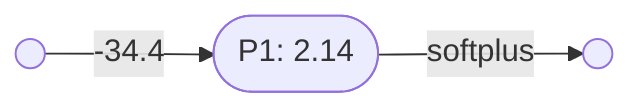
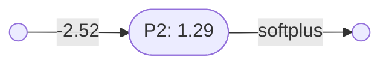
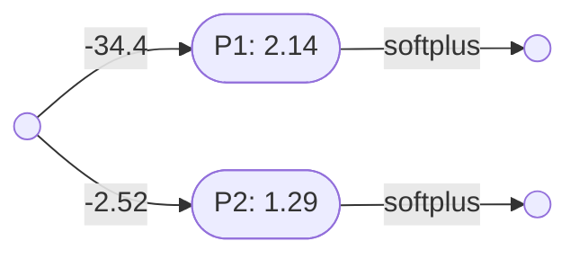
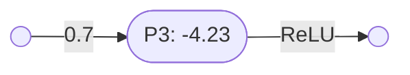
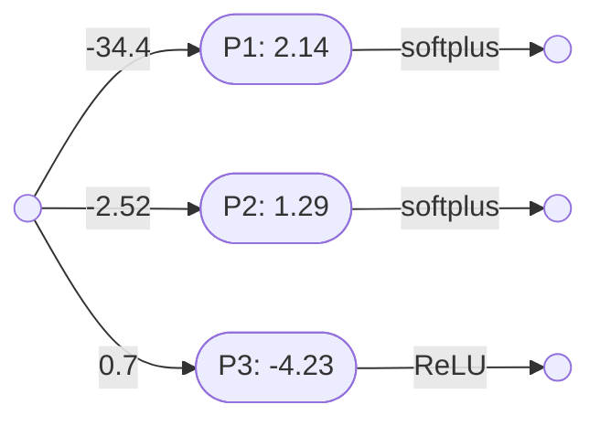
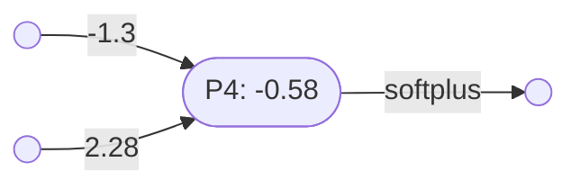

# Perceptron layers

[Perceptrons](perceptrons.md) of the same arity can be combined into a perceptron layer.

### Unary perceptron layers

Two or more unary perceptrons can be combined into a unary perceptron layer.

Here is perceptron $\mathbf{P_1}$, with one input:

And perceptron $\mathbf{P_2}$, which also has one input:

Note that:
- $\mathbf{P_1} = \lambda x(\mathbf{softplus}(2.14 - 34.4x)) \vdash \mathbb{R}\to\mathbb{R}$
- $\mathbf{P_2} = \lambda x(\mathbf{softplus}(1.29 - 2.52x)) \vdash \mathbb{R}\to\mathbb{R}$

Since these two perceptrons have the same arity they can be combined into the perceptron layer $\mathbf{L_1}$:

The following perceptron combinator is used to create these parallel layers:
- $\otimes = \lambda(P_1,P_2,\ldots, P_n)\lambda(x_1,x_2,\ldots,x_m)(P_1(x_1,x_2,\ldots,x_m),P_2(x_1,x_2,\ldots,x_m),\ldots, P_n(x_1,x_2,\ldots,x_m)) \vdash (\mathbb{R}^m\to\mathbb{R})^n \to (\mathbb{R}^m\to\mathbb{R}^n)$

So:
- $\mathbf{L_1} = \mathbf{P_1}\otimes\mathbf{P_2}$
- $\mathbf{L_1} = \lambda(P,Q)\lambda x(Px,Qx)(\mathbf{P_1},\mathbf{P_2})$
- $\mathbf{L_1} = \lambda x(\mathbf{P_1}x,\mathbf{P_2}x)$
- $\mathbf{L_1} = \lambda x(\lambda y(\mathbf{softplus}(2.14 - 34.4y))x,\lambda y(\mathbf{softplus}(1.29 - 2.52y))x)$
- $\mathbf{L_1} = \lambda x(\mathbf{softplus}(2.14 - 34.4x),\mathbf{softplus}(1.29 - 2.52x)) \vdash \mathbb{R}\to(\mathbb{R},\mathbb{R})$

You can also create a unary perceptron stack with three or more perceptrons.

Here is a third unary perceptron $\mathbf{P_3} = \lambda x(\mathbf{ReLU}(0.7x - 4.23)) \vdash \mathbb{R}\to\mathbb{R}$:

And here is a three perceptron layer $\mathbf{L_2}$, formed out of $\mathbf{P_1}$, $\mathbf{P_2}$ and $\mathbf{P_3}$:

So:
- $\mathbf{L_2} = \mathbf{P_1}\otimes\mathbf{P_2}\otimes\mathbf{P_3}$
- $\mathbf{L_2} = \lambda(P,Q,R)\lambda x(Px,Qx,Rx)(\mathbf{P_1},\mathbf{P_2},\mathbf{P_3})$
- $\mathbf{L_2} = \lambda x(\mathbf{P_1}x,\mathbf{P_2}x,\mathbf{P_3}x)$
- $\mathbf{L_2} = \lambda x(\lambda y(\mathbf{softplus}(2.14 - 34.4y))x,\lambda y(\mathbf{softplus}(1.29 - 2.52y))x,\lambda y(\mathbf{ReLU}(0.7y - 4.23))x)$
- $\mathbf{L_2} = \lambda x(\mathbf{softplus}(2.14 - 34.4x),\mathbf{softplus}(1.29 - 2.52x),\mathbf{ReLU}(0.7x - 4.23)) \vdash \mathbb{R}\to(\mathbb{R},\mathbb{R},\mathbb{R})$

Note that a unary perceptron layer has one input and $n$ outputs, where $n$ is the number of layered perceptrons. 

### Binary perceptron layers

Two or more binary perceptrons can be combined into a binary perceptron layer.

Here is binary perceptron $\mathbf{P_4} = $:

And a second binary perceptron $\mathbf{P_5} = $

Note that a binary perceptron layer has two inputs and $n$ outputs, where $n$ is the number of layered perceptrons. 

### Ternary perceptron layers

----

Back to: [Index](index.md)

