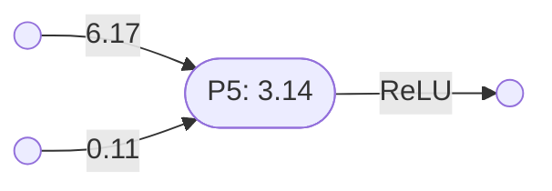
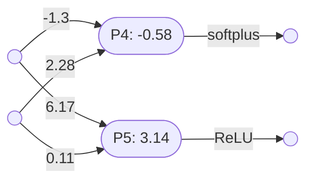
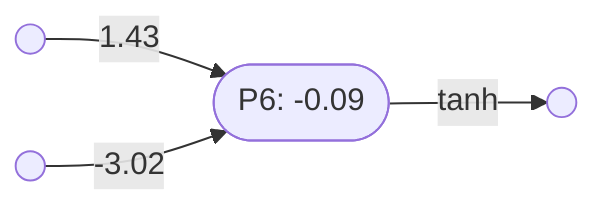
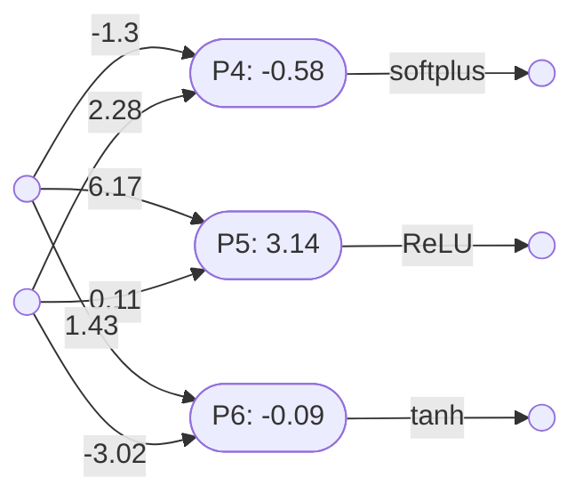
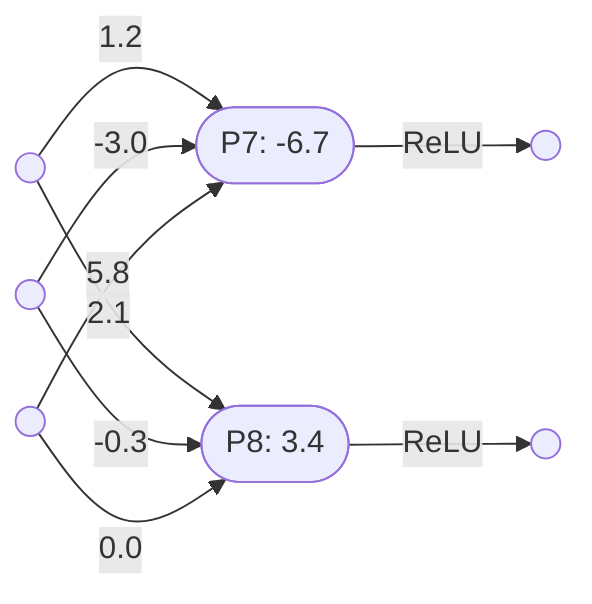

# Perceptron layers

[Perceptrons](perceptrons.md) of the same arity can be combined into a perceptron layer.

### Unary perceptron layers

Two or more unary perceptrons can be combined into a unary perceptron layer.

Here is perceptron $\mathbf{P_1}$, with one input:

And perceptron $\mathbf{P_2}$, which also has one input:

Note that:
- $\mathbf{P_1} = \lambda x(\mathbf{softplus}(2.14 - 34.4x)) \vdash \mathbb{R}\to\mathbb{R}$
- $\mathbf{P_2} = \lambda x(\mathbf{softplus}(1.29 - 2.52x)) \vdash \mathbb{R}\to\mathbb{R}$

Since these two perceptrons have the same arity they can be combined into the perceptron layer $\mathbf{L_1}$:

The following perceptron combinator is used to create these parallel layers:
- $\otimes = \lambda(P_1,P_2,\ldots, P_n)\lambda(x_1,x_2,\ldots,x_m)(P_1(x_1,x_2,\ldots,x_m),P_2(x_1,x_2,\ldots,x_m),\ldots, P_n(x_1,x_2,\ldots,x_m)) \vdash (\mathbb{R}^m\to\mathbb{R})^n \to (\mathbb{R}^m\to\mathbb{R}^n)$

So:
- $\mathbf{L_1} = \mathbf{P_1}\otimes\mathbf{P_2}$
- $\mathbf{L_1} = \lambda(P,Q)\lambda x(Px,Qx)(\mathbf{P_1},\mathbf{P_2})$
- $\mathbf{L_1} = \lambda x(\mathbf{P_1}x,\mathbf{P_2}x)$
- $\mathbf{L_1} = \lambda x(\lambda y(\mathbf{softplus}(2.14 - 34.4y))x,\lambda y(\mathbf{softplus}(1.29 - 2.52y))x)$
- $\mathbf{L_1} = \lambda x(\mathbf{softplus}(2.14 - 34.4x),\mathbf{softplus}(1.29 - 2.52x)) \vdash \mathbb{R}\to(\mathbb{R},\mathbb{R})$

You can also create a unary perceptron layer with three or more perceptrons.

Here is a third unary perceptron $\mathbf{P_3} = \lambda x(\mathbf{ReLU}(0.7x - 4.23)) \vdash \mathbb{R}\to\mathbb{R}$:

And here is a three perceptron layer $\mathbf{L_2}$, formed out of $\mathbf{P_1}$, $\mathbf{P_2}$ and $\mathbf{P_3}$:

So:
- $\mathbf{L_2} = \mathbf{P_1}\otimes\mathbf{P_2}\otimes\mathbf{P_3}$
- $\mathbf{L_2} = \lambda(P,Q,R)\lambda x(Px,Qx,Rx)(\mathbf{P_1},\mathbf{P_2},\mathbf{P_3})$
- $\mathbf{L_2} = \lambda x(\mathbf{P_1}x,\mathbf{P_2}x,\mathbf{P_3}x)$
- $\mathbf{L_2} = \lambda x(\lambda y(\mathbf{softplus}(2.14 - 34.4y))x,\lambda y(\mathbf{softplus}(1.29 - 2.52y))x,\lambda y(\mathbf{ReLU}(0.7y - 4.23))x)$
- $\mathbf{L_2} = \lambda x(\mathbf{softplus}(2.14 - 34.4x),\mathbf{softplus}(1.29 - 2.52x),\mathbf{ReLU}(0.7x - 4.23)) \vdash \mathbb{R}\to(\mathbb{R},\mathbb{R},\mathbb{R})$

Note that a unary perceptron layer has one input and $n$ outputs, where $n$ is the number of layered perceptrons. 

### Binary perceptron layers

Two or more binary perceptrons can be combined into a binary perceptron layer.

Here is binary perceptron $\mathbf{P_4} = \lambda(x,y)(\mathbf{softplus}(2.28y - 1.3x -0.58)) \vdash (\mathbb{R},\mathbb{R})\to\mathbb{R}$:

And a second binary perceptron $\mathbf{P_5} = \lambda(x,y)(\mathbf{ReLU}(6.17x + 0.11y + 3.14)) \vdash (\mathbb{R},\mathbb{R})\to\mathbb{R}$

Since these two perceptrons have the same arity they can be combined into the perceptron layer $\mathbf{L_3}$:

So:
- $\mathbf{L_3} = \mathbf{P_4}\otimes\mathbf{P_5}$
- $\mathbf{L_3} = \lambda(P,Q)\lambda(x,y)(P(x,y),Q(x,y))(\mathbf{P_4},\mathbf{P_5})$
- $\mathbf{L_3} = \lambda(x,y)(\mathbf{P_4}(x,y),\mathbf{P_5}(x,y))$
- $\mathbf{L_3} = \lambda(x,y)(\lambda(z,w)(\mathbf{softplus}(2.28w - 1.3z -0.58))(x,y),\lambda(z,w)(\mathbf{ReLU}(6.17z + 0.11w + 3.14))(x,y))$
- $\mathbf{L_3} = \lambda(x,y)(\mathbf{softplus}(2.28y - 1.3x -0.58),\mathbf{ReLU}(6.17x + 0.11y + 3.14)) \vdash (\mathbb{R},\mathbb{R})\to(\mathbb{R},\mathbb{R})$

You can also create a binary perceptron layer with three or more binary perceptrons.

Here is a third binary perceptron $\mathbf{P_6} = \lambda(x,y)(\mathbf{tanh}(1.43x - 3.02y - 0.09)) \vdash (\mathbb{R},\mathbb{R})\to\mathbb{R}$:

And here is a three perceptron layer $\mathbf{L_4}$, formed out of $\mathbf{P_4}$, $\mathbf{P_5}$ and $\mathbf{P_6}$:

So:
- $\mathbf{L_4} = \mathbf{P_4}\otimes\mathbf{P_5}\otimes\mathbf{P_6}$
- $\mathbf{L_4} = \lambda(P,Q,R)\lambda(x,y)(P(x,y),Q(x,y),R(x,y))(\mathbf{P_4},\mathbf{P_5},\mathbf{P_6})$
- $\mathbf{L_4} = \lambda(x,y)(\mathbf{P_4}(x,y),\mathbf{P_5}(x,y),\mathbf{P_6}(x,y))$
- $\mathbf{L_4} = \lambda(x,y)(\mathbf{softplus}(2.28y - 1.3x -0.58), \mathbf{ReLU}(6.17x + 0.11y + 3.14), \mathbf{tanh}(1.43x - 3.02y - 0.09)) \vdash (\mathbb{R},\mathbb{R})\to(\mathbb{R},\mathbb{R},\mathbb{R})$

Note that a binary perceptron layer has two inputs and $n$ outputs, where $n$ is the number of layered perceptrons. 

### Ternary perceptron layers

Two or more ternary perceptrons can be combined into a ternary perceptron layer.

For example:

So:
- $\mathbf{P_7} = \lambda(x,y,z)(\mathbf{ReLU}(1.2x - 3y + 5.2z - 6.7)) \vdash (\mathbb{R},\mathbb{R},\mathbb{R})\to\mathbb{R}$
- $\mathbf{P_8} = \lambda(x,y,z)(\mathbf{ReLU}(2.1x - 0.3y + 0z + 3.4)) \vdash (\mathbb{R},\mathbb{R},\mathbb{R})\to\mathbb{R}$
- $\mathbf{L_5} = \mathbf{P_7}\otimes\mathbf{P_8} \vdash (\mathbb{R},\mathbb{R},\mathbb{R})\to(\mathbb{R},\mathbb{R})$

Note that a ternary perceptron layer has three inputs and $n$ outputs, where $n$ is the number of layered perceptrons. 

----

Back to: [Index](index.md)

