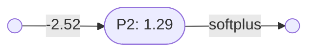

# Perceptron layers

[Perceptrons](perceptrons.md) of the same arity can be combined into a perceptron layer.

### Unary perceptron layers

Two or more unary perceptrons can be combined into a unary perceptron layer.

Here is perceptron $\mathbf{P_1}$, with one input:

And perceptron $\mathbf{P_2}$, which also has one input:

Note that:
- $\mathbf{P_1} = \lambda x(\mathbf{softplus}(2.14 - 34.4x)) \vdash \mathbb{R}\to\mathbb{R}$
- $\mathbf{P_2} = \lambda x(\mathbf{softplus}(1.29 - 2.52x)) \vdash \mathbb{R}\to\mathbb{R}$

Since these two perceptrons have the same arity they can be combined into the perceptron layer $\mathbf{L_1}$:

The following perceptron combinator is used to create these parallel layers:
- $\otimes = \lambda(P_1,P_2,\ldots, P_n)\lambda(x_1,x_2,\ldots,x_m)(P_1(x_1,x_2,\ldots,x_m),P_2(x_1,x_2,\ldots,x_m),\ldots, P_n(x_1,x_2,\ldots,x_m)) \vdash (\mathbb{R}^m\to\mathbb{R})^n \to (\mathbb{R}^m\to\mathbb{R}^n)$

So:
- $\mathbf{L_1} = \mathbf{P_1}\otimes\mathbf{P_2}$
- $\mathbf{L_1} = \lambda(P,Q)\lambda x(Px,Qx)(\mathbf{P_1},\mathbf{P_2})$
- $\mathbf{L_1} = \lambda x(\mathbf{P_1}x,\mathbf{P_2}x)$
- $\mathbf{L_1} = \lambda x(\lambda y(\mathbf{softplus}(2.14 - 34.4y))x,\lambda y(\mathbf{softplus}(1.29 - 2.52y))x)$
- $\mathbf{L_1} = \lambda x(\mathbf{softplus}(2.14 - 34.4x),\mathbf{softplus}(1.29 - 2.52x)) \vdash \mathbb{R}\to(\mathbb{R},\mathbb{R})$

You can also create a unary perceptron stack with three or more perceptrons.

### Binary perceptron layers

Two or more unary perceptrons can be combined into a unary perceptron layer.

### Ternary perceptron layers

----

Back to: [Index](index.md)

