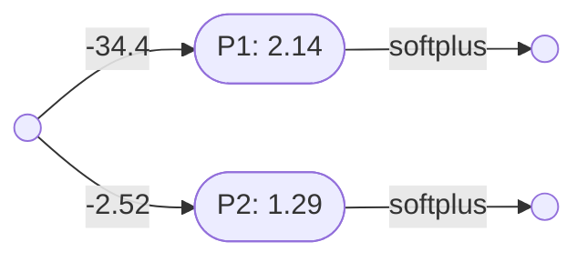
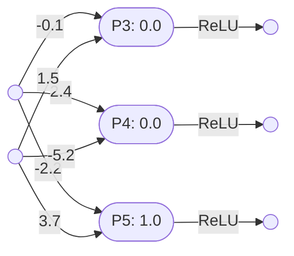
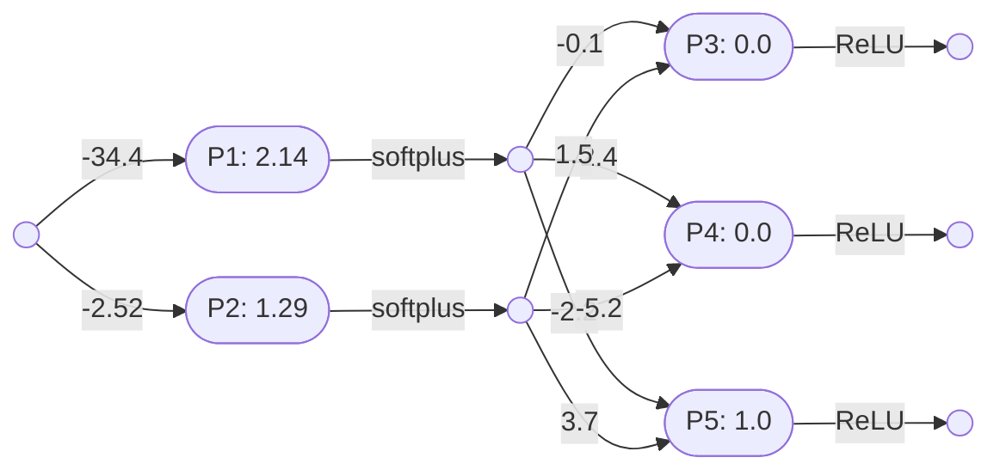

# Perceptron networks

Two [perceptron layers](perceptron_layers.md) can be combined, in series, into a perceptron network, as long as the output arity of the first layer is identical to the input arity of the second layer. 

### A two-layer network

The following perceptron layer $\mathbf{L_1}$ has an output arity of 2:

Note that:
- $\mathbf{L_1} = \mathbf{P_1}\otimes\mathbf{P_2} = \lambda x(\mathbf{softplus}(2.14 - 34.4x), \mathbf{softplus}(1.29 - 2.52x)) \vdash \mathbb{R}\to(\mathbb{R},\mathbb{R})$

Here is a second perceptron layer $\mathbf{L_2}$, with an input arity of 2:

Note that:
$\mathbf{L_2} = \mathbf{P_3}\otimes\mathbf{P_4}\otimes\mathbf{P_5} = \lambda(x,y)(\mathbf{ReLU}(1.5y - 0.1x),\mathbf{ReLU}(2.4x - 5.2y),\mathbf{ReLU}(3.7y - 2.2x + 1)) \vdash (\mathbb{R},\mathbb{R})\to(\mathbb{R},\mathbb{R},\mathbb{R})$

These two layers can be combined into a single neural network $\mathbf{N_1}$:

So:
- $\circ = \lambda(l,m)\lambda x(m(l(x))) \vdash (X\to Y,Y\to Z) \to (X\to Z) $
- $\mathbf{N_1} = \mathbf{L_1}\circ\mathbf{L_2}$
- $\mathbf{N_1} = \lambda(l,m)\lambda x(m(l(x))) (\mathbf{L_1},\mathbf{L_2})$
- $\mathbf{N_1} = \lambda x(\mathbf{L_2}(\mathbf{L_1}(x)))$
- $\mathbf{N_1} = \lambda x(\mathbf{L_2}(\lambda y(\mathbf{softplus}(2.14 - 34.4y), \mathbf{softplus}(1.29 - 2.52y))(x)))$
- $\mathbf{N_1} = \lambda x(\mathbf{L_2}(\mathbf{softplus}(2.14 - 34.4x), \mathbf{softplus}(1.29 - 2.52x)))$
- $\mathbf{N_1} = \lambda x((\lambda(y,z)(\mathbf{ReLU}(1.5z - 0.1y),\mathbf{ReLU}(2.4y - 5.2z),\mathbf{ReLU}(3.7z - 2.2y + 1)))(\mathbf{softplus}(2.14 - 34.4x), \mathbf{softplus}(1.29 - 2.52x)))$
- $\mathbf{N_1} = \lambda x(\mathbf{ReLU}(1.5(\mathbf{softplus}(1.29 - 2.52x)) - 0.1(\mathbf{softplus}(2.14 - 34.4x))),\mathbf{ReLU}(2.4(\mathbf{softplus}(2.14 - 34.4x)) - 5.2(\mathbf{softplus}(1.29 - 2.52x))),\mathbf{ReLU}(3.7(\mathbf{softplus}(1.29 - 2.52x)) - 2.2(\mathbf{softplus}(2.14 - 34.4x)) + 1))$
- $\mathbf{N_1} \vdash \mathbb{R}\to(\mathbb{R},\mathbb{R},\mathbb{R})$

### A three-layer network

A more complex network is the digit classifier discussed in the 3Blue1Brown tutorial [But what is a neural network?](https://www.youtube.com/watch?v=aircAruvnKk):
- $\mathbf{N_2} \vdash \mathbb{R}^{784}\to \mathbb{R}^{10}$

Note that:
- $\mathbf{N_2}$ has 784 inputs, one for each pixel in a 28-by-28 pixel grid. 
- $\mathbf{N_2}$ has 10 outputs, one for each of the ten decimal digits 0 through 9.

Network $\mathbf{N_2}$ consists of three layers:
- $\mathbf{N_2} = \mathbf{L_3}\circ\mathbf{L_4}\circ\mathbf{L_5}$
- $\mathbf{L_3} \vdash \mathbb{R}^{784}\to\mathbb{R}^{16}$
- $\mathbf{L_4} \vdash \mathbb{R}^{16}\to\mathbb{R}^{16}$
- $\mathbf{L_5} \vdash \mathbb{R}^{16}\to\mathbb{R}^{10}$

Layer $\mathbf{L_3}$ consists of sixteen 784-input perceptrons:
- $\mathbf{L_3} = \mathbf{P_{3.1}} \otimes \mathbf{P_{3.2}} \otimes \mathbf{P_{3.3}} \otimes \ldots \otimes \mathbf{P_{3.16}}$
- $\mathbf{P_{3.1}}, \mathbf{P_{3.2}}, \mathbf{P_{3.3}}, \ldots, \mathbf{P_{3.16}} \vdash \mathbb{R}^{784}\to \mathbb{R}$

Layer $\mathbf{L_4}$ consists of sixteen 16-input perceptrons:
- $\mathbf{L_4} = \mathbf{P_{4.1}} \otimes \mathbf{P_{4.2}} \otimes \mathbf{P_{4.3}} \otimes \ldots \otimes \mathbf{P_{4.16}}$
- $\mathbf{P_{4.1}}, \mathbf{P_{4.2}}, \mathbf{P_{4.3}}, \ldots, \mathbf{P_{4.16}} \vdash \mathbb{R}^{16}\to \mathbb{R}$

Layer $\mathbf{L_5}$ consists of ten 16-input perceptrons:
- $\mathbf{L_5} = \mathbf{P_{5.1}} \otimes \mathbf{P_{5.2}} \otimes \mathbf{P_{5.3}} \otimes \ldots \otimes \mathbf{P_{5.10}}$
- $\mathbf{P_{5.1}}, \mathbf{P_{5.2}}, \mathbf{P_{5.3}}, \ldots, \mathbf{P_{5.10}} \vdash \mathbb{R}^{16}\to \mathbb{R}$

Network $\mathbf{N_2}$ consists of 42 perceptrons and 13,002 parameters (12,960 input weights, and 42 biases).

----

Back to: [Index](index.md)

