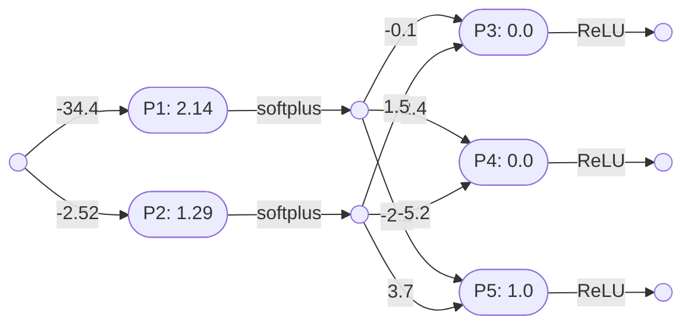

# Perceptron networks

Two [perceptron layers](perceptron_layers.md) can be combined, in series, into a perceptron network, as long as the output arity of the first layer is identical to the input arity of the second layer. 

The following perceptron layer $\mathbf{L_1}$ has an output arity of 2:

Note that:
- $\mathbf{L_1} = \mathbf{P_1}\otimes\mathbf{P_2} = \lambda x(\mathbf{softplus}(2.14 - 34.4x), \mathbf{softplus}(1.29 - 2.52x)) \vdash \mathbb{R}\to(\mathbb{R},\mathbb{R})$

Here is a second perceptron layer $\mathbf{L_2}$, with an input arity of 2:

Note that:
$\mathbf{L_2} = \mathbf{P_3}\otimes\mathbf{P_4}\otimes\mathbf{P_5} = \lambda(x,y)(\mathbf{ReLU}(1.5y - 0.1x),\mathbf{ReLU}(2.4x - 5.2y),\mathbf{ReLU}(3.7y - 2.2x + 1)) \vdash (\mathbb{R},\mathbb{R})\to(\mathbb{R},\mathbb{R},\mathbb{R})$

These two layers can be combined into a single neural network $\mathbf{N_1}$:

So:
- $\circ = \lambda(l,m)\lambda x(m(l(x))) \vdash (X\to Y,Y\to Z) \to (X\to Z) $
- $\mathbf{N_1} = \mathbf{L_1}\circ\mathbf{L_2}$
- $\mathbf{N_1} = \lambda(l,m)\lambda x(m(l(x))) (\mathbf{L_1},\mathbf{L_2})$
- $\mathbf{N_1} = \lambda x(\mathbf{L_2}(\mathbf{L_1}(x)))$
- 

----

Back to: [Index](index.md)

