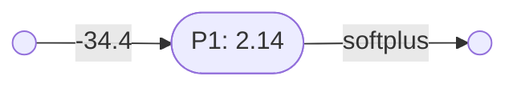
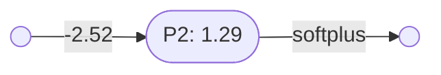

# Perceptron stacks

[Perceptrons](perceptrons.md) of the same arity can be combined into perceptron stacks.

### Unary perceptron stacks

Here is perceptron $\mathbf{P_1}$, with one input:

And perceptron $\mathbf{P_2}$, which also has one input:

Note that:
- $\mathbf{P_1} = \lambda x(\mathbf{softplus}(2.14 - 34.4x)) \vdash \mathbb{R}\to\mathbb{R}$
- $\mathbf{P_2} = \lambda x(\mathbf{softplus}(1.29 - 2.52x)) \vdash \mathbb{R}\to\mathbb{R}$

Since these two perceptrons have the same arity they can be combined into a perceptron stack:

mmm
- $p_1 = \lambda x(\mathbf{softplus}(2.14 - 34.4x)) \vdash \mathbb{R}\to\mathbb{R}$
- $p_2 = \lambda x(\mathbf{softplus}(1.29 - 2.52x)) \vdash \mathbb{R}\to\mathbb{R}$
- $| = \lambda(p,q)\lambda x(p(x),q(x)) \vdash (\mathbb{R}\to\mathbb{R},\mathbb{R}\to\mathbb{R}) \to (\mathbb{R}\to(\mathbb{R},\mathbb{R}))$
- $l_1 = p_1|p_2$
- $l_1 = (\lambda(p,q)\lambda x(p(x),q(x))) (p_1,p_2)$
- $l_1 = \lambda x(p_1(x),p_2(x))$
- $l_1 = \lambda x(\lambda y(\mathbf{softplus}(2.14 - 34.4y))(x),\lambda y(\mathbf{softplus}(1.29 - 2.52y))(x))$
- $l_1 = \lambda x(\mathbf{softplus}(2.14 - 34.4x), \mathbf{softplus}(1.29 - 2.52x)) \vdash \mathbb{R}\to(\mathbb{R},\mathbb{R})$

### Binary perceptron stacks

### Ternary perceptron stacks

----

Back to: [Index](index.md)

