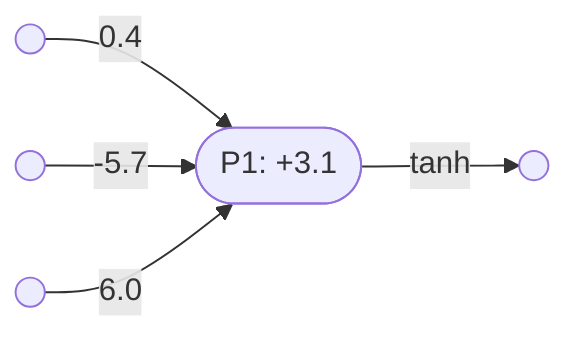
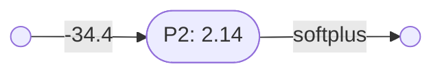
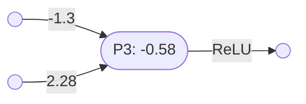

# Perceptrons

A perceptron is a very simple mathematical model of how a biological neuron works.

A perceptron computes a function from sequences of real numbers to real numbers.

The function underlying a perceptron has the following general form:
- $\lambda(x_1,x_2,\ldots,x_n)(f(w_1x_1 + w_2x_2 + \ldots + w_nx_n +b))$

Where:
- each $w_i$ is a real number which is used to weight the corresponding input $x_i$.
- $b$ is a real number which is used to bias the total of the weighted inputs.
- $f$ is an [activation function](activation_functions.md), used to modulate the output.

The perceptron: 
1. takes each input $x_i$ in turn
2. multiplies it by the relevant weight $w_i$
3. adds all the weighted inputs together
4. adds on the bias $b$
5. passes the whole thing through the activation function $f$
6. outputs the result.

Here is an example of a perceptron:
- $\mathbf{P_1} = \lambda(x,y,z)(\tanh(0.4x - 5.7y + 6z + 3.1))$

In $\mathbf{P_1}$:
- the input weights are $(0.4,-5.7,6.0)$
- the bias is $3.1$
- the activation function is the hyperbolic tangent function.

Here is a diagram representing perceptron $\mathbf{P_1}$:

### Perceptron arity

Perceptron $\mathbf{P_1}$ has three inputs - it has an arity of 3. We can denote its ‘type’ as follows:
- $\mathbf{P_1} = \lambda(x,y,z)(\tanh(0.4x - 5.7y + 6z + 3.1)) \vdash (\mathbb{R},\mathbb{R},\mathbb{R})\to\mathbb{R}$

Here is a diagram representing a perception $\mathbf{P_2}$ with arity 1:

And perceptron $\mathbf{P_3}$ has arity 2:

Note that:
- $\mathbf{P_2} = \lambda x(\mathbf{softplus}(2.14 - 34.4x)) \vdash \mathbb{R}\to\mathbb{R}$
- $\mathbf{P_3} = \lambda(x,y)(\mathbf{ReLU}(2.28y - 1.3x -0.58)) \vdash (\mathbb{R},\mathbb{R})\to\mathbb{R}$

----

Multiple perceptrons of the same arity can be combined, in parallel, into a [perceptron layer](perceptron_layers.md).

----

See also:
- Wikipedia page on [artificial neurons](https://en.wikipedia.org/wiki/Artificial_neuron)

----

Back to: [Index](index.md)
