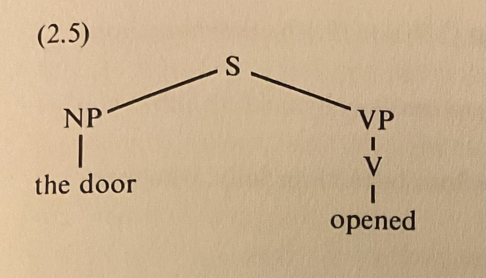
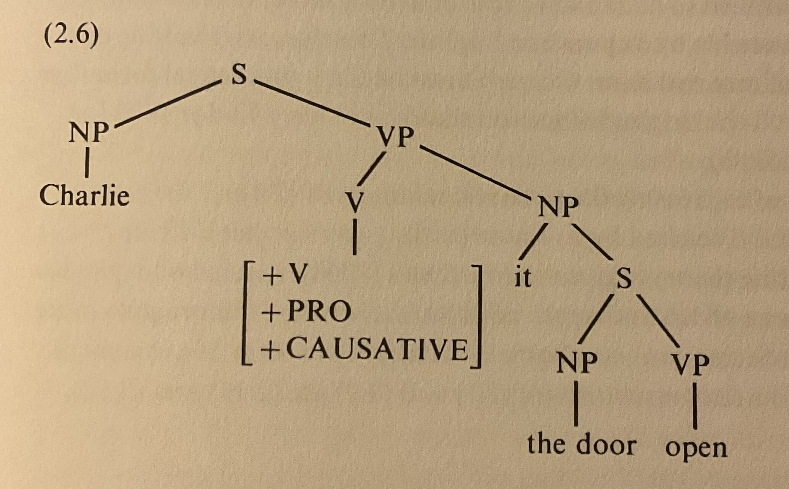
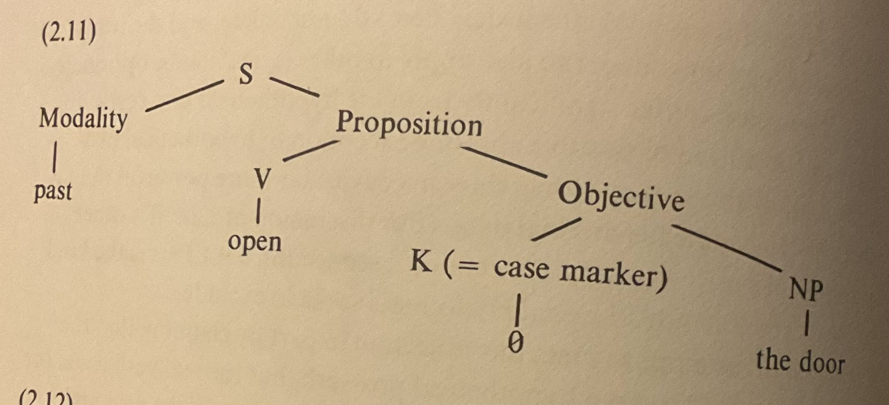
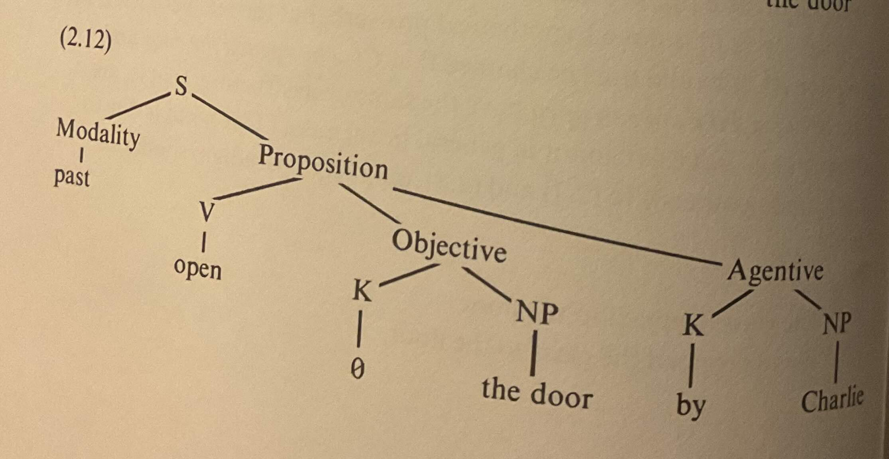

# Grammatical relations and functional structure

My notes from chapter 2 of Ray S. Jackendoff (1972) *Semantic Interpretation in Generative Grammar*.

## The semantic insufficiency of grammatical relations

There is no straightforward correspondence between traditional grammatical relations and understood semantic relations (a.k.a. ‘functional structure’).

The next two sections discuss two examples of this:
- the causative/inchoative alternation
- verbs of buying and selling

#### Causative/inchoative alternation

Consider these examples:

> `(2.1) The door opened.`
>
> `(2.2) Charlie opened the door.`

In `(2.1)`:
- The noun phrase `the door` is the grammatical **subject** of the verb `opened`.
- The material entity denoted by `the door` is the semantic **theme** of the event denoted by `opened`.

Whereas in `(2.2)`:
- The noun phrase `the door` is now the grammatical **object** of the verb `opened`.
- But the material entity denoted by `the door` is still the semantic **theme** of the event denoted by `opened`.

Thus, with the verb `open`: 
- The semantic theme can correspond to either the grammatical subject or the grammatical object.

The verb `drop` exhibits the same alternation:

> `(2.7) The glass dropped to the floor.`
>
> `(2.8) Floyd dropped the glass to the floor.`

#### Verbs of buying and selling

Consider the next two examples:

> `(2.3) Fred bought some hashish from Reuben.`
>
> `(2.4) Reuben sold some hashish to Fred.`

In `(2.3)`:
- `Fred` is the grammatical **subject** and the semantic **recipient** of the verb `bought`.
- `Reuben` is the grammatical *from*-**complement** and the semantic **donor** of the verb `bought`.

Whereas in `(2.4)`:
- `Fred` is now the grammatical *to*-**complement** yet still the semantic **recipient** of the verb `sold`.
- `Reuben` is now the grammatical **subject** yet still the semantic **donor** of the verb `sold`.

Thus, with the verbs `buy` and `sell`:
- The semantic recipient can correspond to either the grammatical subject or the grammatical *to*-complement.
- The semantic donor can correspond to either the grammatical subject or the grammatical *from*-complement.
- The grammatical subject can correspond to either the semantic recipient or the semantic donor. 

#### Deep grammatical structure

Some generative grammarians of the 1960s and 1970s believed that there must be a straightforward correspondence between grammatical relations and semantic relations (sometimes called ‘The Katz-Postal Hypothesis’). They proposed a level of ‘deep’ grammatical structure, distinct from (but related to) the traditional notion of ‘surface’ grammatical structure.

Returning to the examples above:
- In both `(2.1)` and `(2.2)`, the noun phrase `the door` must have the same deep grammatical relation to the verb `opened`.
- In `(2.3)` and `(2.4)`, 
  - `Fred` must have the same deep grammatical relation to the verbs `bought` and `sold`.
  - `Reuben` must have the same deep grammatical relation to the verbs `bought` and `sold`.

Deep grammatical structures are converted into surface grammatical structures by means of transformation rules:
- The noun phrase `the door` is transformed into the surface grammatical subject in `(2.1)` but into the surface grammatical object in `(2.2)`.
- `Fred` is transformed into the surface grammatical subject in `(2.3)` but into the surface grammatical *to*-complement in `(2.4)`.
- `Reuben` is transformed into the surface grammatical *from*-complement in `(2.3)` but into the surface grammatical subject in `(2.4)`.

#### Generative semantics

One way of encoding such deep grammatial relations comes from the Generative Semantics theory of George Lakoff (see *On Syntactic Irregularity* 1971). Parts of the semantic reading are broken off and expressed as higher pro-verbs (at deep structure) that must eventually be deleted (at surface structure).

For example, the proposed deep structure of `(2.1)` is:

And the proposed deep structure of `(2.2)` is:

#### Case grammar

Another way of encoding deep grammatial relations comes from the Case Grammar theory of Charles Fillmore (see *The Case for Case* 1968). More deep structure is put into the clause itself, in the form of a system of case relations.

For example, the proposed deep structure of `(2.1)` is:

And the proposed deep structure of `(2.2)` is:

## Thematic relations

There is an alternative approach to the semantic insufficiency of traditional grammatical relations. Instead of positing multiple layers of grammatical relations, we can formalise an extra-grammatical level of ‘thematic relations’, as based on work by Jeffrey S. Gruber (see his doctoral dissertation *Studies in Lexical Relations* 1965).

Five important thematic relations will be covered in the following sections:
- Theme
- Location
- Source
- Goal
- Agent

#### Theme

Every sentence (or every verb) has a Theme.

The Theme of a verb of (physical) motion is the noun phrase understood as undergoing the motion.

> `(2.13) The rock moved away.`
>
> `(2.14) John rolled the rock from the dump to the house.`
>
> `(2.15) Bill forced the rock into the hole.`
>
> `(2.31) George got to Philadelphia.`
>
> `(2.33) Harry went from Bloomington to Boston.`

Note that:
- In `(2.13)`, the Theme of `moved` is `the rock` (the subject).
- In `(2.14)`, the Theme of `rolled` is `the rock` (the object).
- In `(2.15)`, the Theme of `forced` is `the rock` (the object).
- In `(2.31)`, the Theme of `got` is `George` (the subject).
- In `(2.33)`, the Theme of `went` is `Harry` (the subject).

The Theme of a verb of (physical) location is the noun phrase whose location is being asserted.

> `(2.20) The rock stood in the corner.`
>
> `(2.21) John clung to the window sill.`
>
> `(2.22) Herman kept the book on the shelf.`
>
> `(2.29) John stayed in the room.`

Note that:
- In `(2.20)`, the Theme of `stood` is `the rock`.
- In `(2.21)`, the Theme of `clung` is `John`.
- In `(2.22)`, the Theme of `kept` is `the book`.
- In `(2.29)`, the Theme of `stayed` is `John`.

#### Location

The Location of a verb of (physical) location is the noun phrase expressing the location, usually within a prepositional phrase.

Note that:
- In `(2.20)`, the Location of `stood` is `(in) the corner`.
- In `(2.21)`, the Location of `clung` is `(to) the window sill`.
- In `(2.22)`, the Location of `kept` is `(on) the shelf`.
- In `(2.29)`, the Location of `stayed` is `(in) the room`.

#### Source

Note that:
- In `(2.14)`, the Source of `rolled` is `(from) the dump`.
- In `(2.33)`, the Source of `went` is `(from) Bloomington`.

#### Goal

Note that:
- In `(2.13)`, the Goal of `moved` is `away` (ie. ‘to another place’).
- In `(2.14)`, the Goal of `rolled` is `(to) the house`.
- In `(2.15)`, the Goal of `forced` is `(into) the hole`.
- In `(2.31)`, the Goal of `got` is `(to) Philadelphia`.
- In `(2.33)`, the Goal of `went` is `(to) Boston`.

#### Agent

The Agent of a verb of physical motion is the animate noun phrase (usually the grammatical subject) that has will or volition towards the action expressed by the sentence.

Note that:
- In `(2.13)`, there is no Agent (since `the rock` is inanimate).
- In `(2.14)`, `John` is the Agent but not the Theme.
- In `(2.15)`, `Bill` is the Agent but not the Theme.
- In `John rolled down the hill`, `John` is the Theme and also optionally the Agent (dependeing on the reading)

A good test for Agenthood involves ‘purposive adverbials’ like `deliberately`, `intentionally`, `accidentally`, `on purpose`, and purposive constructions using `in order to` and `so that`:

> `(2.35) * The rock deliberately rolled down the hill.`
> 
> `(2.36) John deliberately rolled down the hill.`
>
> `(2.38) John took the book from Bill in order to read it.`

#### Possessional motion and location

The notions of physical motion and location can be extended by analogy to the domain of ‘possession’.

> `(2.16) Harry gave the book away.`
>
> `(2.17) Will inherited a million dollars.`
>
> `(2.18) Charlie bought the lamp from Max.`
>
> `(2.23) Herman kept the book.`
>
> `(2.24) The book belongs to Herman.`
>
> `(2.25) Max owns the book.`

Note that:
- In `(2.16)`, `the book` is the Theme, `Harry` is the Source and Agent, and `away` is the Goal.
- In `(2.17)`, `a million dollars` is the Theme, and `Will` is the Goal (but not the Agent).
- In `(2.18)`, `the lamp` is the Theme, `(from) Max` is the Source, and `Charlie` is the Goal and Agent.
- In `(2.23)`, `the book` is the Theme, and `Herman` is the Location.
- In `(2.24)`, `the book` is the Theme, and `(to) Herman` is the Location.
- In `(2.25)`, `the book` is the Theme, and `Max` is the Location.

Note also the use of the verb `kept` to express location in both the physical `(2.22)` and the possessional `(2.23)` domains.

Some examples with purposive adverbials and constructions:

> `(2.37) * John received the book from Bill in order to read it.`
>
> `(2.39) ? John lost the money so that he could get sympathy.`
>
> `(2.40) John gave the money away so that he could win his friends’ admiration.`

#### Abstract motion and location

The notions of physical motion and location can be extended by analogy into more abstract domains as well.

> `(2.19) Dave explained the proof to his students.`
>
> `(2.32) George got angry.`
>
> `(2.34) Harry went from elated to depressed.`
>
> `(2.26) Max knows the answer.`
>
> `(2.30) John stayed angry.`

Note that:
- In `(2.19)`, `the proof` is the Theme, `Dave` is the Source and Agent, and `(to) his students` is the Goal.
- In `(2.32)`, `George` is the Theme, and the adjective `angry` is the Goal.
- In `(2.34)`, `Harry` is the Theme, `(from) elated` is the Source, and `(to) depressed` is the Goal.
- In `(2.26)`, `the answer` is the Theme, and `Max` is the Location.
- In `(2.30)`, `John` is the Theme, and the adjective `angry` is the Location.

Note also the use of:
- the verb `stayed` to express location in both the physical `(2.29)` and the abstract ‘quality space’ `(2.30)` domains
- the verb `got` to express motion in both the physical `(2.31)` and the quality space `(2.32)` domains
- the verb `went` to express motion in both the physical `(2.34)` and the quality space `(2.34)` domains.

Some examples with purposives:

> `(2.41) ? John intentionally struck Bill as funny.`
>
> `(2.42) John intentionally made Bill think of him as funny.`

#### Miscellaneous points

> `(2.27) The circle contains the dot.`
>
> `(2.28) The dot is contained in the circle.`

## Thematic relations vs. Case Grammar

## Correlating thematic relations with deep structure

## The Thematic Herarchy Condition

