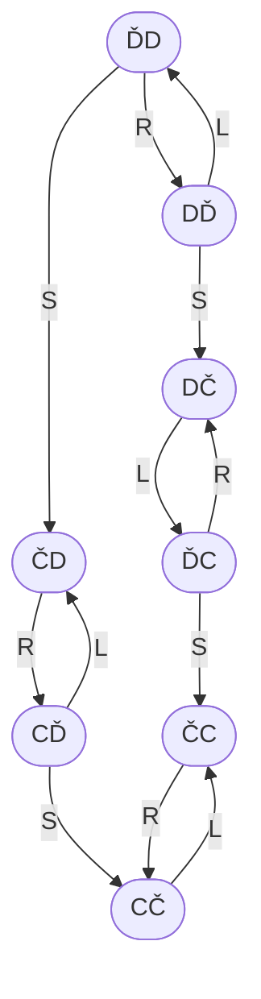
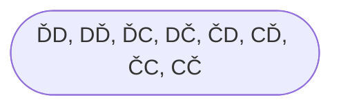
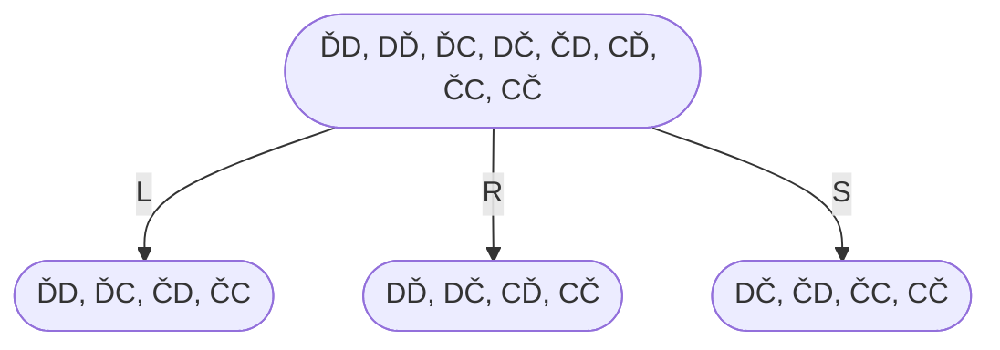
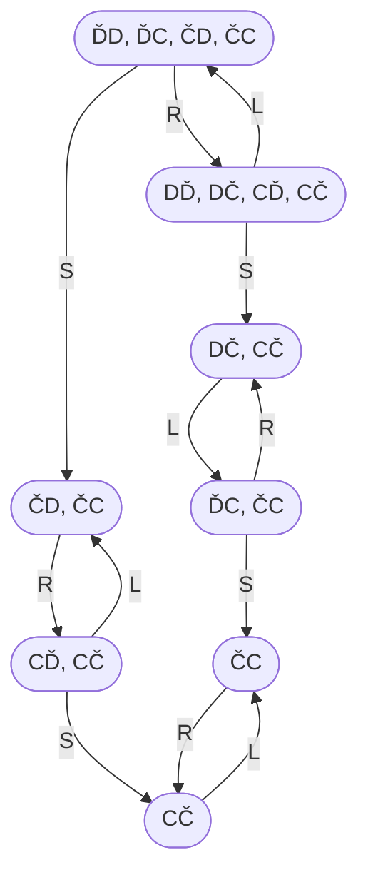
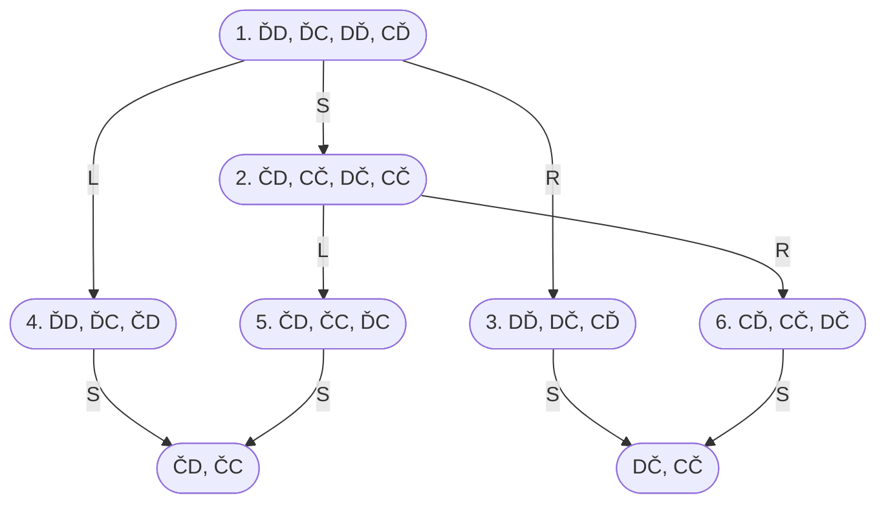

# Problems

A problem-solving agent:
- formulates a `goal` (based on the current situation)
- considers sequences of actions that might achieve that goal ie. makes a `plan`
- maximises its performance measure.

A `problem` consists of:
- a goal
- a set of means for achieving that goal.

`Search` involves exploring what the means can do, systematically considering the consequences of different courses of action.

The problem type depends on the knowledge available to an agent:
- Does it know the current state?
- Does it understand the consequences of its actions?

A goal is a set of world-states (just those states in which the goal is satisfied).

Actions cause transitions between world states.

Problem formulation — deciding on the most appropriate world-states and actions/transitions.

Does the agent have a map of the problem space/world in its memory?

If so it can start by making a plan, searching for a solution, before setting out (on the execution phase).

`Search algorithm` – takes in a problem as input and returns a solution (sequence of actions).

## The vacuum world

The vacuum world consists of two locations – left and right. Each location is either dirty or clean. The agent is either on the left or on the right.

There are this eight distinct objective states that the vacuum world can be in:
1. `ĎD` – The agent is on the left, and both the left and right are dirty.
2. `DĎ` – The agent is on the right, and both the left and right are dirty.
3. `ĎC` – The agent is on the left, the left is dirty but the right is clean.
4. `DČ` – The agent is on the right, the left is dirty but the right is clean.
5. `ČD` – The agent is on the left, the left is clean but the right is dirty.
6. `CĎ` – The agent is on the right, the left is clean but the right is dirty.
7. `ČC` – The agent is on the left, and both the left and right are clean.
8. `CČ` – The agent is on the right, and both the left and right are clean.

In the vacuum world, the agent can perform three distinct actions:
1. Move to the left.
2. Move to the right.
3. Activate the vacuum’s suction.

The following three facts all hold:
1. If the agent moves to the left, then it will be on the left.
2. If the agent moves to the right, then it will be on the right.
3. If the agent activates the vacuum’s suction, then its current location will be clean.

The agent knows these three facts.

These world states and actions are thus linked as follows:

### No sensors

Let’s start by assuming that the agent completely lacks sensors. It thus has no way of knowing:
- which location it is in
- whether its location is clean or dirty
- whether the other location is clean or dirty.

All the agent knows is what it can do, what will happen if it does something, and what its goal is.

Before the agent does anything, it is in the following knowledge state:

In other words, the agent knows that it is either on the left or on the right, that the left is either dirty or clean, and that the right is either dirty or clean.

The agent also knows what knowledge state it will enter into if it does something:

In other words:
- If the agent moves left, then it knows it will be on the left.
- If the agent moves right, then it knows that it will be on the right.
- If the agent activates the vacuum’s suction, then it knows that it will be in a clean location.

In total, there will be ten such knowledge states, related via actions as follows:

Even without sensors, the agent can figure out a plan that is guaranteed to reach its goal, for example:
- Move to the left.
- Suck.
- Move to the right.
- Suck.

### Location sensor – you know where you are 

Plans:
- agent is on the left: suck, move right, suck
- agent is on the right: suck, move left, suck

### Local dirt sensor – you know if there is dirt where you are

### Next door dirt sensor – you know if there is dirt next door

### Non-deterministic

Actions:
- `L` – you move to the left
- `R` – you move to the right
- `S` – you activate the suction, which either removes all the dirt from where you are, or deposits more dirt where you are, randomly

----

Back up to: [Maglocunus](../index.md)
