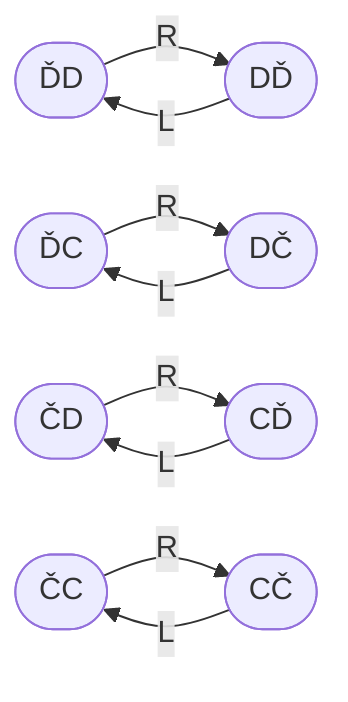

# Problems

## The vacuum world

```mermaid
graph LR
  state1(["ĎD"])
  state2(["DĎ"])
  state3(["ĎC"])
  state4(["DČ"])
  state5(["ČD"])
  state6(["CĎ"])
  state7(["ČC"])
  state8(["CČ"])
  state1 -- R --> state2
  state2 -- L --> state1
  state3 -- R --> state4
  state4 -- L --> state3
  state5 -- R --> state6
  state6 -- L --> state5
  state7 -- R --> state8
  state8 -- L --> state7
```

----

Back up to: [Maglocunus](../index.md)
